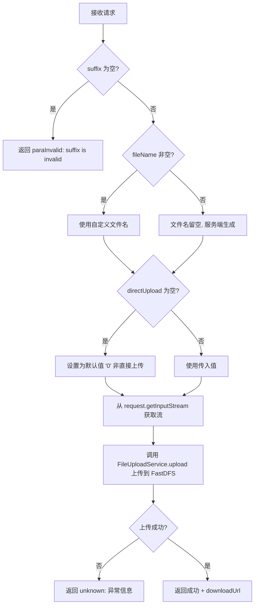
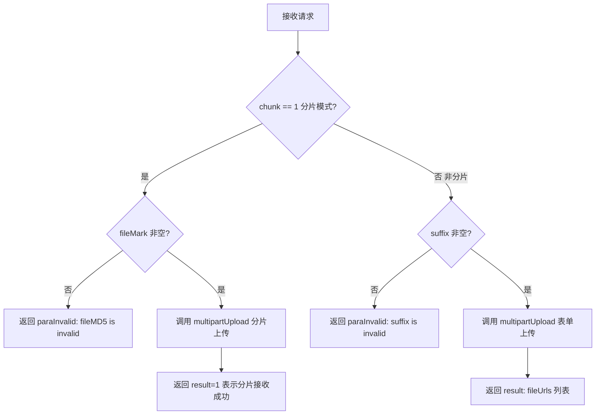
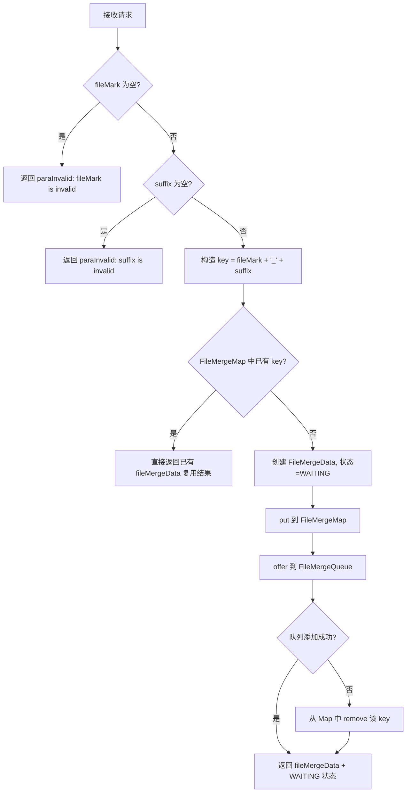

# service-File — 文件上传接口（ApiServlet）

> 分支：syy.release.z7.8.1.0
> 源文件：`src/main/java/cn/testin/service/fs/File.java`
> 基础类：`cn.testin.service.GenericBaseService`
> 机制：请求走 `ApiServlet /openapi` 入口，通过 `action=fs` + `op=File.方法名` 路由到此类的对应 public 方法；每个方法的参数包含 `HttpServletRequest` + `ApiRequest`，返回 JSON 字符串。
> - **action**: `fs`（对应包 `cn.testin.service.fs`）
> - **入口格式**：`{"op": "File.方法名", "action": "fs", "data": {...}}`
> 业务：文件上传（流式 / form 表单多部件 / 分片合并），最终文件存储到 FastDFS。

## op 列表总表

| # | op | 方法名 | 说明 |
|---|---|---|---|
| 1 | File.upload | upload | 文件流式上传（从 HttpServletRequest 输入流读取） |
| 2 | File.multipartUpload | multipartUpload | 多部件上传（支持分片 / 非分片模式） |
| 3 | File.merge | merge | 分片合并（查/注册合并任务，异步执行合并上传） |

---

## 1. op=File.upload — 文件流式上传

### 请求格式
```json
{"op": "File.upload", "action": "fs", "data": {"suffix": "apk", "fileName": "app.apk", "fileType": "android", "directUpload": "1"}}
```
文件体通过 HTTP Body 的 InputStream 传入。

### 参数

| 字段 | 类型 | 必填 | 说明 |
|---|---|---|---|
| suffix | String | 是 | 文件后缀名，如 `apk`、`ipa`、`zip`、`png`（代码 `reqJson.optString` 后 `isBlank` 校验） |
| fileName | String | 否 | 自定义文件名（`optString`，无校验） |
| fileType | String | 否 | 文件归属类型（见 `FileUploadConstants`），用于区分业务用途 |
| directUpload | String | 否 | 是否直接上传（不保存临时文件），为空时默认非直接上传 `0` |

### 核心逻辑

1. 从 `ApiRequest` 提取 `suffix`、`fileName`、`fileType`、`directUpload` 参数。
2. 校验 `suffix` 非空。
3. 从 `HttpServletRequest.getInputStream()` 获得输入流。
4. 调用 `FileUploadServiceFactory.fileUploadService.upload(inputStream, fileName, suffix, fileType, directUpload)` 执行上传。
5. 返回文件在 FastDFS 上的下载 URL。



**关键代码：**

```java
InputStream inputStream = null;
try {
    inputStream = request.getInputStream();
    url = FileUploadServiceFactory.fileUploadService.upload(
        inputStream, fileName, suffix, fileType, directUpload);
} catch (Exception e) {
    Logit.error(e.getMessage(), new Throwable(e));
    return ApiUtil.getResult(apirequest, CommonCode.unknown.getValue(), ...);
} finally {
    if (inputStream != null) {
        inputStream.close();
    }
}
```

### 响应

```json
{
  "error_code": 0,
  "msg": "success",
  "data": {
    "result": "http://fdfs-host/group1/M00/00/01/xxx.apk"
  }
}
```

**返回参数**

| 字段 | 类型 | 说明 |
|---|---|---|
| action | String | 回显请求 action（fs） |
| op | String | 回显请求 op（File.upload） |
| code | Integer | 状态码，0 成功 |
| msg | String | 提示信息 |
| data | JSONObject | 业务数据 |
| data.result | String | 上传成功后 FastDFS 上的文件下载 URL |

---

## 2. op=File.multipartUpload — 多部件/分片上传

### 请求格式

**非分片模式：**
```json
{"op": "File.multipartUpload", "action": "fs", "data": {"chunk": 0, "suffix": "apk"}}
```

**分片模式：**
```json
{"op": "File.multipartUpload", "action": "fs", "data": {"chunk": 1, "fileMark": "unique-md5-value"}}
```
文件体通过 `HttpServletRequest` 的 multipart/form-data 传入。

### 参数

| 字段 | 类型 | 必填 | 说明 |
|---|---|---|---|
| chunk | Integer | 否 | 是否为分片模式：0=非分片（默认），1=分片上传（`optInt(...,0)`） |
| fileMark | String | 否 | 分片模式（chunk=1）下必填；文件唯一标记（建议用文件 MD5），用于后续合并关联 |
| suffix | String | 否 | 非分片模式（chunk=0）下必填；文件后缀名 |
| fileType | String | 否 | 文件归属类型 |

### 核心逻辑

1. 解析 `chunk`、`fileMark`、`suffix`、`fileType` 参数。
2. 分片模式校验 `fileMark` 非空；非分片模式校验 `suffix` 非空。
3. 调用 `FileUploadServiceFactory.fileUploadService.multipartUpload(request, isChunk, fileMark, suffix, fileType)` 处理上传。
4. 分片模式返回 `result=1`（表示分片成功）；非分片模式返回文件 URL 列表。



### 响应

**分片模式：**
```json
{
  "error_code": 0,
  "msg": "success",
  "data": {
    "result": 1
  }
}
```

**非分片模式：**
```json
{
  "error_code": 0,
  "msg": "success",
  "data": {
    "result": ["http://fdfs-host/group1/M00/00/01/file1.apk", "http://fdfs-host/group1/M00/00/01/file2.png"]
  }
}
```

**返回参数**

| 字段 | 类型 | 说明 |
|---|---|---|
| action | String | 回显请求 action（fs） |
| op | String | 回显请求 op（File.multipartUpload） |
| code | Integer | 状态码，0 成功 |
| msg | String | 提示信息 |
| data | JSONObject | 业务数据 |
| data.result | Integer / JSONArray | 分片模式：固定 `1`（表示分片接收成功）；非分片模式：文件下载 URL 数组 `List<String>` |

---

## 3. op=File.merge — 分片合并

### 请求格式
```json
{"op": "File.merge", "action": "fs", "data": {"fileMark": "unique-md5-value", "suffix": "apk", "fileName": "app.apk", "fileType": "android"}}
```

### 参数

| 字段 | 类型 | 必填 | 说明 |
|---|---|---|---|
| fileMark | String | 是 | 文件唯一标记，与分片上传时使用的标记一致（`optString` 后 `isBlank` 校验） |
| suffix | String | 是 | 最终文件的扩展名（`optString` 后 `isBlank` 校验） |
| fileName | String | 否 | 最终文件名 |
| fileType | String | 否 | 文件归属类型 |

### 核心逻辑

1. 校验 `fileMark` 和 `suffix` 非空。
2. 构造合并 Key：`fileMark + "_" + suffix`。
3. 检查 `FileMergeUtils.getFileMergeMap()` 是否已有该 Key 的合并结果：
   - **已有结果**：直接取出返回（幂等）。
   - **无结果**：创建 `FileMergeData` 对象，状态设为 `WAITING`，放入内存 Map，并将任务加入 `FileMergeQueue` 队列。
4. 后台任务异步从队列消费，执行分片文件合并并上传到 FastDFS。
5. 如果队列添加失败，从 Map 中移除 Key 以确保一致性。



**关键代码：**

```java
FileMergeData fileMergeData = new FileMergeData();
String key = fileMark + "_" + suffix;
if (FileMergeUtils.getFileMergeMap().containsKey(key)) {
    fileMergeData = FileMergeUtils.getFileMergeMap().get(key);
} else {
    fileMergeData.setFileMark(fileMark);
    fileMergeData.setSuffix(suffix);
    fileMergeData.setFileName(fileName);
    fileMergeData.setCode(FileMergeEnums.WAITING.getCode());
    fileMergeData.setMsg(FileMergeEnums.WAITING.getDescr());
    FileMergeUtils.getFileMergeMap().put(key, fileMergeData);
    boolean offer = FileMergeUtils.getFileMergeQueue().offer(fileMergeData);
    if (!offer) {
        FileMergeUtils.getFileMergeMap().remove(key);
    }
}
```

### 响应

```json
{
  "error_code": 0,
  "msg": "success",
  "data": {
    "object": {
      "fileMark": "unique-md5-value",
      "suffix": "apk",
      "fileName": "app.apk",
      "code": 0,
      "msg": "WAITING",
      "url": null
    },
    "result": null
  }
}
```

**返回参数**

| 字段 | 类型 | 说明 |
|---|---|---|
| action | String | 回显请求 action（fs） |
| op | String | 回显请求 op（File.merge） |
| code | Integer | 状态码，0 成功 |
| msg | String | 提示信息 |
| data | JSONObject | 业务数据 |
| data.objInfo | JSONObject | 合并任务对象 `FileMergeData` |
| data.objInfo.code | Integer | 合并状态码（`FileMergeEnums`，如 WAITING/SUCCESS/FAILED） |
| data.objInfo.msg | String | 合并状态描述 |
| data.objInfo.fileMark | String | 文件唯一标记 |
| data.objInfo.suffix | String | 文件后缀 |
| data.objInfo.fileName | String | 最终文件名 |
| data.objInfo.url | String | 合并后上传到 FastDFS 的下载 URL（合并完成前为 null） |
| data.objInfo.md5Key | String | 唯一标识（`fileMark + "_" + suffix`） |
| data.objInfo.fileType | String | 文件归属类型 |
| data.result | String | 合并后下载 URL（合并完成前为 null） |

> **注意**：合并是异步执行的，首次调用 `merge` 时返回 `WAITING` 状态。前端需要轮询重试 `merge` 接口，当 `code` 变为成功态时 `result` 会填充最终的下载 URL。幂等设计使得重复调用不会重复合并。

---

### 涉及表

- 无直接数据库表操作。文件上传的元数据通过 `FileUploadService`、`FileMergeUtils` 管理（内存 Map + 队列），最终存储到 FastDFS。
- `FileMergeUtils.getFileMergeMap()`：`ConcurrentHashMap`，内存中存储合并任务状态。
- `FileMergeUtils.getFileMergeQueue()`：内存队列，后台线程异步消费。

### 辅助类

- `FileUploadServiceFactory`：文件上传服务工厂。
- `FileMergeData`（`cn.testin.schdule.file.FileMergeData`）：分片合并数据模型。
- `FileMergeEnums`（`cn.testin.schdule.file.FileMergeEnums`）：合并状态枚举（如 WAITING、SUCCESS、FAILED）。
- `FileMergeUtils`（`cn.testin.schdule.file.FileMergeUtils`）：合并工具类，管理 Map + Queue。
