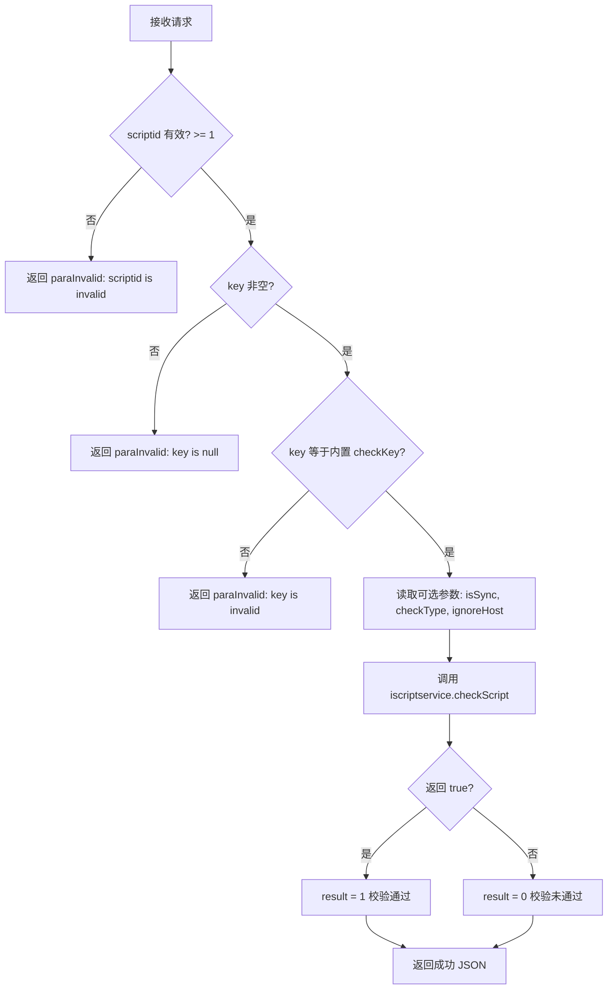

# service-Script — 脚本校验接口（ApiServlet）

> 分支：syy.release.z7.8.1.0
> 源文件：`src/main/java/cn/testin/service/fs/Script.java`
> 基础类：`cn.testin.service.GenericBaseService`
> 机制：请求走 `ApiServlet /openapi` 入口，通过 `action=fs` + `op=Script.方法名` 路由到此类的对应 public 方法；每个方法的参数为 `ApiRequest`，返回 JSON 字符串。
> - **action**: `fs`（对应包 `cn.testin.service.fs`）
> - **入口格式**：`{"op": "Script.方法名", "action": "fs", "data": {...}}`
> 业务：脚本检测与校验，通过内部 key 鉴权后调用 `IScriptService.checkScript()` 进行脚本检查。

## op 列表总表

| # | op | 方法名 | 说明 |
|---|---|---|---|
| 1 | Script.checkScript | checkScript | 校验脚本（需内置 key 鉴权） |

---

## 1. op=Script.checkScript — 校验脚本

### 请求格式
```json
{"op": "Script.checkScript", "action": "fs", "data": {"scriptid": 123, "key": "fa568093e6354882a534dbce946c9d53", "isSync": "sync", "checkType": "append", "ignoreHost": "..."}}
```

### 参数

| 字段 | 类型 | 必填 | 说明 |
|---|---|---|---|
| scriptid | Integer | 是 | 脚本 ID，必须 >= 1（`getInt` 后校验 `null`/`<1`） |
| key | String | 是 | 鉴权密钥，必须等于内置常量 `fa568093e6354882a534dbce946c9d53`（`getString` 后 `isBlank` 校验） |
| isSync | String | 否 | 同步模式，默认 `"sync"`（传入给底层 `checkScript` 方法控制同步/异步执行） |
| checkType | String | 否 | 检查类型，默认 `"append"`（控制脚本追加/覆盖模式） |
| ignoreHost | String | 否 | 忽略的主机地址（`optString`，无默认值） |

### 核心逻辑

1. 校验 `scriptid` 非空且 >= 1。
2. 校验 `key` 非空且等于硬编码常量 `"fa568093e6354882a534dbce946c9d53"`。
3. 从请求中获取可选参数：`isSync`（默认 `"sync"`）、`checkType`（默认 `"append"`）、`ignoreHost`。
4. 调用 `iscriptservice.checkScript(scriptid, isSync, ignoreHost, checkType)` 执行脚本检查。
5. 根据 `checkScript` 返回值构造响应：true 返回 `result=1`，false 返回 `result=0`。



**关键代码：**

```java
private static final String checkKey = "fa568093e6354882a534dbce946c9d53";

if (!checkKey.equals(key)) {
    return ApiUtil.getResult(apirequest, CommonCode.paraInvalid.getValue(),
            String.format("%s(%s)", CommonCode.paraInvalid.getDescr(), "key is invalid"));
}

boolean result = iscriptservice.checkScript(scriptid, isSync, ignoreHost, checkType);
```

### 响应

```json
{
  "error_code": 0,
  "msg": "success",
  "data": {
    "result": 1
  }
}
```

> `result`: 1 = 脚本校验通过；0 = 脚本校验未通过。

**返回参数**

| 字段 | 类型 | 说明 |
|---|---|---|
| action | String | 回显请求 action（fs） |
| op | String | 回显请求 op（Script.checkScript） |
| code | Integer | 状态码，0 成功 |
| msg | String | 提示信息 |
| data | JSONObject | 业务数据 |
| data.result | Integer | 1 = 脚本校验通过；0 = 脚本校验未通过 |

---

### 涉及表

- 无直接数据库表操作。底层 `IScriptService.checkScript()` 可能通过 RPC 调用 [service-ScriptMain](service-ScriptMain.md) 等脚本管理服务，读取 `db_script_file` 表（`ScriptFile` 模型）获取脚本内容后执行校验逻辑。
- `checkKey` 是硬编码于本类中的静态常量，作为简单的服务间调用鉴权手段。

### 辅助类

- `IScriptService`（`cn.testin.business.interfaces.IScriptService`）：由 `GenericBaseService` 通过 `SpringHelper.getBean("IScriptService")` 注入的 Spring Bean，可能是 RPC 远程调用接口。
