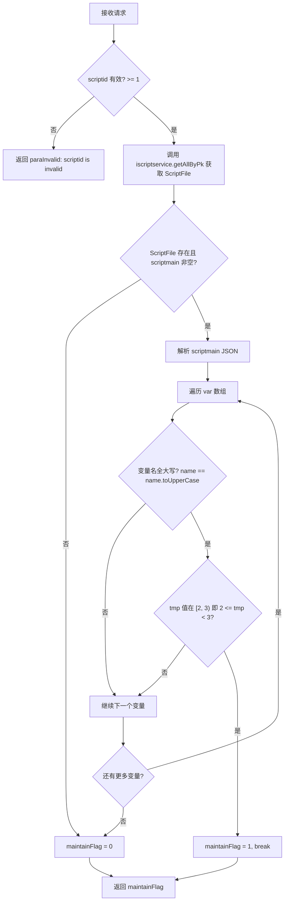
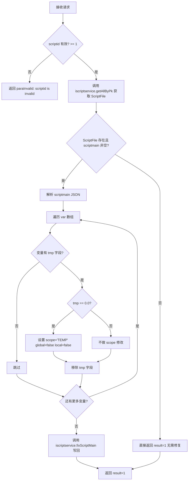

# service-ScriptMain — 脚本维护接口（ApiServlet）

> 分支：syy.release.z7.8.1.0
> 源文件：`src/main/java/cn/testin/service/script/ScriptMain.java`
> 基础类：`cn.testin.service.GenericBaseService`
> 机制：请求走 `ApiServlet /openapi` 入口，通过 `action=script` + `op=ScriptMain.方法名` 路由到此类的对应 public 方法；每个方法的参数为 `ApiRequest`，返回 JSON 字符串。
> - **action**: `script`（对应包 `cn.testin.service.script`）
> - **入口格式**：`{"op": "ScriptMain.方法名", "action": "script", "data": {...}}`
> 业务：脚本维护标记查询、脚本临时变量修复。

## op 列表总表

| # | op | 方法名 | 说明 |
|---|---|---|---|
| 1 | ScriptMain.maintainFlag | maintainFlag | 获取脚本的维护标记（检测是否包含大写全名变量的 tmp 值在 [2,3) 范围） |
| 2 | ScriptMain.fix | fix | 修复脚本临时变量：将 tmp=0 的变量设置为 TEMP 作用域，并移除所有变量的 tmp 临时字段 |

---

## 1. op=ScriptMain.maintainFlag — 获取维护标记

### 请求格式
```json
{"op": "ScriptMain.maintainFlag", "action": "script", "data": {"scriptid": 123}}
```

### 参数

| 字段 | 类型 | 必填 | 说明 |
|---|---|---|---|
| scriptid | Integer | 是 | 脚本 ID，必须 >= 1（`getInt` 后校验 `null`/`<1`） |

### 核心逻辑

1. 校验 `scriptid` 非空且 >= 1。
2. 调用 `iscriptservice.getAllByPk(scriptid)` 从数据库获取 `ScriptFile` 对象。
3. 若 `ScriptFile` 存在且 `scriptmain` 字段（JSON 字符串）非空：
   - 解析 `scriptmain` 为 JSON 对象。
   - 遍历 `var` 数组（脚本变量定义）。
   - 对每个变量，检查其 `name` 是否与 `name.toUpperCase()` 相等（即变量名全大写）。
   - 检查该变量的 `tmp` 值是否在 `[2, 3)` 范围内（即 `tmp >= 2 && tmp < 3`）。
   - 若同时满足以上两条件，`maintainFlag = 1`。
4. 默认 `maintainFlag = 0`。



**关键代码：**

```java
ScriptFile scriptFile = this.iscriptservice.getAllByPk(scriptid);
Integer maintainFlag = 0;
if (scriptFile != null && StringUtils.isNotBlank(scriptFile.getScriptmain())) {
    JSONObject scriptJson = new JSONObject(scriptFile.getScriptmain());
    if (!scriptJson.isNull("var")) {
        JSONArray varsJson = scriptJson.optJSONArray("var");
        for (int i = 0; i < varsJson.length(); i++) {
            JSONObject varJson = varsJson.getJSONObject(i);
            String name = varJson.optString("name");
            double tmp = 0;
            if (!varJson.isNull("tmp")) {
                tmp = varJson.optDouble("tmp");
            }
            if (tmp >= 2 && tmp < 3 && name.equals(name.toUpperCase())) {
                maintainFlag = 1;
                break;
            }
        }
    }
}
```

### 响应

```json
{
  "error_code": 0,
  "msg": "success",
  "data": {
    "result": 1
  }
}
```

> `result`: 1 = 存在维护标记（有全大写名称变量且 tmp 在 [2,3) 范围内）；0 = 无维护标记。

**返回参数**

| 字段 | 类型 | 说明 |
|---|---|---|
| action | String | 回显请求 action（script） |
| op | String | 回显请求 op（ScriptMain.maintainFlag） |
| code | Integer | 状态码，0 成功 |
| msg | String | 提示信息 |
| data | JSONObject | 业务数据 |
| data.result | Integer | 1 = 存在维护标记；0 = 无维护标记 |

---

## 2. op=ScriptMain.fix — 修复脚本临时变量

### 请求格式
```json
{"op": "ScriptMain.fix", "action": "script", "data": {"scriptid": 123}}
```

### 参数

| 字段 | 类型 | 必填 | 说明 |
|---|---|---|---|
| scriptid | Integer | 是 | 脚本 ID，必须 >= 1（`getInt` 后校验 `null`/`<1`） |

### 核心逻辑

1. 校验 `scriptid` 非空且 >= 1。
2. 调用 `iscriptservice.getAllByPk(scriptid)` 获取脚本数据。
3. 若 `ScriptFile` 存在且 `scriptmain` 非空：
   - 解析 `scriptmain` JSON。
   - 遍历 `var` 数组中的每个变量。
   - 若变量有 `tmp` 字段且值为 `0.0`：设置 `scope = "TEMP"`、`global = false`、`local = false`。
   - 移除所有变量的 `tmp` 字段（无论 `tmp` 值为何）。
4. 调用 `iscriptservice.fixScriptMain(scriptid, scriptJson.toString())` 将修复后的 JSON 写回数据库。



**关键代码：**

```java
if (!varJson.isNull("tmp")) {
    if (varJson.getDouble("tmp") == 0) {
        varJson.put("scope", "TEMP");
        varJson.put("global", false);
        varJson.put("local", false);
    }
}
varJson.remove("tmp");
// ... after loop:
this.iscriptservice.fixScriptMain(scriptid, scriptJson.toString());
```

### 响应

```json
{
  "error_code": 0,
  "msg": "success",
  "data": {
    "result": 1
  }
}
```

> `result`: 始终返回 1（表示操作已执行）。

**返回参数**

| 字段 | 类型 | 说明 |
|---|---|---|
| action | String | 回显请求 action（script） |
| op | String | 回显请求 op（ScriptMain.fix） |
| code | Integer | 状态码，0 成功 |
| msg | String | 提示信息 |
| data | JSONObject | 业务数据 |
| data.result | Integer | 始终返回 1（表示操作已执行） |

---

### 涉及表

- `db_script_file`（`ScriptFile` / `cn.testin.filecloud.model.ScriptFile`）：通过 `IScriptService.getAllByPk(scriptid)` 读取，通过 `IScriptService.fixScriptMain(scriptid, json)` 写入。
  - 关键字段：`scriptid`（主键）、`scriptmain`（JSON 文本，含脚本变量定义 `var` 数组，每个变量有 `name`、`tmp`、`scope`、`global`、`local` 等属性）。

### 业务背景

- `maintainFlag` 用于检测脚本中是否包含全大写名称的变量且其 `tmp` 值在 [2, 3) 区间，这是一个特定的维护标记信号，可能用于标识脚本是否需要特殊处理或在某种维护流程中。
- `fix` 用于数据迁移/修复操作：将 `tmp=0` 的变量修正为 `TEMP` 作用域（`scope="TEMP"`, `global=false`, `local=false`），并清理所有变量上遗留的 `tmp` 临时字段（该字段可能来自旧版脚本编辑器，在数据模型升级后不再需要）。

### 辅助类

- `IScriptService`（`cn.testin.business.interfaces.IScriptService`）：由 `GenericBaseService` 通过 `SpringHelper.getBean("IScriptService")` 注入的 Spring Bean，提供脚本的 CRUD 操作。
- `ScriptFile`（`cn.testin.filecloud.model.ScriptFile`）：脚本文件模型，映射 `db_script_file` 表。
