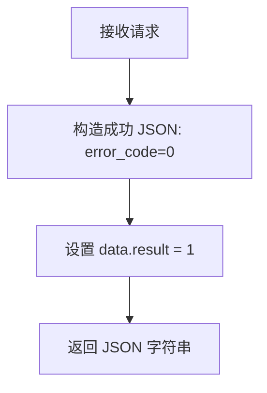

# service-TestResult — 测试结果解析接口（ApiServlet）

> 分支：syy.release.z7.8.1.0
> 源文件：`src/main/java/cn/testin/service/fs/TestResult.java`
> 基础类：`cn.testin.service.GenericBaseService`
> 机制：请求走 `ApiServlet /openapi` 入口，通过 `action=fs` + `op=TestResult.方法名` 路由到此类的对应 public 方法；每个方法的参数包含 `HttpServletRequest` + `ApiRequest`，返回 JSON 字符串。
> - **action**: `fs`（对应包 `cn.testin.service.fs`）
> - **入口格式**：`{"op": "TestResult.方法名", "action": "fs", "data": {...}}`
> 业务：测试结果文件解析（当前为桩实现，直接返回成功）。

## op 列表总表

| # | op | 方法名 | 说明 |
|---|---|---|---|
| 1 | TestResult.parse | parse | 测试结果解析（桩实现，始终返回 result=1） |

---

## 1. op=TestResult.parse — 测试结果解析

### 请求格式
```json
{"op": "TestResult.parse", "action": "fs", "data": {}}
```

### 参数

无必填参数。方法签名中声明了 `HttpServletRequest request` 参数（用于可能的流式读取），但当前实现未使用任何参数。

### 核心逻辑

当前为**桩实现（Stub）**，不做任何实际业务处理，直接返回成功：
1. 调用 `ApiUtil.getJSONobj()` 构造成功响应。
2. 设置 `result=1`。
3. 直接返回。



**完整实现代码：**

```java
public String parse(HttpServletRequest request, ApiRequest apirequest) throws Exception {
    JSONObject jObj = ApiUtil.getJSONobj(apirequest,
            CommonCode.success.getValue(), CommonCode.success.getDescr());

    Map<String, Object> datamap = new HashMap<>();
    datamap.put(ApiResponse.RES_RESULT, 1);
    jObj.put(ApiResponse.RES_DATA, datamap);

    return jObj.toString();
}
```

### 响应

```json
{
  "error_code": 0,
  "msg": "success",
  "data": {
    "result": 1
  }
}
```

**返回参数**

| 字段 | 类型 | 说明 |
|---|---|---|
| action | String | 回显请求 action（fs） |
| op | String | 回显请求 op（TestResult.parse） |
| code | Integer | 状态码，0 成功 |
| msg | String | 提示信息 |
| data | JSONObject | 业务数据 |
| data.result | Integer | 桩实现固定返回 1 |

---

### 涉及表

- 无任何数据库表操作。当前实现为桩，不涉及任何数据持久化或外部服务调用。

### 说明

`TestResult.parse` 是一个预留接口，计划用于解析测试结果文件（如 JUnit XML 报告、自动化测试日志等）。当前实现为桩，不读取请求参数、不解析文件内容、不调用下游服务。方法签名中保留了 `HttpServletRequest` 参数以支持后续扩展为流式读取文件内容。
