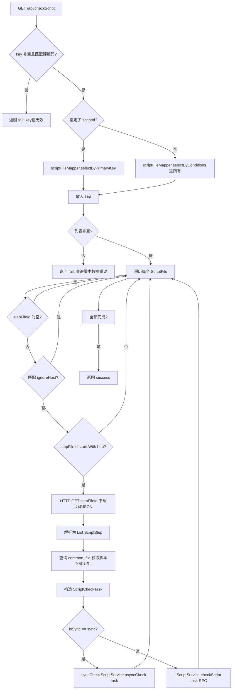
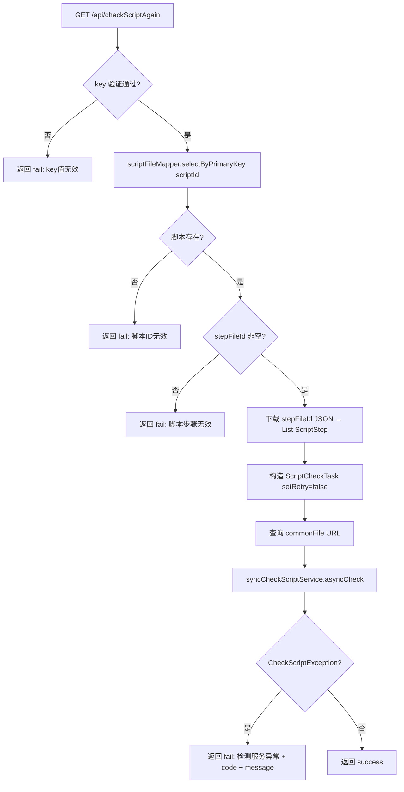

# ApiController -- 脚本校验工具（内部）

> 分支：syy.release.z7.8.1.0
> 源文件：`src/main/java/cn/testin/filecloud/web/controller/ApiController.java`
> 类级路由：`/api`
> 业务：内部运维工具接口，用于批量校验历史脚本、重新校验单个脚本、获取脚本检查结果。通过硬编码 key 做简单鉴权。

## 接口列表总表

| 方法 | 路径 | 方法名 | 说明 |
|---|---|---|---|
| GET | `/api/checkScript` | checkScript | 批量校验历史脚本（增量或全量） |
| GET | `/api/checkScriptAgain` | checkScriptAgain | 重新校验指定单个脚本 |
| POST | `/api/getScriptCheckResult` | getScriptCheckResult | 获取脚本校验结果 |

统一响应包装：`RespMsg<T>`。

---

## 1. GET /api/checkScript -- 批量校验脚本

### 入口

`ApiController.checkScript()` -- ApiController.java

### 请求参数

| 字段 | 类型 | 必填 | 说明 |
|---|---|---|---|
| key | String | 是 | 鉴权 key，必须为 `fa568093e6354882a534dbce946c9d53` |
| checkType | String | 否 | 校验类型，默认 "append"（增量） |
| isSync | String | 否 | 是否同步执行，默认 "sync"（同步校验） |
| scriptId | Integer | 否 | 指定脚本 ID（仅校验单个脚本，为空则校验所有） |
| ignoreHost | String | 否 | 忽略的域名/主机（跳过该域名的脚本文件） |

### 响应结构

成功：
```json
{
  "code": 0,
  "msg": "success"
}
```

失败：
```json
{
  "code": <非0>,
  "msg": "<错误描述>"
}
```

### 实现意图

1. 校验 key 是否匹配硬编码 `fa568093e6354882a534dbce946c9d53`。
2. 若指定 `scriptId`，仅查询该脚本；否则通过 `scriptFileMapper.selectByConditions(param)` 查所有脚本。
3. 遍历脚本列表：
   - 跳过 `stepFileId` 为空的脚本。
   - 跳过 `ignoreHost` 匹配的脚本（域名过滤）。
   - 跳过 stepFileId 不以 "http" 开头的脚本。
   - 通过 HTTP 请求下载 `stepFileId` 中的步骤 JSON（`listScriptSteps`）。
   - 构造 `ScriptCheckTask` 对象。
   - 若 `isSync == "sync"`：调用 `syncCheckScriptService.asyncCheck(task)` 同步校验。
   - 否则：通过 `IScriptService.checkScript(task)` RPC 调用远程校验服务。
4. 不等待全部完成，以遍历方式逐个提交。

### mermaid流程图



### 调用链

```
ApiController.checkScript
├─ scriptFileMapper.selectByConditions / selectByPrimaryKey
├─ listScriptSteps(stepFileId)
│  ├─ HttpUtils.get(stepFileId) → 下载步骤 JSON
│  └─ JSONObject.parseArray → List<ScriptStep>
├─ commonFileMapper.selectByPrimaryKey(scriptFile.getFileid)
├─ syncCheckScriptService.asyncCheck(task) [sync模式]
│  └─ 同步执行校验逻辑
└─ IScriptService.checkScript(task) [async模式]
   └─ RPC 远程调用校验服务
```

### 涉及表

| 表 | 操作 |
|---|---|
| `script_file` | SELECT（查询待校验脚本） |
| `common_file` | SELECT（获取脚本文件 URL） |

### 异常

| 条件 | 返回信息 |
|---|---|
| key 为空或错误 | "key值无效" |
| 查询不到脚本数据 | "查询脚本数据错误" |

---

## 2. GET /api/checkScriptAgain -- 重新校验指定脚本

### 入口

`ApiController.checkScriptAgain()` -- ApiController.java

### 请求参数

| 字段 | 类型 | 必填 | 说明 |
|---|---|---|---|
| key | String | 是 | 鉴权 key |
| scriptId | Integer | 是 | 要重新校验的脚本 ID |
| ignoreHost | String | 否 | 忽略的域名 |

### 响应结构

成功返回 `RespMsg.success()`；失败返回错误描述。

### 实现意图

与 `checkScript` 类似，但：
- 仅校验单个 `scriptId`（必填）。
- `ScriptCheckTask.setRetry(false)` -- 不重试，只校验一次。
- 校验 `stepFileId` 非空。
- 仅使用 `syncCheckScriptService.asyncCheck(task)` 同步方式。
- 捕获 `CheckScriptException` 并返回错误详情。

### mermaid流程图



### 调用链

```
ApiController.checkScriptAgain
├─ scriptFileMapper.selectByPrimaryKey(scriptId)
├─ listScriptSteps(stepFileId)
│  ├─ HttpUtils.get(stepFileId)
│  └─ JSONObject.parseArray → List<ScriptStep>
├─ commonFileMapper.selectByPrimaryKey(scriptFile.getFileid)
└─ syncCheckScriptService.asyncCheck(task)
```

### 涉及表

| 表 | 操作 |
|---|---|
| `script_file` | SELECT（按 scriptId） |
| `common_file` | SELECT（按 fileid 查 URL） |

### 异常

| 条件 | 返回信息 |
|---|---|
| key 为空或错误 | "key值无效" |
| scriptId 查不到 | "脚本ID无效" |
| stepFileId 为空 | "脚本步骤无效" |
| CheckScriptException（校验服务异常） | "检测服务异常,code:X,message:Y" |

---

## 3. POST /api/getScriptCheckResult -- 获取校验结果

### 入口

`ApiController.getScriptCheckResult()` -- ApiController.java

### 请求参数

| 字段 | 类型 | 必填 | 说明 |
|---|---|---|---|
| key | String | 是 | 鉴权 key |
| scriptid | Integer | 是 | 脚本 ID |

### 响应结构

成功：
```json
{
  "code": 200,
  "msg": "成功",
  "data": [<ScriptCheck列表>]
}
```

失败：
```json
{
  "code": 500,
  "msg": "<错误描述>"
}
```

> **代码未确认/注意**：当前实现（`ApiController.checkScript(String key, Integer scriptid)`）仅设置了 `code` 和 `msg`，查询到的 `List<ScriptCheck> check` 并未赋值给响应 `data` 字段，因此实际返回中 `data` 恒为 `null`（示例中的 `data` 列表为预期结构，代码未落地）。

**返回参数（`data` 若按 `ScriptCheck` 列表返回时的单条字段）**

| 字段 | 类型 | 说明 |
|---|---|---|
| code | Integer | 状态码，200 成功 / 500 失败 |
| msg | String | 提示信息（"成功"/"key无效"/"没有检测到结果"） |
| data | JSONArray | 脚本校验结果列表（当前实现恒为 null） |
| data[].id | Integer | 记录主键 |
| data[].scriptId | Integer | 脚本 ID |
| data[].scriptNo | Integer | 脚本编号 |
| data[].scriptCreateDesc | String | 脚本创建描述 |
| data[].checkStatus | Integer | 检查状态 |
| data[].checkContent | String | 检查内容 |
| data[].checkTime | Long | 检查时间戳 |

### 实现意图

1. 校验 key。
2. `scriptCheckMapper.selectByScriptId(scriptid)` 查询校验结果记录。
3. 返回结果列表或"没有检测到结果"。

### 调用链

```
ApiController.getScriptCheckResult
└─ scriptCheckMapper.selectByScriptId(scriptid)
```

### 涉及表

| 表 | 操作 |
|---|---|
| `script_check` | SELECT（按 scriptid 查校验结果） |

### 异常

| 条件 | 错误码 |
|---|---|
| key 错误 | 500 "key无效" |
| 无校验结果 | 500 "没有检测到结果" |

### 代码摘录

```java
@Controller
@RequestMapping("/api")
public class ApiController {
    @Autowired
    private SyncCheckScriptService syncCheckScriptService;
    @Autowired
    private ScriptFileMapper scriptFileMapper;
    @Autowired
    private CommonFileMapper commonFileMapper;
    @Autowired
    private ScriptCheckMapper scriptCheckMapper;

    // GET /api/checkScript
    @RequestMapping(value = "/checkScript")
    @ResponseBody
    public RespMsg<String> checkScript(
            @RequestParam String key,
            @RequestParam(defaultValue = "append") String checkType,
            @RequestParam(defaultValue = "sync") String isSync,
            @RequestParam(required = false) Integer scriptId,
            @RequestParam(required = false) String ignoreHost) {
        String authKey = "fa568093e6354882a534dbce946c9d53";
        if (!authKey.equalsIgnoreCase(key)) {
            return RespMsg.fail("key值无效");
        }
        // 查询所有脚本 或 指定脚本
        List<ScriptFile> allScript = scriptFileMapper.selectByConditions(param);
        for (ScriptFile scriptFile : allScript) {
            if (scriptFile == null || StringUtils.isBlank(scriptFile.getStepFileId()))
                continue;
            if (ignoreHost不为空且匹配 || !stepFileId.startsWith("http"))
                continue;
            List<ScriptStep> steps = listScriptSteps(scriptFile.getStepFileId());
            ScriptCheckTask task = new ScriptCheckTask();
            task.setScriptFile(scriptFile);
            // 查询 commonFile URL 并设置...
            task.setSteps(steps);
            if ("sync".equals(isSync)) {
                syncCheckScriptService.asyncCheck(task);
            } else {
                IScriptService iScriptService = SpringHelper.getBean(IScriptService.class);
                iScriptService.checkScript(task, "ApiController.checkScript");
            }
        }
        return RespMsg.success();
    }

    // 下载并解析步骤JSON
    private List<ScriptStep> listScriptSteps(String stepFileId) {
        String stepJsonConent = HttpUtils.get(stepFileId);
        if (!StringUtils.isBlank(stepJsonConent)) {
            return JSONObject.parseArray(stepJsonConent, ScriptStep.class);
        }
        return Lists.newArrayList();
    }
}
```

---

## 备注

- 硬编码鉴权 key `fa568093e6354882a534dbce946c9d53`，不依赖数据库或 Redis。
- `checkScript` 支持全部扫描模式（scriptId 为空），可校验历史所有脚本。
- `checkScriptAgain` 与 `checkScript` 的关键区别：setRetry(false)、仅同步模式、抛 CheckScriptException。
- `isSync` 参数控制校验方式：sync 模式走 `syncCheckScriptService.asyncCheck`（本地同步），非 sync 走 `IScriptService`（RPC 远程异步）。
- `ignoreHost` 用于私有云/开发环境隔离，避免校验无法访问的脚本文件。

相关文档：[ScriptV3Controller](../脚本管理/ScriptV3Controller.md) [HeartBeatController](HeartBeatController.md)
