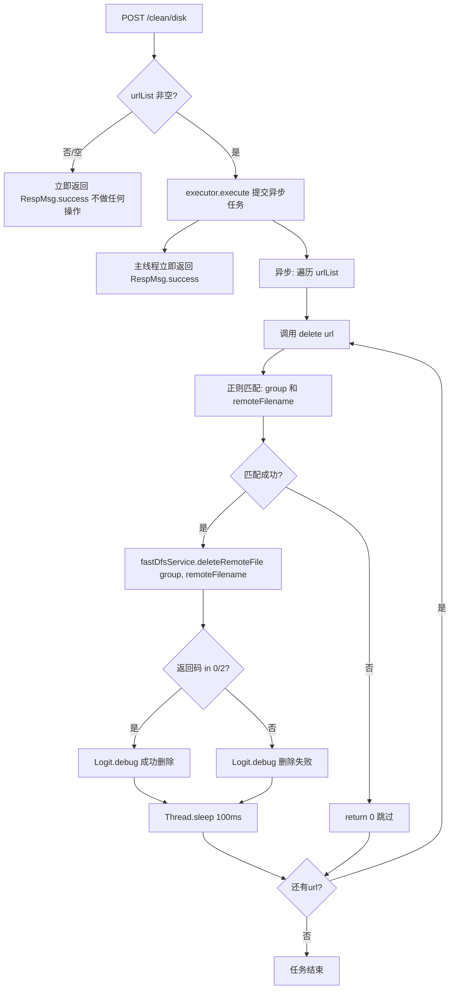

# CleanResultController -- 清理 FastDFS 文件

> 分支：syy.release.z7.8.1.0
> 源文件：`src/main/java/cn/testin/filecloud/web/controller/CleanResultController.java`
> 类级路由：`/clean`
> 业务：接收文件 URL 列表，异步批量删除 FastDFS 上的远程文件。通过正则解析 URL 提取 group 和 remoteFilename，调用 FastDFSService 执行物理删除。

## 接口列表总表

| 方法 | 路径 | 方法名 | 说明 |
|---|---|---|---|
| POST | `/clean/disk` | cleanDisk | 异步批量删除 FastDFS 文件 |

统一响应包装：`RespMsg<String>`。

---

## 1. POST /clean/disk -- 清理 FastDFS 文件

### 入口

`CleanResultController.cleanDisk()` -- CleanResultController.java

### 请求参数

`@RequestBody List<String> urlList`：FastDFS 文件 URL 列表（JSON 数组）。

示例请求体：
```json
["http://storage.example.com/group1/M00/00/01/xxx.txt", ...]
```

### 响应结构

成功（立即返回，删除异步执行）：
```json
{
  "code": 0,
  "msg": "success"
}
```

> ⚠️ **待复核**：本类用 `RespMsg` 包装，`RespMsg.success()` 的 code 实为 200（`fail()` 为 500），此处示例 `code:0` 疑似笔误。

### 实现意图

1. 校验 urlList 非空。
2. 提交到线程池 `executor`（`cleanTaskExecutes`）异步执行。
3. 异步任务遍历 urlList，逐条调用 `delete(url)`：
   - 正则 `.*(group[\d]+)/(.*).*$` 匹配 URL，提取 group 和 remoteFilename。
   - 调用 `fastDfsService.deleteRemoteFile(group, remoteFilename)` 删除。
   - 返回码在 `DEL_IGNORE_CODE = {0, 2}` 中视为成功（0=删除成功，2=文件不存在）。
   - 每删除一个文件后 `Thread.sleep(100)` 避免打满 FastDFS。
4. 主线程立即返回 success。

### mermaid流程图



### 调用链

```
CleanResultController.cleanDisk
├─ executor.execute(异步任务)
│  └─ for each url:
│     ├─ remote_file_url_pattern.matcher(url)
│     │  └─ 正则: .*(group[\d]+)/(.*).*$
│     ├─ fastDfsService.deleteRemoteFile(group, remoteFilename)
│     │  └─ FastDFS 客户端 API 删除
│     ├─ ArrayUtils.contains(DEL_IGNORE_CODE, code)
│     └─ Thread.sleep(100)
└─ RespMsg.success() (立即返回)
```

### 涉及表

无直接数据库操作（仅 FastDFS 物理删除）。FastDFS 返回码：
- 0：删除成功
- 2：文件不存在

### 异常

| 条件 | 行为 |
|---|---|
| urlList 为 null 或空 | 不做任何操作，直接返回 success |
| URL 正则不匹配 | 跳过该 URL（return 0） |
| FastDFS 删除返回非预期码 | 日志记录"删除远程文件失败" |
| IOException | 被异步任务 catch，打印堆栈 |
| InterruptedException | 被异步任务 catch，打印堆栈 |

### 代码摘录

```java
@Controller
@RequestMapping("/clean")
public class CleanResultController {
    static Pattern remote_file_url_pattern =
        Pattern.compile(".*(group[\\d]+)\\/(.*).*$");
    static int[] DEL_IGNORE_CODE = {0, 2}; // 0:删除成功, 2:文件不存在

    @Resource(name = "cleanTaskExecutes")
    private Executor executor;
    private final FastDFSService fastDfsService =
        SpringHelper.getBean(FastDFSService.class);

    @RequestMapping(value = "/disk", method = RequestMethod.POST)
    @ResponseBody
    public RespMsg<String> cleanDisk(@RequestBody List<String> urlList) {
        if (urlList != null && !urlList.isEmpty()) {
            executor.execute(() -> {
                for (String url : urlList) {
                    try {
                        delete(url);
                        Thread.sleep(100);
                    } catch (IOException | InterruptedException e) {
                        e.printStackTrace();
                    }
                }
            });
        }
        return RespMsg.success();
    }

    public int delete(String url) throws IOException {
        Matcher matcher = remote_file_url_pattern.matcher(url);
        if (matcher.find()) {
            String group = matcher.group(1);
            String remoteFilename = matcher.group(2);
            int code = fastDfsService.deleteRemoteFile(group, remoteFilename);
            if (ArrayUtils.contains(DEL_IGNORE_CODE, code)) {
                Logit.debug("成功->已经删除{}", url);
                return 1;
            } else {
                Logit.debug("删除远程文件失败,URL:{}", url);
            }
        }
        return 0;
    }
}
```

---

## 备注

- 无鉴权控制，应为内部运维接口。
- 异步执行，接口立即返回不等待删除完成，适合批量清理场景。
- `Thread.sleep(100)` 为简单限流，避免瞬时大量删除请求打满 FastDFS 服务。
- URL 正则 `.*(group[\d]+)/(.*).*$` 匹配标准 FastDFS URL 格式（`group1/M00/00/01/filename.ext`）。
- 返回码 0（删除成功）和 2（文件不存在）均视为成功，避免因文件已被删除而报错。
- `cleanTaskExecutes` Bean 来自 Spring 配置，需确保线程池合理配置。

相关文档：[OperationController](../文件上传/OperationController.md)
