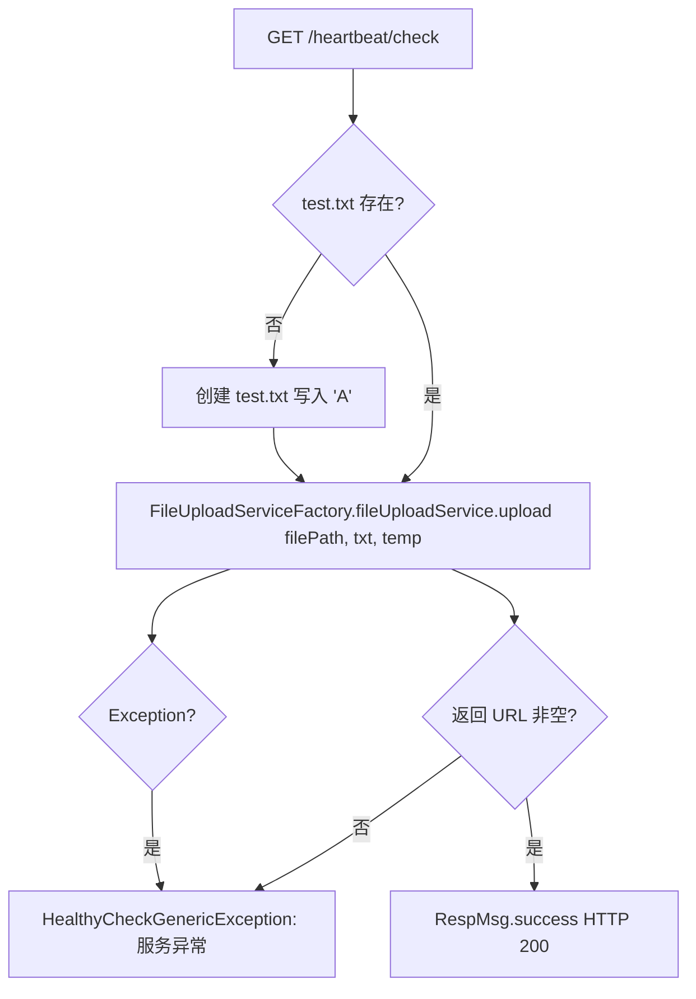

# HeartBeatController -- 健康检查

> 分支：syy.release.z7.8.1.0
> 源文件：`src/main/java/cn/testin/filecloud/web/controller/HeartBeatController.java`
> 类级路由：无（根路由为 `/heartbeat/check`）
> 业务：服务健康检查探针。创建一个测试文件并上传到文件存储服务（FastDFS），验证文件上传链路正常，供负载均衡 / K8s 探活使用。

## 接口列表总表

| 方法 | 路径 | 方法名 | 说明 |
|---|---|---|---|
| GET | `/heartbeat/check` | uploadyByUrl | 文件上传链路健康检查 |

统一响应包装：`RespMsg<String>`；成功返回 `RespMsg.success()`，失败抛出 `HealthyCheckGenericException` 由 Spring 全局异常处理器转 HTTP 500。

---

## 1. GET /heartbeat/check -- 健康检查

### 入口

`HeartBeatController.uploadyByUrl()` -- HeartBeatController.java

### 请求参数

无。

### 响应结构

- 成功：`RespMsg.success()`，HTTP 200。
- 失败：抛出 `HealthyCheckGenericException("1", "服务异常")`，由 `@ExceptionHandler` 拦截返回 500。

### 实现意图

1. 定义文件路径 `test.txt`，若文件不存在则创建并写入内容 `"A"`。
2. 调用 `FileUploadServiceFactory.fileUploadService.upload(filePath, "txt", "temp")` 将 test.txt 上传到文件存储服务。
3. 检查返回的 URL 是否为空：空则抛出 `HealthyCheckGenericException("1", "服务异常")`。
4. 任何异常均包装为 `HealthyCheckGenericException("1", "服务异常")` 抛出。

### mermaid流程图



### 调用链

```
HeartBeatController.uploadyByUrl
├─ Files.exists(Paths.get("test.txt"))
├─ Files.write(path, Collections.singleton("A"))  [if not exists]
├─ FileUploadServiceFactory.fileUploadService.upload("test.txt", "txt", "temp")
│  └─ [底层文件上传 → FastDFS → 返回 URL]
└─ StringUtils.isBlank(url) → HealthyCheckGenericException
```

### 涉及表

无直接数据库读写。但 `fileUploadService.upload` 内部可能写入 `common_file` 表（视具体实现而定）。

### 异常

| 条件 | 异常 |
|---|---|
| 上传返回 URL 为空 | HealthyCheckGenericException("1", "服务异常") |
| 任何 Exception（IO 异常等） | HealthyCheckGenericException("1", "服务异常") |

### 代码摘录

```java
@Controller
public class HeartBeatController extends GenericFileProcess {

    @RequestMapping(value = "/heartbeat/check", method = RequestMethod.GET)
    @ResponseBody
    public RespMsg<String> uploadyByUrl(HttpServletRequest request,
                                         HttpServletResponse response) throws Exception {
        RespMsg<String> respMsg = RespMsg.success();
        try {
            String filePath = "test.txt";
            Path path = Paths.get(filePath);
            if (!Files.exists(path)) {
                String contentToWrite = "A";
                Files.write(path, Collections.singleton(contentToWrite));
            }
            String url = FileUploadServiceFactory.fileUploadService
                .upload(filePath, "txt", "temp");
            if (StringUtils.isBlank(url)) {
                throw new HealthyCheckGenericException("1", "服务异常");
            }
        } catch (Exception e) {
            Logit.errorLog(e.getMessage(), e);
            throw new HealthyCheckGenericException("1", "服务异常");
        }
        return respMsg;
    }

    @Override
    protected FResult<String> uploadToHD(UploadFileRequest uploadRequest,
            String saveTempFileDirectory, HttpServletRequest request,
            Short fileSource) {
        return null; // 不适用于健康检查场景
    }
}
```

---

## 备注

- 本接口为纯探活端点，无鉴权、无操作日志、无事务。
- 继承 `GenericFileProcess` 但实际不使用其处理器链逻辑，仅为了类结构统一（`uploadToHD` 返回 null）。
- 验证的是完整的文件上传链路：本地上传 -> 文件服务 -> 存储层，而非简单的 TCP 端口检测。
- 测试文件 `test.txt` 内容为单个字符 "A"，最小化存储开销。
- 测试文件不会被健康检查接口自动清理，会保留在工作目录下供下次检查复用。

相关文档：[00-分支索引](00-分支索引.md)
