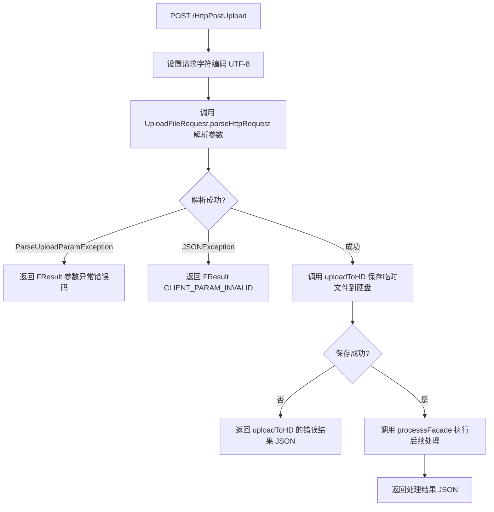

# HttpStreamUpload — HTTP 流式上传（原始 Servlet）

> 分支：syy.release.z7.8.1.0
> 源文件：`src/main/java/cn/testin/filecloud/web/servlet/HttpStreamUpload.java`
> 父类：`cn.testin.filecloud.core.GenericFileProcess`
> Servlet 映射：`/HttpPostUpload`（web.xml `<url-pattern>/HttpPostUpload</url-pattern>`）
> 业务：兼容旧版上传方式——客户端通过 HTTP Connection 直接向服务端写文件输入流的方式上传文件。非标准的 multipart/form-data，而是纯二进制流 + Header 参数。

## 端点

| 方法 | 路径 | 说明 |
|---|---|---|
| POST | `/HttpPostUpload` | 接收 HTTP 流式上传请求，解析 Header 参数，保存临时文件，处理后返回 |

## 请求处理流程

### 请求格式

客户端通过建立 HTTP URLConnection，在请求头中携带上传参数（`uploadParam` 等），Body 中直接写入文件的二进制流（非 `multipart/form-data` 的 `file` 域方式）。

**请求头参数：**
- `uploadParam`：JSON 格式的上传参数（包括过期时间、文件类型等）
- 其他标准上传参数见 `UploadFileRequest.parseHttpRequest()`

**参数（`UploadFileRequest.parseHttpRequest(request)` 解析）：**

| 字段 | 类型 | 必填 | 说明 |
|---|---|---|---|
| UPLOAD-JSON（请求头） | String | 是 | 上传参数 JSON（`UploadFileParam.HEADER_UPLOAD_JSON`），非空、不超过协议栈大小、URLEncoded 合法 JSON |
| uploadJSON.suffix | String | 否 | 文件后缀（`optString`，为空时置空串；若开启 `limitSuffix` 则须在支持列表内） |
| uploadJSON.filename | String | 否 | 下载时保存的文件名 |
| Body | 二进制流 | 是 | 文件二进制内容（通过 `getInputStream` 读取写入临时文件） |

### 处理流程



### 核心方法

**doPost 方法：**

```java
protected void doPost(HttpServletRequest request, HttpServletResponse response)
        throws ServletException, IOException {
    request.setCharacterEncoding("UTF-8");
    UploadFileRequest uploadRequest;
    try {
        // 公共基础参数校验
        uploadRequest = UploadFileRequest.parseHttpRequest(request);
    } catch (ParseUploadParamException e) {
        ServletUtil.responseOutWithJson(response,
            JSON.toJSONString(FResult.newFailure(e.getCode(), e.getMessage())));
        return;
    } catch (JSONException e) {
        ServletUtil.responseOutWithJson(response,
            JSON.toJSONString(FResult.newFailure(HttpResponseCode.CLIENT_PARAM_INVALID, e.getMessage())));
        return;
    }
    // 上传到硬盘
    FResult<String> uploadToHDResult = uploadToHD(uploadRequest,
        getTemporaryFileFolderPath(), request, null);
    if (!uploadToHDResult.success()) {
        ServletUtil.responseOutWithJson(response, JSON.toJSONString(uploadToHDResult));
        return;
    }
    // processFacade 中的 uploadJson 属性是 http 请求的 json 参数
    ServletUtil.responseOutWithJson(response,
        processsFacade(request, response, uploadRequest));
}
```

**uploadToHD 重写：**
```java
@Override
protected FResult<String> uploadToHD(UploadFileRequest uploadRequest,
        String saveTempFileDirectory, HttpServletRequest request, Short fileSource) {
    return super.transferServletRequestStreamToHD(uploadRequest,
        saveTempFileDirectory, request);
}
```

### 处理步骤详解

1. **参数解析（`UploadFileRequest.parseHttpRequest`）**
   - 从 HTTP Header 中提取上传参数（如 `uploadParam`）
   - 校验公共基础参数合法性
   - 构造 `UploadFileRequest` 对象

2. **保存临时文件（`uploadToHD` -> `transferServletRequestStreamToHD`）**
   - 从 `HttpServletRequest.getInputStream()` 读取请求体中的二进制文件流
   - 写入服务端临时目录（由 `getTemporaryFileFolderPath()` 指定）

3. **后续处理（`processsFacade`）**
   - 父类 `GenericFileProcess` 提供的方法
   - 根据 `uploadJson` 中的参数执行文件转存、业务处理等操作
   - 返回最终的下载 URL

### 涉及表

- 无直接数据库表操作。文件通过 `GenericFileProcess` 父类处理链最终上传到 FastDFS 文件存储。
- `UploadFileRequest`：封装上传请求参数的对象（项目 ID、文件类型、过期时间、JSON 参数等）。

### 与 OpenUpload 的区别

| 特性 | HttpStreamUpload | OpenUpload |
|---|---|---|
| URL 映射 | `/HttpPostUpload` | `/OpenUpload` |
| 鉴权 | 无 | 需要 SID 认证 + 项目组权限校验 |
| 用途 | 兼容旧版代码的通用上传 | 面向已登录用户的开放上传接口 |
| 父类 | GenericFileProcess | GenericFileProcess |

### 辅助类

- `GenericFileProcess`（`cn.testin.filecloud.core.GenericFileProcess`）：文件处理基类，提供 `uploadToHD()`、`processsFacade()`、`transferServletRequestStreamToHD()` 等模板方法。
- `UploadFileRequest`（`cn.testin.filecloud.core.UploadFileRequest`）：上传请求模型，封装 HTTP 请求中的上传参数。
- `FResult`（`cn.testin.filecloud.common.http.FResult`）：统一结果封装（成功/失败）。
- `HttpResponseCode`（`cn.testin.filecloud.common.http.HttpResponseCode`）：HTTP 错误码常量（如 `CLIENT_PARAM_INVALID`、`SERVER_ERROR`）。
