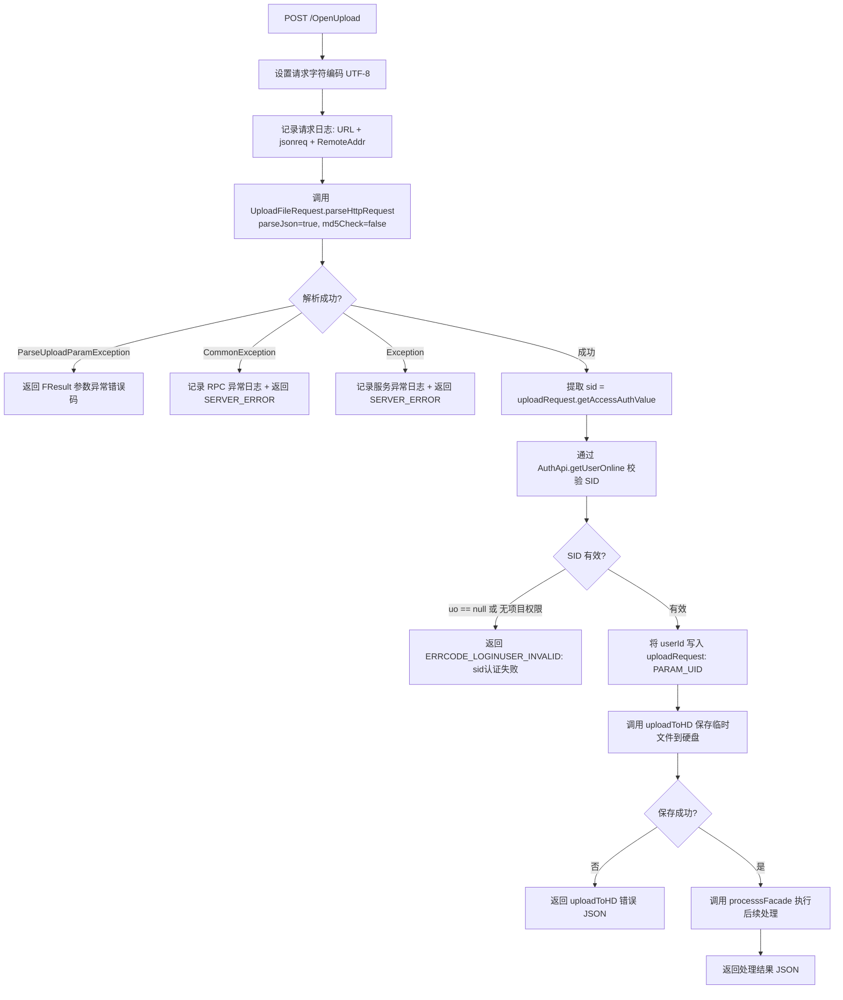

# OpenUpload — 开放上传接口（原始 Servlet）

> 分支：syy.release.z7.8.1.0
> 源文件：`src/main/java/cn/testin/filecloud/web/servlet/OpenUpload.java`
> 父类：`cn.testin.filecloud.core.GenericFileProcess`
> Servlet 映射：`/OpenUpload`（web.xml `<url-pattern>/OpenUpload</url-pattern>`）
> 业务：面向已登录用户的开放上传接口。与 [HttpStreamUpload](HttpStreamUpload.md) 类似，通过 HTTP 流式上传文件，但增加了 SID 认证和项目组权限校验。

## 端点

| 方法 | 路径 | 说明 |
|---|---|---|
| POST | `/OpenUpload` | 接收需要身份认证的 HTTP 流式上传请求 |

## 请求处理流程

### 请求格式

客户端通过 HTTP Connection 发送请求，Header 中携带：
- `uploadParam`（通过 `UploadFileParam.HEADER_UPLOAD_JSON` 常量指定）：JSON 格式的上传参数，含 `sid`（会话令牌）、`projectId` 等
- Body 中为文件二进制流

**参数（`UploadFileRequest.parseHttpRequest(request, true, false)` 解析）：**

| 字段 | 类型 | 必填 | 说明 |
|---|---|---|---|
| UPLOAD-JSON（请求头） | String | 是 | 上传参数 JSON（`UploadFileParam.HEADER_UPLOAD_JSON`），非空、不超过协议栈大小、URLEncoded 合法 JSON |
| uploadJSON.sid / uploadJSON.token | String | 是 | 登录会话标识（`needSid=true`，`getAccessAuthValue` 校验，二者任取其一，空则返回 `缺少认证参数:sid`） |
| uploadJSON.projectId | Integer | 否 | 项目组 ID（`optInt`，无显式校验，但用于 `groupCheck` 项目权限校验，缺失会鉴权失败） |
| uploadJSON.suffix | String | 否 | 文件后缀（`optString`，为空时置空串；若开启 `limitSuffix` 则须在支持列表内） |
| uploadJSON.filename | String | 否 | 下载时保存的文件名 |
| Body | 二进制流 | 是 | 文件二进制内容（通过 `getInputStream` 读取写入临时文件） |

### 处理流程



### 核心方法

**doPost 方法关键部分：**

```java
protected void doPost(HttpServletRequest request, HttpServletResponse response)
        throws ServletException, IOException {
    request.setCharacterEncoding("UTF-8");
    UploadFileRequest uploadRequest;
    try {
        Logit.messageLog("URL:/OpenUpload, jsonreq:"
            + request.getHeader(UploadFileParam.HEADER_UPLOAD_JSON)
            + "from:" + request.getRemoteAddr());
        // 公共基础参数校验（parseJson=true, md5Check=false）
        uploadRequest = UploadFileRequest.parseHttpRequest(request, true, false);
        // 验证登陆信息是否有效
        String sid = uploadRequest.getAccessAuthValue();
        AuthApi authApi = super.getBean(AuthApi.class);
        UserOnline uo = authApi.getUserOnline(sid);
        if (uo == null || authApi.groupCheck(uploadRequest.getProjectId(), uo.getUserid())) {
            ServletUtil.responseOutWithJson(response,
                JSON.toJSONString(FResult.newFailure(
                    HttpResponseCode.ERRCODE_LOGINUSER_INVALID, "sid认证失败")));
            return;
        } else {
            uploadRequest.putJsonValue(UploadFileParam.PARAM_UID, uo.getUserid());
        }
    } catch (ParseUploadParamException e) {
        ServletUtil.responseOutWithJson(response,
            JSON.toJSONString(FResult.newFailure(e.getCode(), e.getMessage())));
        return;
    } catch (CommonException commonException) {
        Logit.error("服务发生RPC异常", commonException);
        ServletUtil.responseOutWithJson(response,
            JSON.toJSONString(FResult.newFailure(HttpResponseCode.SERVER_ERROR,
                commonException.getMessage())));
        return;
    } catch (Exception serverException) {
        Logit.error("服务异常", serverException);
        ServletUtil.responseOutWithJson(response,
            JSON.toJSONString(FResult.newFailure(HttpResponseCode.SERVER_ERROR,
                "服务异常,请求稍后再试")));
        return;
    }
    // 上传到硬盘
    FResult<String> uploadToHDResult = uploadToHD(uploadRequest,
        getTemporaryFileFolderPath(), request, null);
    if (!uploadToHDResult.success()) {
        ServletUtil.responseOutWithJson(response, JSON.toJSONString(uploadToHDResult));
        return;
    }
    ServletUtil.responseOutWithJson(response,
        processsFacade(request, response, uploadRequest));
}
```

### 处理步骤详解

1. **参数解析（`UploadFileRequest.parseHttpRequest(request, true, false)`）**
   - `parseJson=true`：要求解析 JSON 参数
   - `md5Check=false`：不强制校验文件 MD5
   - 从 Header 中读取 `uploadParam` 等参数

2. **身份认证**
   - 从 `UploadFileRequest` 获取 `sid`（通过 `getAccessAuthValue()`）
   - 调用 `AuthApi.getUserOnline(sid)` 从会话中心查询在线用户信息（`UserOnline` 对象，含 `userid`）
   - 调用 `AuthApi.groupCheck(projectId, userId)` 校验用户对该项目组的访问权限
   - 认证失败返回 `ERRCODE_LOGINUSER_INVALID` 错误

3. **保存临时文件（`uploadToHD`）**
   - 同 [HttpStreamUpload](HttpStreamUpload.md)，从 `HttpServletRequest.getInputStream()` 读取流并写入临时目录

4. **后续处理（`processsFacade`）**
   - 父类 `GenericFileProcess` 的后处理流程

### 涉及表

- **用户在线信息表**：通过 `AuthApi.getUserOnline(sid)` RPC 查询，通常关联 `db_user_online` 或 Redis 会话数据。
- **项目组权限表**：通过 `AuthApi.groupCheck(projectId, userId)` RPC 校验，通常关联 `db_user_project_role` 或 `db_project`。
- 文件本身不直接操作数据库，通过 `GenericFileProcess` 最终上传到 FastDFS。

### 异常处理

| 异常类型 | HTTP 错误码 | 说明 |
|---|---|---|
| `ParseUploadParamException` | `e.getCode()` | 参数校验失败 |
| `CommonException` | `SERVER_ERROR` | RPC 调用异常（如 AuthApi 调用失败） |
| `Exception`（其他） | `SERVER_ERROR` | 通用服务异常，提示"请求稍后再试" |

### 与 HttpStreamUpload 的区别

| 特性 | OpenUpload | HttpStreamUpload |
|---|---|---|
| URL | `/OpenUpload` | `/HttpPostUpload` |
| SID 鉴权 | 是（必选） | 否 |
| 项目权限校验 | 是（groupCheck） | 否 |
| parseJson 参数 | `true`（强制解析 JSON） | 默认 `false` |
| md5Check | `false` | 默认行为 |
| 用户信息注入 | 将 userId 写入 uploadRequest | 无 |

### 辅助类

- `GenericFileProcess`（`cn.testin.filecloud.core.GenericFileProcess`）：文件处理基类。
- `UploadFileRequest`（`cn.testin.filecloud.core.UploadFileRequest`）：上传请求模型。
- `UploadFileParam`（`cn.testin.filecloud.core.UploadFileParam`）：上传参数常量（`HEADER_UPLOAD_JSON`、`PARAM_UID` 等）。
- `AuthApi`（`cn.testin.filecloud.core.support.auth.AuthApi`）：认证 API，提供 `getUserOnline(sid)` 和 `groupCheck(projectId, userId)` 方法。
- `UserOnline`（`cn.testin.filecloud.core.support.bean.UserOnline`）：在线用户 Bean，含 `userid`。
- `FResult` / `HttpResponseCode`：统一结果封装。
