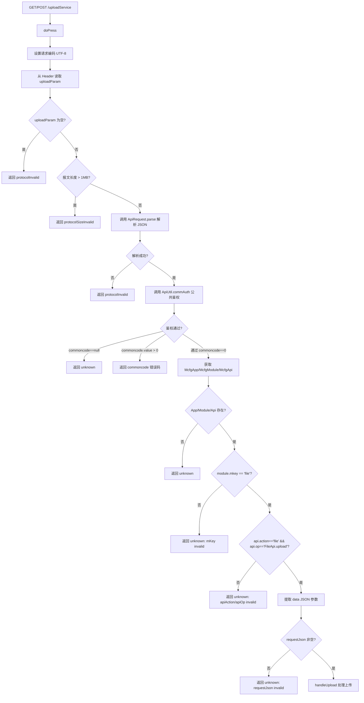
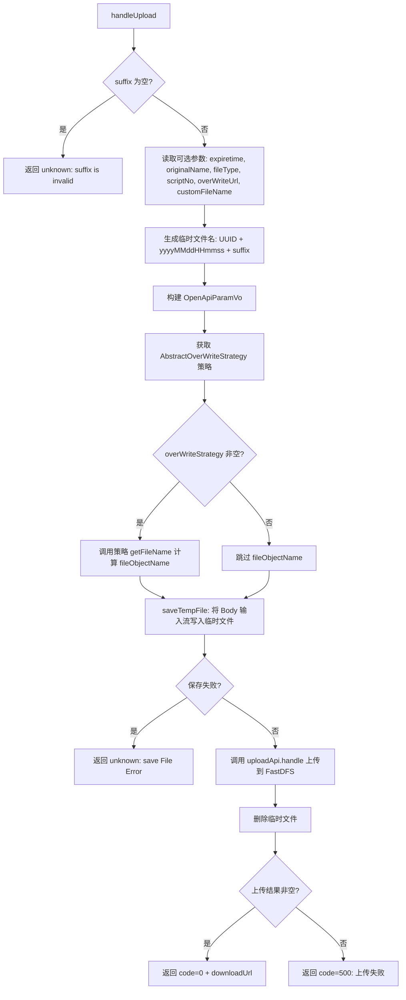

# UploadService — Open API 上传服务（原始 Servlet）

> 分支：syy.release.z7.8.1.0
> 源文件：`src/main/java/cn/testin/filecloud/web/servlet/UploadService.java`
> 父类：`javax.servlet.http.HttpServlet`（直接继承，非 GenericFileProcess）
> Servlet 映射：`/uploadService`（web.xml `<url-pattern>/uploadService</url-pattern>`）
> 业务：面向 Open API 的上传服务，替代 proxy-openapi 模块中的上传功能。支持完整的 Open API 鉴权流程（App/Module/Api 三层配置校验）。文件通过 FastDFS 上传服务存储。

## 端点

| 方法 | 路径 | 说明 |
|---|---|---|
| GET | `/uploadService` | 委托给 `doPress()` 处理（与 POST 逻辑相同） |
| POST | `/uploadService` | 委托给 `doPress()` 处理 |

## 请求处理流程

### 请求格式

- HTTP Header `uploadParam`：JSON 格式的完整请求协议（包含 Open API 标准鉴权参数 + 上传业务参数）
- Body：文件二进制流，通过 `InputStream` 读取

**uploadParam JSON 示例：**
```json
{
  "data": {
    "suffix": "apk",
    "expiretime": -1,
    "originalName": "app.apk",
    "fileType": "android",
    "scriptNo": 123,
    "overWriteUrl": "",
    "customFileName": ""
  }
}
```

> `uploadParam` 中还包含 Open API 的标准鉴权字段（appkey、timestamp、sign 等），由 `ApiUtil.commAuth()` 校验。

### 处理流程



**handleUpload 子流程：**



### 核心方法

**doPress 入口 — 多层校验链路：**

```java
public void doPress(HttpServletRequest request, HttpServletResponse response)
        throws ServletException, IOException {
    // 1. 读取 Header uploadParam
    String jsonreq = request.getHeader("uploadParam");
    // 2. 校验报文非空 + 长度限制 1MB
    if (StringUtils.isBlank(jsonreq)) { return protocolInvalid; }
    if (jsonreq.length() > PROTOCOL_MAXSIZE) { return protocolSizeInvalid; }
    // 3. 解析 JSON 为 ApiRequest
    ApiRequest jsonrequest = ApiRequest.parse(jsonreq, true);
    if (jsonrequest == null) { return protocolInvalid; }
    // 4. Open API 公共鉴权
    CommonCode commoncode = ApiUtil.commAuth(request, jsonrequest);
    if (commoncode == null || commoncode.getValue() > 0) { return error; }
    // 5. 获取配置
    McfgApp app = (McfgApp) request.getAttribute(ApiUtil.ATTRIBUTE_APP_KEY);
    McfgModule module = (McfgModule) request.getAttribute(ApiUtil.ATTRIBUTE_MODULE_KEY);
    McfgApi api = (McfgApi) request.getAttribute(ApiUtil.ATTRIBUTE_API_KEY);
    if (app == null || module == null || api == null) { return unknown; }
    // 6. 模块校验: mkey == "file"
    if (!"file".equalsIgnoreCase(module.getMkey())) { return unknown; }
    // 7. API 校验: action="file" && op="FileApi.upload"
    if (!api.getApiAction().equalsIgnoreCase("file")
            || !api.getApiOp().equalsIgnoreCase("FileApi.upload")) { return unknown; }
    // 8. 提取 data
    jsonrequest.setReqjson(requestJsonClone.getJSONObject("data"));
    // 9. 处理上传
    handleUpload(request, response, watch, jsonreq, jsonrequest, requestJson);
}
```

**handleUpload 核心逻辑：**

```java
private void handleUpload(...) throws GeneralException {
    // 文件后缀必填
    String suffix = requestJson.getString("suffix");
    // 过期时间: 默认 -1 永久有效
    Long expireTime = requestJson.isNull("expiretime") ? -1 : requestJson.getLong("expiretime");
    // 自定义文件名解码（URLDecode 后处理后缀拼接）
    String customFileNameDecode = getCustomFileNameDecode(requestJson, suffix);
    // 生成唯一临时文件名: requestId_yyyyMMddHHmmss.suffix
    final String temporaryFileName = requestId + "_"
            + DateFormatUtils.format(new Date(), "yyyyMMddHHmmss") + "." + suffix;
    // 构建参数 VO
    OpenApiParamVo paramVo = new OpenApiParamVo();
    // 覆盖策略处理（目前仅 script/report 类型有效）
    AbstractOverWriteStrategy overWriteStrategy = AbstractOverWriteStrategy.getOverWriteStrategy(fileType);
    if (overWriteStrategy != null) {
        String fileObjectName = overWriteStrategy.getFileName(suffix, fileType, scriptNo,
                overWriteUrl, uploadTempFilePath, customFileNameDecode);
        if (StringUtils.isNotBlank(fileObjectName)) {
            paramVo.setFileObjectName(fileObjectName);
        }
    }
    // 保存临时文件
    if (saveTempFile(request, response, watch, jsonreq, jsonrequest, uploadTempFilePath)) return;
    // 上传到 FastDFS
    String downloadUrl = uploadApi.handle(paramVo.getFullName(), paramVo.getSuffix(),
            paramVo.getExpiretime(), BizCode.simple.getCode(), paramVo.getFileType(),
            paramVo.getFileObjectName());
    FileUtil.deleteFile(uploadTempFilePath);
    // 返回结果
}
```

### 参数

| 字段 | 类型 | 必填 | 说明 |
|---|---|---|---|
| suffix | String | 是 | 文件扩展名（不含点），`isNull` 后为 null 直接返回 `suffix is invalid` |
| expiretime | Long | 否 | 文件过期时间（秒），默认 -1 表示永久有效 |
| originalName | String | 否 | 原始文件名（`isNull ? null : getString`） |
| fileType | String | 否 | 文件归属类型，用于区分业务场景（如 `"script"`、`"report"`、`"android"`），默认空串 |
| scriptNo | Integer | 否 | 脚本号（步骤截图文件路径需要拼入 scriptNo），默认 -1 |
| overWriteUrl | String | 否 | 需要覆盖的文件 URL（上位机上传步骤截图时传递，表示用新文件替换此 URL 的内容），默认空串 |
| customFileName | String | 否 | 自定义文件名（URL 编码），解码后若缺少后缀则自动拼接 suffix，默认空串 |

### 响应

**成功：**
```json
{
  "code": 0,
  "msg": "成功",
  "data": {
    "downloadUrl": "http://fdfs-host/group1/M00/00/01/xxx.apk"
  }
}
```

**失败：**
```json
{
  "code": 500,
  "msg": "上传失败，上传结果为空"
}
```

### 涉及表

- **Open API 配置表**：通过 `ApiUtil.commAuth()` 查询 `McfgApp`（应用配置）、`McfgModule`（模块配置）、`McfgApi`（API 接口配置），对应表可能为 `mcfg_app`、`mcfg_module`、`mcfg_api` 或 Redis 缓存。
- **文件存储**：通过 `cn.testin.filecloud.core.UploadService.handle()` 上传到 FastDFS，可能涉及 `db_file_record` 或类似文件元数据表。
- 无直接数据库写操作；`saveTempFile()` 将文件流存入本地临时目录 `Config.TEMP_DIR_PATH`。

### 鉴权流程

1. **commAuth**：校验 `uploadParam` 中的 appkey、timestamp、sign 等 Open API 标准鉴权参数。
2. **App 校验**：确认 App 已配置且状态有效。
3. **Module 校验**：确认该 App 下 `mkey=file` 的模块已启用。
4. **API 校验**：确认 `action=file`、`op=FileApi.upload` 的接口已配置。

### 覆盖策略（AbstractOverWriteStrategy）

当 `fileType` 为 `script` 或 `report` 时，`AbstractOverWriteStrategy.getOverWriteStrategy(fileType)` 返回对应的覆盖策略实现，用于计算 `fileObjectName`（FastDFS 中的目标文件名）。其他 `fileType` 返回 null，使用服务端默认的命名策略。

### 辅助类

- `cn.testin.filecloud.core.UploadService`：核心上传服务，通过 `SpringHelper.getBean()` 单例注入。
- `OpenApiParamVo`（`cn.testin.filecloud.web.vo.OpenApiParamVo`）：上传参数 VO，含 `expiretime`、`fullName`、`newName`、`originalName`、`fileType`、`fileObjectName`、`downloadUrl`。
- `AbstractOverWriteStrategy`（`cn.testin.strategy.AbstractOverWriteStrategy`）：文件覆盖策略抽象类。
- `McfgApp` / `McfgModule` / `McfgApi`（`cn.testin.filecloud.openapi.bean`）：Open API 配置模型。
- `ApiUtil`（`cn.testin.filecloud.openapi.ApiUtil`）：Open API 工具类，提供 `commAuth()` 鉴权、`response()` 响应输出。
- `BizCode`（`cn.testin.filecloud.common.enums.BizCode`）：业务编码枚举，此处使用 `BizCode.simple`。
- `FileUtil`（`cn.testin.filecloud.common.util.FileUtil`）：文件工具类，`deleteFile()` 清理临时文件。
- `LogHelper`：带 RequestId 的结构化日志记录器。
