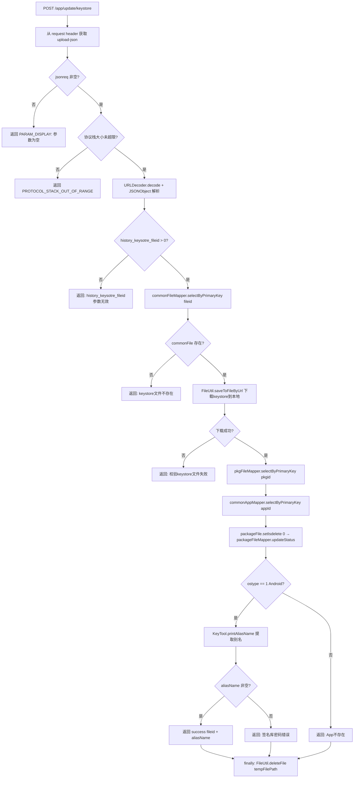

# AppController -- 签名 KeyStore 更新

> 分支：syy.release.z7.8.1.0
> 源文件：`src/main/java/cn/testin/filecloud/web/controller/AppController.java`
> 类级路由：`/app`
> 业务：更新 Android APP 的 KeyStore 签名文件，通过请求头 `upload-json` 协议传参。从已有 keystore 文件的存储 URL 下载到本地，用 keytool 命令提取别名信息校验密码正确性。

## 接口列表总表

| 方法 | 路径 | 方法名 | 说明 |
|---|---|---|---|
| POST | `/app/update/keystore` | updateKeystore | 更新 APP KeyStore 签名文件 |

统一响应包装：`FResult<T>`。

---

## 1. POST /app/update/keystore -- 更新签名

### 入口

`AppController.updateKeystore()` -- AppController.java

### 请求参数

请求头 `upload-json`（URLEncoded JSON）：

| 字段 | 类型 | 必填 | 说明 |
|---|---|---|---|
| history_keysotre_fileid | Long | 是 | 历史 KeyStore 文件 ID（common_file 主键），`optLong` 后校验 `<=0` 无效 |
| pkgid | Integer | 否 | 包 ID（package_file 主键），代码未做空值校验，缺失会导致后续 NPE |
| ostype | Integer | 否 | 操作系统类型（1=Android），代码未做空值校验 |
| storePass | String | 否 | KeyStore 密码，仅 `ostype==1` 时用于 keytool 提取别名；代码未做空值校验 |

### 响应结构

成功（仅 Android/ostype=1 才会返回别名）：
```json
{
  "code": 0,
  "data": "{\"fileid\": <fileid>, \"alias\": \"<aliasName>\"}",
  "msg": "成功"
}
```

失败：
```json
{
  "code": <错误码>,
  "data": null,
  "msg": "<错误描述>"
}
```

### 实现意图

1. 从请求头 `upload-json` 解析 JSON 参数（校验参数非空、协议栈大小）。
2. 根据 `history_keysotre_fileid` 查询 `common_file` 表获取 keystore 的下载 URL。
3. 从 URL 下载 keystore 文件到本地临时目录。
4. 根据 `pkgid` 查询 `package_file` 获取 appId，再查 `common_app` 获取应用信息。
5. 将 `package_file.isdelete` 重置为 0（恢复删除状态）。
6. 若 `ostype == 1`（Android），调用 `KeyTool.printAliasName(tempFilePath, storePass)` 执行 keytool 命令提取别名。
7. 校验密码正确性（aliasName 非空则密码正确），返回 fileid + alias。
8. finally 块清理本地临时 keystore 文件。

### mermaid流程图



### 调用链

```
AppController.updateKeystore
├─ request.getHeader("upload-json")
├─ URLDecoder.decode(jsonreq, "UTF-8")
├─ new JSONObject(jsonreq)
├─ commonFileMapper.selectByPrimaryKey(historyKeyStoreFileid) → common_file
├─ FileUtil.saveToFileByUrl(downloadUrl, saveTempKeyStorePath)
│  └─ HTTP 下载 + FileOutputStream 写入本地
├─ packageFileMapper.selectByPrimaryKey(pkgId) → package_file
├─ commonAppMapper.selectByPrimaryKey(appId) → common_app
├─ packageFileMapper.updateStatus → package_file
├─ KeyTool.printAliasName(tempPath, storePass)  [if ostype==1]
│  └─ 调用 keytool 命令提取签名别名
└─ finally: FileUtil.deleteFile(saveTempKeyStorePath)
```

### 涉及表

| 表 | 操作 |
|---|---|
| `common_file` | SELECT（按 fileid 查下载 URL） |
| `package_file` | SELECT（按 pkgid）+ UPDATE（isdelete=0） |
| `common_app` | SELECT（按 appid） |

### 异常

| 条件 | 错误码/信息 |
|---|---|
| upload-json 为空 | 201 "UPLOAD-JSON参数内容为空" |
| 协议栈超限 | 210 "UPLOAD-JSON参数内容超过协议栈大小" |
| URLDecode 失败 | 206 "UPLOAD-JSON参数无效" |
| JSON 解析失败 | 206 "参数内容不是一个JSON对象格式" |
| history_keysotre_fileid <= 0 | 206 "history_keysotre_fileid参数无效" |
| keystore 文件不存在 | 204 "keystore文件不存在" |
| 下载 keystore 失败 | 502 "校验keystore文件失败" |
| aliasName 为空（密码错误） | 206 "签名库密码错误" |
| ostype != 1 或 commonApp == null | 204 "App不存在" |

---

## 备注

- 此接口是少数不继承 `GenericFileProcess` 的 controller 之一，独立实现。
- 通过请求头 `upload-json` 传参（非请求体），与其他接口的 Form/Query 参数方式不同。
- 参数名 `history_keysotre_fileid` 有拼写错误（应为 keystore）。
- `KeyTool.printAliasName` 依赖系统 keytool 命令，要求 JVM 运行环境安装 JDK 且系统语言为 `en_US.UTF-8`。
- 将 `isdelete` 重置为 0 意味着即使包之前被逻辑删除，更新签名时也会恢复。

相关文档：[FileUploadController](FileUploadController.md)
