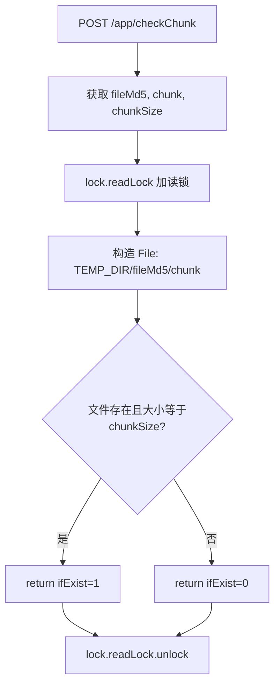
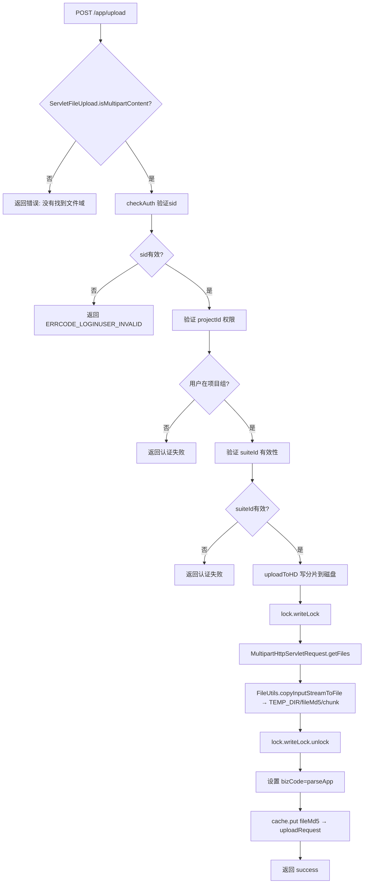
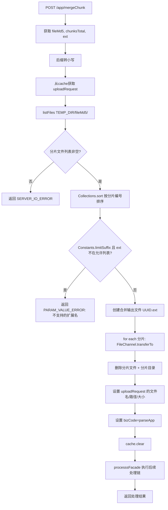

# AppUploadController -- APP 分片上传（断点续传）

> 分支：syy.release.z7.8.1.0
> 源文件：`src/main/java/cn/testin/filecloud/web/controller/AppUploadController.java`
> 类级路由：`/app`
> 业务：重写的 APP 上传方式，支持大文件分片上传与合并。客户端先调用 checkChunk 检查分片是否已存在，再逐片上传，最后调用 mergeChunk 合并。同时校验 sid 登录态、projectId 权限、suiteId 有效性。

## 接口列表总表

| 方法 | 路径 | 方法名 | 说明 |
|---|---|---|---|
| POST | `/app/checkChunk` | checkChunk | 检查分片是否已上传完成 |
| POST | `/app/upload` | uploadApp | 上传单个分片 |
| POST | `/app/mergeChunk` | mergeChunk | 合并所有分片并进入上传后续流程 |

统一响应包装：`FResult<T>` 或 `FResult<JSONObject>`；成功 code=0。

---

## 1. POST /app/checkChunk -- 检查分片

### 入口

`AppUploadController.checkChunk()` -- AppUploadController.java

### 请求参数

| 字段 | 类型 | 必填 | 说明 |
|---|---|---|---|
| fileMd5 | String | 是 | 完整文件的 MD5 值，作为分片目录名 |
| chunk | String | 是 | 当前分片编号（索引） |
| chunkSize | String | 是 | 期望分片大小（字节） |

### 响应结构

```json
{
  "code": 0,
  "data": { "ifExist": 1 },
  "msg": "成功"
}
```

`ifExist`：1 表示分片已上传完成（文件存在且大小匹配），0 表示未上传或未完成。

### 实现意图

1. 在临时目录 `{TEMP_DIR}/{fileMd5}/{chunk}` 查找分片文件。
2. 检查文件是否存在且大小与 `chunkSize` 一致。
3. 使用 `ReadWriteLock.readLock()` 保证并发检查的线程安全。

### mermaid流程图



### 调用链

```
AppUploadController.checkChunk
├─ request.getParameter("fileMd5")
├─ request.getParameter("chunk")
├─ request.getParameter("chunkSize")
├─ new File(getTemporaryFileFolderPath + / + fileMd5 + / + chunk)
└─ checkFile.exists() && checkFile.length() == Integer.parseInt(chunkSize)
```

### 涉及表

无数据库操作。

### 异常

| 条件 | 行为 |
|---|---|
| 目录不存在或文件不存在 | 返回 ifExist=0，不视为错误 |
| 其他 Exception | catch 日志后继续返回原 JSONObject（ifExist 默认为 0） |

---

## 2. POST /app/upload -- 分片上传

### 入口

`AppUploadController.uploadApp()` -- AppUploadController.java

### 请求参数

| 字段 | 类型 | 必填 | 说明 |
|---|---|---|---|
| public_access_auth | boolean | 否 | 是否登录鉴权，默认 true |
| file | MultipartFile | 是 | 当前分片的文件体（Form file 域） |
| fileMd5 | String | 是 | 完整文件的 MD5 值 |
| chunk | String | 是 | 当前分片编号 |
| upload-json | String | 是 | URLEncoded JSON，含 sid/projectid/suiteId 等 |

`upload-json` 关键字段：

| 字段 | 类型 | 必填 | 说明 |
|---|---|---|---|
| sid | String | 是 | 登录会话 ID（`public_access_auth` 默认 true 时鉴权必需） |
| projectid | Integer | 是 | 项目组 ID |
| suiteId | Integer | 是 | 应用套件 ID |
| suffix | String | 是 | 文件扩展名 |

### 响应结构

```json
{
  "code": 0,
  "data": { "originalFilename": "apk" },
  "msg": "成功"
}
```

### 实现意图

1. 检查是否是 `multipart/form-data` 请求。
2. `checkAuth(request, public_access_auth)` 验证 sid 有效性、projectId 权限（用户是否在该项目组）、suiteId 有效性。
3. 通过 `writeLock` 加写锁，用 `FileUtils.copyInputStreamToFile` 将分片写入 `{TEMP_DIR}/{fileMd5}/{chunk}`。
4. 设置 bizCode 为 `BizCode.parseApp`（3），并将 uploadRequest 缓存到 `cache` Map 中供 mergeChunk 使用。

### mermaid流程图



### 调用链

```
AppUploadController.uploadApp
├─ ServletFileUpload.isMultipartContent(request)
├─ checkAuth(request, public_access_auth)
│  ├─ UploadFileRequest.parseFormRequest
│  ├─ AuthApi.getUserOnline(sid)
│  ├─ AuthApi.myProjects(eid, userId) → 校验 projectId
│  └─ 校验 suiteId
└─ uploadToHD(uploadRequest, saveTempFileDirectory, request, fileMd5)
   ├─ lock.writeLock
   ├─ MultipartHttpServletRequest.getFiles("file")
   ├─ new File(saveTempFileDirectory/fileMd5).mkdir
   ├─ FileUtils.copyInputStreamToFile → chunkFile
   └─ lock.writeLock.unlock
```

### 涉及表

`checkAuth` 中 `AuthApi.myProjects` 和 `AuthApi.getUserOnline` 为远程 RPC 调用；无直接本地数据库操作。

### 异常

| 条件 | 错误码 |
|---|---|
| 非 Multipart 请求 | 206 "没有找到文件域" |
| sid 无效 | 10014 "验证登陆信息认证失败" |
| projectId < 1 或用户不属于项目组 | 10014 |
| suiteId 无效或为空 | 10014 |
| IO 异常（写分片文件） | 501 "解析上传文件IO异常" |

---

## 3. POST /app/mergeChunk -- 合并分片

### 入口

`AppUploadController.mergeChunk()` -- AppUploadController.java

### 请求参数

| 字段 | 类型 | 必填 | 说明 |
|---|---|---|---|
| fileMd5 | String | 是 | 完整文件 MD5 |
| chunksTotal | String | 是 | 总分片数（用于日志） |
| ext | String | 是 | 合并后文件的扩展名 |

### 响应结构

成功返回 `processsFacade` 的结果（处理器链输出），同 [FileUploadController](FileUploadController.md)。

### 实现意图

1. 从 `cache` Map 取出 uploadRequest。
2. 列出 `{TEMP_DIR}/{fileMd5}/` 下所有分片文件，按分片编号排序。
3. 检查后缀名是否在 `Constants.getSupportFileSuffix()` 允许列表中。
4. 用 `FileChannel.transferTo` 按顺序将所有分片合并为一个文件。
5. 逐个删除分片文件，再删除分片目录。
6. 设置合并后文件路径，调用 `processsFacade()` 进入后续上传处理器链。
7. 清除 `cache`。

### mermaid流程图



### 调用链

```
AppUploadController.mergeChunk
├─ cache.get(fileMd5)
├─ tempFile.listFiles → 分片列表
├─ Collections.sort(fileList, chunkComparator)
├─ Constants.limitSuffix / Constants.getSupportFileSuffix → 后缀校验
├─ new FileOutputStream → FileChannel
│  └─ for each chunk: inChannel.transferTo → outChannel
├─ file.delete (逐个分片) + tempFile.delete (目录)
├─ uploadRequest.setOriginalFilename / setTemporaryFilePath / setTemporaryFileSize
├─ cache.clear
└─ processsFacade(request, response, uploadRequest)
   ├─ FileUtil.md5
   ├─ FileProcessFactory.getObject → List<FileUploadProcessor>
   └─ [processor chain execution]
```

### 涉及表

与 `processsFacade` 处理器链绑定的表，典型为 `common_file`、`package_file`。

### 异常

| 条件 | 错误码 |
|---|---|
| 临时目录中没有分片文件 | 501 "上传文件失败" |
| 不支持的扩展名 | 204 "不支持的扩展名" |
| 合并文件 IO 异常 | catch 日志，不直接返回错误（但后续可能因文件不存在而失败） |
| 处理器链异常 | RollbackTransactionException → 事务回滚 |

### 代码摘录（分片排序与合并核心）

```java
// 按分片编号排序
Collections.sort(fileList, new Comparator<File>() {
    @Override
    public int compare(File o1, File o2) {
        if (Integer.parseInt(o1.getName()) < Integer.parseInt(o2.getName())) return -1;
        return 1;
    }
});

// 合并文件
String fileName = UUID.randomUUID().toString() + "." + ext;
File outputFile = new File(getTemporaryFileFolderPath() + File.separator + fileName);
try (FileChannel outChnnel = new FileOutputStream(outputFile).getChannel()) {
    for (File file : fileList) {
        try (FileChannel inChannel = new FileInputStream(file).getChannel()) {
            inChannel.transferTo(0, inChannel.size(), outChnnel);
        }
        file.delete(); // 合并后删除分片
    }
}
```

---

## 备注

- 使用 `ReadWriteLock` 保证分片检查（读）与写入（写）的线程安全。
- 分片文件缓存在 `cache` Map（`fileMd5 -> uploadRequest`）中，mergeChunk 完成后清除。
- `checkAuth` 除了 sid 认证，还校验 projectId（用户是否属于该项目组）和 suiteId 有效性。
- 与 [FileUploadController](FileUploadController.md) 的区别在于支持大文件分片和断点续传，通过 checkChunk 避免重复上传已有分片。

相关文档：[FileUploadController](FileUploadController.md) [AppV3Controller](AppV3Controller.md)
