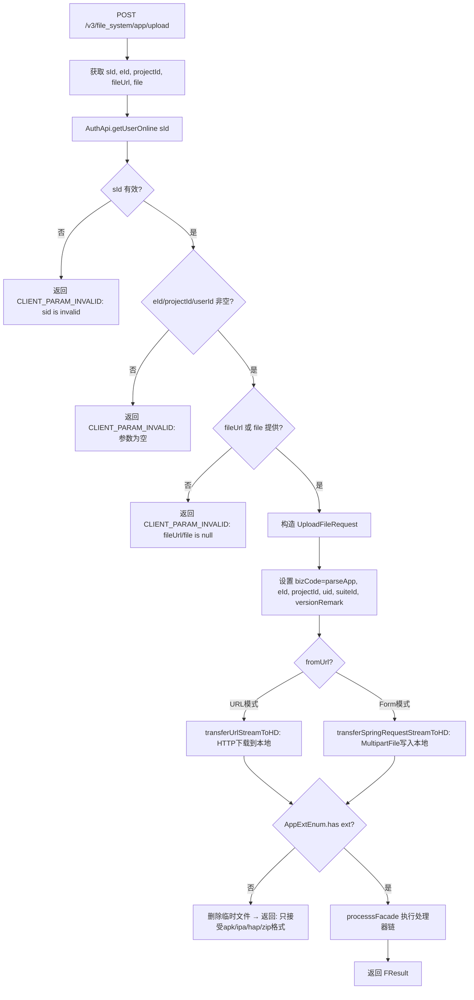

# AppV3Controller -- V3 APP 上传（Form / URL 双模式）

> 分支：syy.release.z7.8.1.0
> 源文件：`src/main/java/cn/testin/filecloud/web/controller/v3/AppV3Controller.java`
> 类级路由：`/file_system`
> 完整路径前缀：web.xml 中 dispatcher 映射 `/openapi/v3/*`，本文接口路径按规范以 `/v3` 前缀记录
> 业务：V3 版本的 APP 上传接口，支持两种来源——multipart Form 直接上传和 URL 远程下载。通过 sid 鉴权，校验 eId/projectId/userId，限制仅接受 apk/ipa/hap/zip 格式。

## 接口列表总表

| 方法 | 路径 | 方法名 | 说明 |
|---|---|---|---|
| POST | `/v3/file_system/app/upload` | uploadApp | V3 APP 上传（支持 Form + URL） |

统一响应包装：`FResult<T>`。

---

## 1. POST /v3/file_system/app/upload -- V3 APP 上传

### 入口

`AppV3Controller.uploadApp()` -- AppV3Controller.java

### 请求参数

| 字段 | 类型 | 必填 | 说明 |
|---|---|---|---|
| sId | String | 是 | 登录会话标识 |
| eId | String | 是 | 企业 ID |
| projectId | String | 是 | 项目组 ID |
| suiteId | String | 否 | 应用套件 ID |
| versionRemark | String | 否 | 版本备注 |
| fileUrl | String | 否 | 远程文件 URL（与 Form file 二选一） |
| file | MultipartFile | 否 | 上传文件体（与 fileUrl 二选一） |

### 响应结构

```json
{
  "code": 0,
  "data": <处理器链返回>,
  "msg": "成功"
}
```

### 实现意图

1. 接收并校验参数 `eId`、`projectId`、`sId` 是否为空。
2. `AuthApi.getUserOnline(sId)` 校验 sid 有效性，获取 userId。
3. 必须提供 `fileUrl` 或 Form file 文件之一。
4. 构造 `UploadFileRequest`，设置 bizCode=`parseApp`(3)，标记来源 from="/V3"。
5. 调用 `uploadToHD()`：
   - 若有 fileUrl：走 `transferUrlStreamToHD`（HTTP 远程下载到本地临时文件）。
   - 若为 Form file：走 `transferSpringRequestStreamToHD`（MultipartFile 写入本地临时文件）。
6. 校验扩展名是否在 `AppExtEnum`（apk/ipa/hap/zip）范围内，不匹配则删除临时文件并返回错误。
7. 调用父类 `processsFacade()` 进入处理器链。

### mermaid流程图



### 调用链

```
AppV3Controller.uploadApp
├─ AuthApi.getUserOnline(sId)
├─ new UploadFileRequest + 参数设置
├─ uploadToHD(uploadRequest, tempDir, request, fileSource)
│  ├─ [FORM] transferSpringRequestStreamToHD
│  │  ├─ MultipartHttpServletRequest.getFileMap
│  │  └─ FileUtils.copyInputStreamToFile
│  └─ [URL] transferUrlStreamToHD
│     ├─ getExtFromUrl(fileUrl)
│     └─ FileUtil.saveToFileByUrl(fileUrl, fileFullPath)
├─ AppExtEnum.has(extName) → 后缀校验
├─ FileUtil.deleteFile (后缀不匹配时)
└─ processsFacade(request, response, uploadRequest)
   ├─ FileUtil.md5
   ├─ FileProcessFactory.getObject → processors
   └─ processor.process
```

### 涉及表

处理器链内部操作的表，典型包括：

| 表 | 操作 |
|---|---|
| `common_file` | INSERT 文件记录 |
| `package_file` | INSERT/UPDATE 包记录 |
| 其他业务表 | 视 bizCode=parseApp 对应的处理器逻辑 |

### 异常

| 条件 | 错误码 |
|---|---|
| sId 无效或 userOnline 为空 | 206 "sid is invalid!" |
| eId/projectId/userId 空 | 206 "eId、projectId、userId is null!" |
| fileUrl 和 Form file 均为空 | 206 "fileUrl、file is null!" |
| 扩展名不在 apk/ipa/hap/zip | 206 "该接口只接受apk,ipa,hap,zip格式的文件" |
| URL 下载失败 | 206 "上传失败"（transferUrlStreamToHD） |
| Form 文件写入失败 | 501 "Save temp file failed" |
| 处理器链异常 | RollbackTransactionException → 回滚并返回错误码 |

### 代码摘录

```java
@Controller
@RequestMapping("/file_system")
public class AppV3Controller extends GenericFileProcess {

    @RequestMapping(value = "/app/upload", method = RequestMethod.POST)
    @ResponseBody
    public FResult<?> uploadApp(HttpServletRequest request, HttpServletResponse response) {
        UploadFileRequest uploadRequest = new UploadFileRequest();
        // ... 参数获取与校验 ...
        boolean fromUrl = StringUtils.isNotBlank(fileUrl);
        uploadRequest.setUploadJSON(new JSONObject());
        uploadRequest.putJsonValue(UploadFileParam.PARAM_BIZCODE, BizCode.parseApp.getCode());
        // ... 设置 eid, projectid, uid, suiteId, versionRemark ...

        result = uploadToHD(uploadRequest,
            getTemporaryFileFolderPath() + File.separator +
            UUID.randomUUID().toString().replaceAll("-", ""),
            request,
            fromUrl ? FileSourceEnum.URL.getCode() : FileSourceEnum.FORM.getCode());

        if (!result.success()) return result;

        if (!AppExtEnum.has(uploadRequest.getOriginalExtName())) {
            FileUtil.deleteFile(uploadRequest.getTemporaryFilePath());
            return FResult.newFailure(HttpResponseCode.CLIENT_PARAM_INVALID,
                "该接口只接受" + AppExtEnum.toEnumString() + "格式的文件");
        }

        return super.processsFacade(request, response, uploadRequest);
    }

    @Override
    protected FResult<String> uploadToHD(UploadFileRequest uploadRequest,
            String saveTempFileDirectory, HttpServletRequest request, Short fileSource) {
        if (Objects.equals(fileSource, FileSourceEnum.FORM.getCode())) {
            return super.transferSpringRequestStreamToHD(uploadRequest, saveTempFileDirectory, request);
        }
        return super.transferUrlStreamToHD(uploadRequest, saveTempFileDirectory,
            request.getParameter("fileUrl"));
    }
}
```

---

## 备注

- 支持 `FileSourceEnum.URL`（1）和 `FileSourceEnum.FORM`（2）两种模式，通过 `uploadToHD` 内部的 `fileSource` 参数分发。
- V3 版本新需求：以显式参数（eId/projectId/sId）代替 upload-json JSON 协议，简化客户端调用。
- 临时文件目录使用 `UUID` 作为子目录名，避免冲突。
- 后缀校验在 `uploadToHD` 之后、`processsFacade` 之前执行，不匹配时主动清理临时文件。
- 与 [AppUploadController](AppUploadController.md) 的不同：V3 不采用分片机制，适合中小文件单次上传；额外支持 ZIP 扩展名（鸿蒙 next 包含 hsp/hap 文件的 zip）。

相关文档：[FileUploadController](FileUploadController.md) [AppUploadController](AppUploadController.md) [FileUploadV3Controller](FileUploadV3Controller.md)
