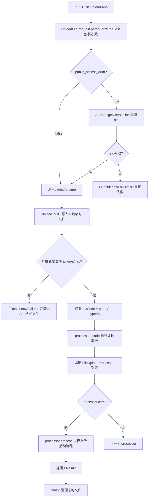

# FileUploadController -- APP 文件上传（Form 表单方式）

> 分支：syy.release.z7.8.1.0
> 源文件：`src/main/java/cn/testin/filecloud/web/controller/FileUploadController.java`
> 类级路由：`/file`
> 业务：接收 Form 表单上传的 APP 文件（apk/ipa/hap），通过 sid 鉴权后，经 GenericFileProcess 的处理器链完成落盘、存储、记录。

## 接口列表总表

| 方法 | 路径 | 方法名 | 说明 |
|---|---|---|---|
| POST | `/file/upload-app` | uploadApp | APP 文件上传 |

统一响应包装：`FResult<T>`；成功返回 `FResult.newSuccess(data)`（code=0），失败返回 `FResult.newFailure(code, message)`。

---

## 1. POST /file/upload-app -- APP 文件上传

### 入口

`FileUploadController.uploadApp()` -- FileUploadController.java

### 请求参数

| 字段 | 类型 | 必填 | 说明 |
|---|---|---|---|
| `public_access_auth` | boolean | 否 | 是否开启登录鉴权，默认 `true` |
| file | MultipartFile | 是 | 上传的文件体（Form file 域） |
| upload-json | String | 是 | URLEncoded JSON 字符串，包含 sid、suffix、projectid 等元数据 |

`upload-json` JSON 字段说明（部分关键字段）：

| 字段 | 类型 | 必填 | 说明 |
|---|---|---|---|
| sid | String | 是 | 登录会话标识（`public_access_auth` 默认 true 时鉴权必需） |
| suffix | String | 是 | 文件扩展名 |
| projectid | Integer | 否 | 项目组 ID |
| uid | Integer | 否 | 用户 ID（鉴权成功时自动注入） |
| eid | Integer | 否 | 企业 ID（鉴权成功时自动注入） |
| uname | String | 否 | 用户名（鉴权成功时自动注入） |

### 响应结构

成功：
```json
{
  "code": 0,
  "data": <处理器链返回的结果对象>,
  "msg": "成功"
}
```

失败：
```json
{
  "code": <错误码>,
  "data": null,
  "msg": "<错误描述>"
}
```

### 实现意图

1. **参数解析**：调用 `UploadFileRequest.parseFormRequest(request, public_access_auth)` 解析 Form 表单中的 `upload-json` 参数。
2. **sid 鉴权**：若 `public_access_auth` 为 true，通过 `AuthApi.getUserOnline(sid)` 验证登录信息，将 `uid`、`eid`、`uname` 写入 uploadRequest。
3. **落盘**：调用 `uploadToHD()` 将上传文件流写入本地临时目录（通过 `transferSpringRequestStreamToHD`）。
4. **文件类型校验**：仅接受 `apk`、`ipa`、`hap` 后缀文件。
5. **业务码设置**：设置 `bizCode` 为 `BizCode.parseApp`（值为 3）。
6. **处理器链**：调用 `processsFacade()` 执行后续处理器链（上传 FastDFS、写数据库等）。

### mermaid流程图



### 调用链

```
FileUploadController.uploadApp
├─ UploadFileRequest.parseFormRequest
│  ├─ URLDecoder.decode(upload-json)
│  └─ new JSONObject(jsonReq)
├─ AuthApi.getUserOnline(sid)    [if public_access_auth]
├─ GenericFileProcess.uploadToHD → transferSpringRequestStreamToHD
│  ├─ MultipartHttpServletRequest.getFileMap
│  ├─ FileUtils.copyInputStreamToFile → 临时文件
│  └─ uploadRequest.setTemporaryFilePath / setTemporaryFileSize
└─ GenericFileProcess.processsFacade
   ├─ FileUtil.md5(temporaryFilePath)
   ├─ FileProcessFactory.getObject → List<FileUploadProcessor>
   ├─ FileUploadProcessor.care → processor.process
   └─ FileUtil.deleteFile(temporaryFilePath) [finally]
```

### 涉及表

处理器链（`processsFacade`）内部涉及的表取决于匹配到的 `FileUploadProcessor`，典型包括：

| 表 | 操作 |
|---|---|
| `common_file` | INSERT 文件记录（存储 FastDFS URL） |
| `package_file` | INSERT/UPDATE 包记录（APP 信息） |
| 其他业务表 | 取决于 `BizCode.parseApp` 对应的处理器逻辑 |

### 异常

| 条件 | 异常/错误码 |
|---|---|
| upload-json 为空 | ParseUploadParamException → code=201 "UPLOAD-JSON参数内容为空" |
| upload-json 超过协议栈大小 | ParseUploadParamException → code=210 |
| upload-json 非有效 JSON | JSONException → code=206 "参数内容不是一个JSON对象格式" |
| sid 认证失败（uo==null） | FResult code=10014 "sid认证失败" |
| 不支持的文件扩展名 | FResult code=204 "不支持的文件扩展名" |
| 文件不是 apk/ipa/hap | FResult code=206 "该接口只接受App格式的文件" |
| 文件 IO 异常 | FResult code=501 "Save temp file failed" |
| 处理器链异常 | RollbackTransactionException → 事务回滚，返回对应错误码 |

### 代码摘录

```java
@Controller
@RequestMapping("/file")
public class FileUploadController extends GenericFileProcess {

    @RequestMapping(value = "/upload-app", method = RequestMethod.POST,
                    produces = MediaType.APPLICATION_JSON_UTF8_VALUE)
    @ResponseBody
    public FResult<?> uploadApp(
            @RequestParam(value = "public_access_auth", defaultValue = "true")
            boolean public_access_auth,
            HttpServletRequest request, HttpServletResponse response) {
        UploadFileRequest uploadRequest;
        try {
            uploadRequest = UploadFileRequest.parseFormRequest(request, public_access_auth);
            if (public_access_auth) {
                String sid = uploadRequest.getAccessAuthValue();
                AuthApi authApi = super.getBean(AuthApi.class);
                UserOnline uo = authApi.getUserOnline(sid);
                if (uo == null) {
                    return FResult.newFailure(HttpResponseCode.ERRCODE_LOGINUSER_INVALID, "sid认证失败");
                } else {
                    uploadRequest.putJsonValue(UploadFileParam.PARAM_UID, uo.getUserid());
                    uploadRequest.putJsonValue(UploadFileParam.PARAM_EID, uo.getEid());
                    if (StringUtils.isNotBlank(uo.getName()) &&
                        StringUtils.isBlank(uploadRequest.getUname())) {
                        uploadRequest.putJsonValue(UploadFileParam.PARAM_UNAME, uo.getName());
                    }
                }
            }
        } catch (ParseUploadParamException e) {
            return FResult.newFailure(e.getCode(), e.getMessage());
        } catch (JSONException e) {
            return FResult.newFailure(HttpResponseCode.CLIENT_PARAM_INVALID, e.getMessage());
        }
        FResult<String> uploadToHDResult =
            uploadToHD(uploadRequest, getTemporaryFileFolderPath(), request, null);
        if (!uploadToHDResult.success()) return uploadToHDResult;
        if (!uploadRequest.getOriginalExtName().equalsIgnoreCase("apk") &&
            !uploadRequest.getOriginalExtName().equalsIgnoreCase("ipa") &&
            !uploadRequest.getOriginalExtName().equalsIgnoreCase("hap")) {
            return FResult.newFailure(HttpResponseCode.CLIENT_PARAM_INVALID,
                "该接口只接受App格式的文件");
        }
        uploadRequest.putJsonValue(UploadFileParam.PARAM_BIZCODE, BizCode.parseApp.getCode());
        return processsFacade(request, response, uploadRequest);
    }
}
```

---

## 备注

- 继承自 `GenericFileProcess extends HttpServlet`，复用统一参数解析、落盘、处理器链逻辑。
- 处理器链 `FileProcessFactory` 从 Spring 容器获取所有 `FileUploadProcessor` bean，按顺序匹配 `care()` 方法决定由谁处理。
- 处理器链执行完毕后，临时文件由 `processsFacade` 的 `finally` 块统一清理。

相关文档：[AppUploadController](AppUploadController.md) [AppV3Controller](AppV3Controller.md) [FileUploadV3Controller](FileUploadV3Controller.md)
