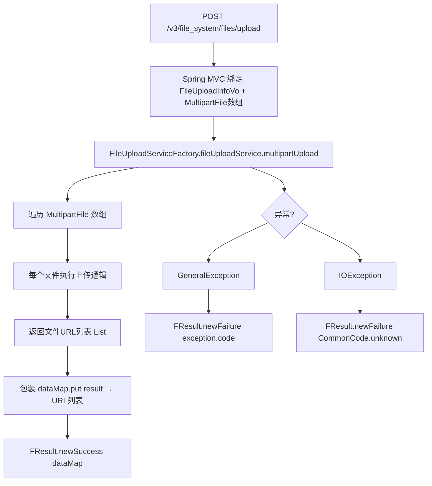

# FileUploadV3Controller -- 通用文件上传（Multipart 多文件）

> 分支：syy.release.z7.8.1.0
> 源文件：`src/main/java/cn/testin/filecloud/web/controller/v3/FileUploadV3Controller.java`
> 类级路由：`/file_system`
> 完整路径前缀：web.xml 中 dispatcher 映射 `/openapi/v3/*`，本文接口路径按规范以 `/v3` 前缀记录
> 业务：V3 通用文件上传接口，通过 `FileUploadServiceFactory.fileUploadService.multipartUpload` 直接调用底层文件上传服务，支持 multipart 多文件上传，无鉴权。

## 接口列表总表

| 方法 | 路径 | 方法名 | 说明 |
|---|---|---|---|
| POST | `/v3/file_system/files/upload` | filesUpload | 通用多文件上传 |

统一响应包装：`FResult<T>`。

---

## 1. POST /v3/file_system/files/upload -- 通用多文件上传

### 入口

`FileUploadV3Controller.filesUpload()` -- FileUploadV3Controller.java

### 请求参数

| 字段 | 类型 | 必填 | 说明 |
|---|---|---|---|
| file | MultipartFile[] | 是 | 上传文件数组 |
| suffix | String | 否 | 自定义文件后缀（FileUploadInfoVo 字段） |
| fileType | String | 否 | 文件类型标识（FileUploadInfoVo 字段） |

`FileUploadInfoVo` 通过 Spring MVC 绑定请求参数。

### 响应结构

成功：
```json
{
  "code": 0,
  "data": {
    "result": ["<文件URL1>", "<文件URL2>", ...]
  },
  "msg": "成功"
}
```

失败：
```json
{
  "code": <错误码>,
  "data": null,
  "msg": "<错误描述>"
}
```

### 实现意图

1. 从请求参数绑定 `FileUploadInfoVo`（含 suffix、fileType 等可选参数）。
2. 从 `RequestParam("file")` 接收 `MultipartFile[]` 数组。
3. 调用 `FileUploadServiceFactory.fileUploadService.multipartUpload(multipartFiles, false, null, suffix, fileType)`：
   - 第一个参数：文件数组。
   - 第二个参数（false）：不使用 `keepOriginalName`。
   - 第三个参数（null）：无自定义文件名前缀。
   - suffix / fileType 透传。
4. 返回每个文件上传后的 URL 列表。

### mermaid流程图



### 调用链

```
FileUploadV3Controller.filesUpload
├─ FileUploadInfoVo (Spring MVC 参数绑定)
├─ RequestParam MultipartFile[] multipartFiles
└─ FileUploadServiceFactory.fileUploadService.multipartUpload
   └─ [底层文件上传服务，含存储（FastDFS 等）和数据库记录]
```

### 涉及表

底层 `fileUploadService.multipartUpload` 内部操作（与具体实现相关），典型为 `common_file` 表 INSERT。

### 异常

| 条件 | 异常/错误码 |
|---|---|
| GeneralException（底层服务自定义异常） | code=exception.getCode(), msg=exception.getMessage() |
| IOException（文件读写异常） | code=CommonCode.unknown, msg="文件处理异常，请联系管理员" |

### 代码摘录

```java
@RestController
@RequestMapping("/file_system")
public class FileUploadV3Controller {

    @RequestMapping(value = "/files/upload", method = RequestMethod.POST)
    @ResponseBody
    public FResult<?> filesUpload(FileUploadInfoVo fileUploadInfoVo,
                                   @RequestParam("file") MultipartFile[] multipartFiles) {
        Map<String, Object> dataMap = new HashMap<>(1);
        try {
            fileUploadInfoVo = fileUploadInfoVo == null ? new FileUploadInfoVo() : fileUploadInfoVo;
            List<String> fileResult = FileUploadServiceFactory.fileUploadService
                    .multipartUpload(multipartFiles, false, null,
                            fileUploadInfoVo.getSuffix(), fileUploadInfoVo.getFileType());
            dataMap.put(ApiResponse.RES_RESULT, fileResult);
            return FResult.newSuccess(dataMap);
        } catch (GeneralException exception) {
            Logit.error(exception.getMessage(), new Throwable(exception));
            return FResult.newFailure(exception.getCode(), exception.getMessage());
        } catch (IOException e) {
            Logit.error(e.getMessage(), new Throwable(e));
            return FResult.newFailure(CommonCode.unknown.getValue(), "文件处理异常，请联系管理员");
        }
    }
}
```

---

## 备注

- 这是最简化的 V3 上传入口，使用 `@RestController`（即 `@Controller + @ResponseBody`）注解，直接调用 `FileUploadServiceFactory`。
- 不继承 `GenericFileProcess`，不经过处理器链，不涉及鉴权、业务码分流等逻辑。
- 支持一次请求上传多个文件（`MultipartFile[]`）。
- `FileUploadServiceFactory.fileUploadService` 为静态字段，通过 Spring Bean 注入实现文件上传底层服务。
- 与 [FileUploadController](FileUploadController.md)、[AppUploadController](AppUploadController.md) 的区别在于完全无鉴权、无业务码分流，是最底层、最通用的上传接口。

相关文档：[FileUploadController](FileUploadController.md) [AppV3Controller](AppV3Controller.md)
