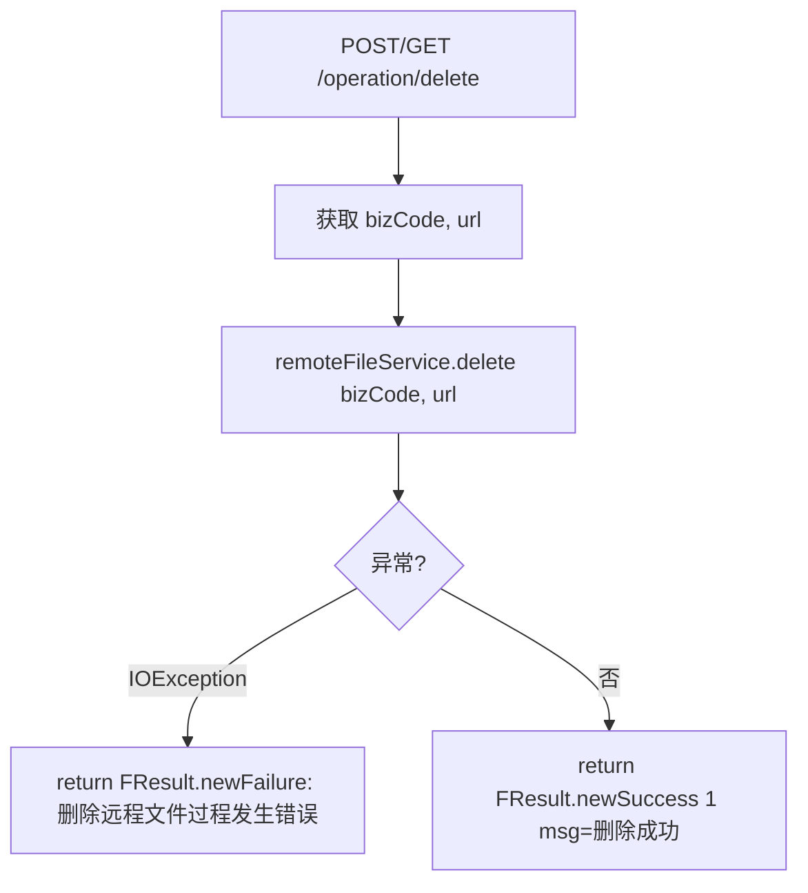

# OperationController -- 远程文件删除

> 分支：syy.release.z7.8.1.0
> 源文件：`src/main/java/cn/testin/filecloud/web/controller/OperationController.java`
> 类级路由：`/operation`
> 业务：物理删除远程存储（如 FastDFS）上的文件。通过 bizCode + url 定位要删除的远程文件。无鉴权，支持 POST 和 GET。

## 接口列表总表

| 方法 | 路径 | 方法名 | 说明 |
|---|---|---|---|
| POST / GET | `/operation/delete` | delete | 删除远程存储文件 |

统一响应包装：`FResult<T>`。

---

## 1. POST / GET /operation/delete -- 删除远程文件

### 入口

`OperationController.delete()` -- OperationController.java

### 请求参数

| 字段 | 类型 | 必填 | 说明 |
|---|---|---|---|
| bizCode | Integer | 是 | 业务编码（见 [BizCode 枚举](BizCode 枚举.md)：1=simple, 3=parseApp, 5=itestin_client_zip, 6=xiaolei_test, 7=VIDEO, 9=web_recording） |
| url | String | 是 | 远程文件 URL（FastDFS 地址） |

### 响应结构

成功：
```json
{
  "code": 0,
  "data": 1,
  "msg": "删除成功"
}
```

失败：
```json
{
  "code": 0,
  "data": null,
  "msg": "删除远程文件过程发生错误"
}
```

### 实现意图

1. 接收 bizCode 和 url 参数。
2. 调用 `remoteFileService.delete(bizCode, url)`：
   - 根据 bizCode 确定业务类型。
   - 从 url 解析 FastDFS group + remote filename。
   - 调用 FastDFS 删除 API 执行物理删除。
   - 可能同步删除数据库对应记录。
3. 返回操作结果。

### mermaid流程图



### 调用链

```
OperationController.delete
└─ remoteFileService.delete(bizCode, url)
   ├─ 根据 bizCode 确定业务类型和对应 mapper
   ├─ 解析 URL → FastDFS group + remoteFilename
   ├─ FastDFS 物理删除
   └─ 可能涉及数据库记录删除
```

### 涉及表

取决于 bizCode 和 `RemoteFileService` 的实现，可能涉及：

| bizCode | 可能涉及的表 |
|---|---|
| 1 (simple) | `common_file` |
| 3 (parseApp) | `package_file`, `common_file` |
| 5 (client_zip) | `script_file`, `common_file` |
| 9 (web_recording) | `script_file`, `common_file` |
| 7 (VIDEO) | `common_file` |

### 异常

| 条件 | 错误信息 |
|---|---|
| 删除过程发生 IOException | "删除远程文件过程发生错误" |

### 代码摘录

```java
@Controller
@RequestMapping("/operation")
public class OperationController {
    @Resource
    private RemoteFileService remoteFileService;

    @RequestMapping(value = "/delete",
            method = {RequestMethod.POST, RequestMethod.GET},
            produces = MediaType.APPLICATION_JSON_UTF8_VALUE)
    @ResponseBody
    public FResult<?> delete(
            @RequestParam(value = "bizCode", required = true) Integer bizCode,
            @RequestParam("url") String url) {
        try {
            remoteFileService.delete(bizCode, url);
        } catch (IOException e) {
            Logit.error("删除远程文件过程发生错误", e);
            return FResult.newFailure(0, "删除远程文件过程发生错误");
        }
        FResult<?> result = FResult.newSuccess(1);
        result.setMsg("删除成功");
        return result;
    }
}
```

---

## 备注

- 无鉴权控制，应为内部运维接口。
- 支持 POST 和 GET 双方法，方便运维脚本直接通过浏览器/curl 调用。
- 通过 bizCode 区分业务类型，不同的 bizCode 对应不同的数据库清理逻辑和文件存储路径。

相关文档：[PackageController](PackageController.md) [CleanResultController](../内部工具/CleanResultController.md)
