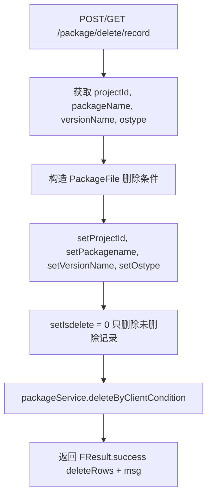

# PackageController -- 包记录删除

> 分支：syy.release.z7.8.1.0
> 源文件：`src/main/java/cn/testin/filecloud/web/controller/PackageController.java`
> 类级路由：`/package`
> 业务：根据项目组、包名、版本名等条件删除（逻辑删除）package_file 记录。无鉴权，支持 POST 和 GET 方法。

## 接口列表总表

| 方法 | 路径 | 方法名 | 说明 |
|---|---|---|---|
| POST / GET | `/package/delete/record` | deleteRecord | 逻辑删除包记录 |

统一响应包装：`FResult<T>`。

---

## 1. POST / GET /package/delete/record -- 删除包记录

### 入口

`PackageController.deleteRecord()` -- PackageController.java

### 请求参数

| 字段 | 类型 | 必填 | 说明 |
|---|---|---|---|
| projectId | Integer | 是 | 项目组 ID |
| packageName | String | 是 | 包名 |
| versionName | String | 是 | 版本名称 |
| ostype | Short | 否 | 操作系统类型，默认 -1 |

### 响应结构

成功：
```json
{
  "code": 0,
  "data": <影响行数>,
  "msg": "影响行数:<N>"
}
```

### 实现意图

1. 接收 `projectId`、`packageName`、`versionName`、`ostype` 参数。
2. 构造 `PackageFile` 查询条件对象，设置 `isdelete=0`（只删除未删除的记录）。
3. 调用 `packageService.deleteByClientCondition(deleteCondition)` 执行逻辑删除。
4. 返回影响行数。

### mermaid流程图



### 调用链

```
PackageController.deleteRecord
├─ new PackageFile
│  ├─ setProjectId, setPackagename, setVersionName, setOstype
│  └─ setIsdelete(0)
└─ packageService.deleteByClientCondition(deleteCondition)
   └─ packageFileMapper.updateByCondition (逻辑删除: set isdelete = 1 or 2)
```

### 涉及表

| 表 | 操作 |
|---|---|
| `package_file` | UPDATE（isdelete 字段标记删除） |

### 异常

无显式异常处理，异常直接由 Spring 全局异常处理器处理。

### 代码摘录

```java
@Controller
@RequestMapping("/package")
public class PackageController {
    @Resource
    private PackageService packageService;

    @RequestMapping(value = "/delete/record",
            method = {RequestMethod.POST, RequestMethod.GET},
            produces = MediaType.APPLICATION_JSON_UTF8_VALUE)
    @ResponseBody
    public FResult<?> deleteRecord(
            @RequestParam Integer projectId,
            @RequestParam String packageName,
            @RequestParam String versionName,
            @RequestParam(defaultValue = "-1") Short ostype) {
        PackageFile deleteCondition = new PackageFile();
        deleteCondition.setProjectId(projectId);
        deleteCondition.setPackagename(packageName);
        deleteCondition.setVersionName(versionName);
        deleteCondition.setOstype(ostype);
        deleteCondition.setIsdelete((short) 0);
        int deleteRows = packageService.deleteByClientCondition(deleteCondition);
        FResult<?> result = FResult.newSuccess(deleteRows);
        result.setMsg("影响行数:" + deleteRows);
        return result;
    }
}
```

---

## 备注

- 无鉴权控制，应为内部管理接口。
- `isdelete` 支持三种值：0=未删除，1=逻辑删除，2=物理删除。本接口仅操作未删除的记录，由 service 层决定具体标记值。
- istdelete 初始值设为 0 作为过滤条件，实际删除由 service 层实现。

相关文档：[OperationController](OperationController.md) [ScriptController](ScriptController.md)
