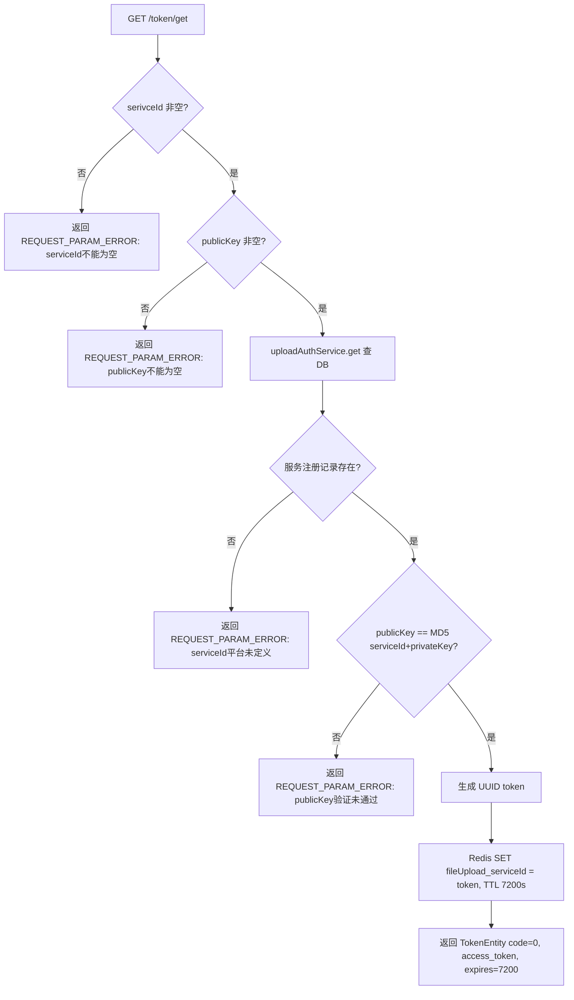
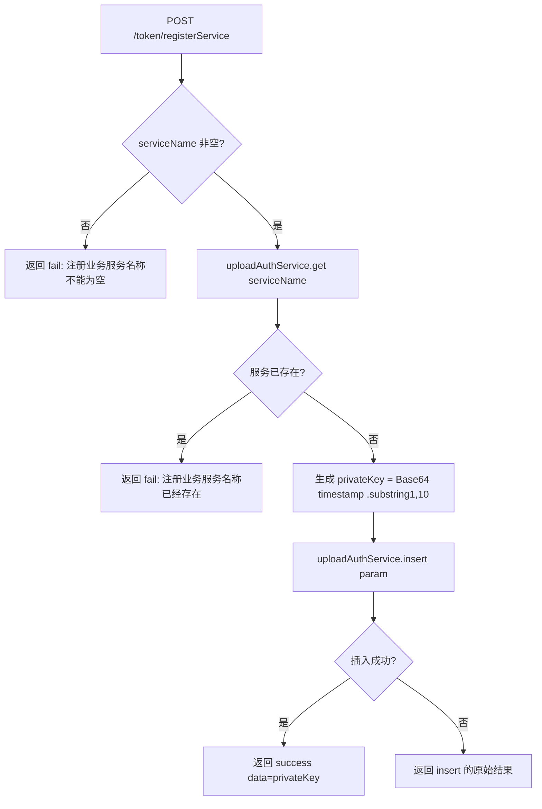

# TokenController -- Token 签发与服务注册

> 分支：syy.release.z7.8.1.0
> 源文件：`src/main/java/cn/testin/filecloud/web/controller/TokenController.java`
> 类级路由：`/token`
> 业务：为第三方业务系统提供 token 签发和服务注册功能。第三方系统通过 serviceId + privateKey 签名换取访问 token（Redis 管理过期），或注册新服务获取 privateKey。

## 接口列表总表

| 方法 | 路径 | 方法名 | 说明 |
|---|---|---|---|
| GET | `/token/get` | get | 签发访问 Token |
| POST | `/token/registerService` | registerService | 注册新服务（获取 privateKey） |

统一响应包装：`TokenEntity`（get 接口）、`RespMsg<String>`（registerService 接口）。

---

## 1. GET /token/get -- 签发 Token

### 入口

`TokenController.get()` -- TokenController.java

### 请求参数

| 字段 | 类型 | 必填 | 说明 |
|---|---|---|---|
| serivceId | String | 是 | 业务服务 ID（与注册时一致） |
| publicKey | String | 是 | MD5(serivceId + privateKey) 签名 |

### 响应结构

成功：
```json
{
  "code": 0,
  "msg": "OK",
  "access_token": "<UUID>",
  "expires": 7200
}
```

失败：
```json
{
  "code": <错误码>,
  "msg": "<错误描述>"
}
```

### 实现意图

1. 校验 `serivceId` 和 `publicKey` 非空。
2. 通过 `UploadAuthService.get(param)` 查询本地数据库验证该 serviceId 是否已注册。
3. 验证 `publicKey == MD5(serivceId + privateKey)` 签名一致性。
4. 生成 UUID 作为 token（去掉横线）。
5. 将 token 存入 Redis：`fileUpload_{serivceId}` -> `token`，TTL 7200 秒。
6. 返回 `TokenEntity`（code=0, access_token, expires=7200）。

### mermaid流程图



### 调用链

```
TokenController.get
├─ uploadAuthService.get(UploadServiceAuth{serviceId})
│  └─ Mapper 查询 upload_service_auth 表
├─ MD5Util.md5(serivceId + auth.getPrivateKey())
├─ UUID.randomUUID().toString().replace("-", "")
└─ redisTemplate.opsForValue().set("fileUpload_" + serivceId, token, 7200, SECONDS)
```

### 涉及表

| 表 | 操作 |
|---|---|
| `upload_service_auth` | SELECT（按 serviceId 查询） |
| Redis | SET key="fileUpload_{serivceId}", value=token, EXPIRE 7200 |

### 异常

| 条件 | 错误码/消息 |
|---|---|
| serivceId 为空 | "serivceId 不能为空" |
| publicKey 为空 | "publicKey 不能为空" |
| serviceId 未注册 | "serivceId 平台未定义" |
| publicKey 签名不匹配 | "publicKey 验证未通过" |

---

## 2. POST /token/registerService -- 注册服务

### 入口

`TokenController.registerService()` -- TokenController.java

### 请求参数

| 字段 | 类型 | 必填 | 说明 |
|---|---|---|---|
| serviceName | String | 是 | 业务服务名称（唯一标识） |

### 响应结构

成功：
```json
{
  "code": 0,
  "msg": "success",
  "data": "<privateKey>"
}
```

失败：
```json
{
  "code": <非0>,
  "msg": "<错误描述>"
}
```

### 实现意图

1. 校验 `serviceName` 非空。
2. 检查 serviceName 是否已存在（调用 `uploadAuthService.get`）。
3. 若不存在，生成 `privateKey`：`Base64.encode(System.currentTimeMillis()).substring(1, 10)`。
4. `uploadAuthService.insert(param)` 写入数据库。
5. 返回 `RespMsg.success("创建成功")`，data 中返回 privateKey。

### mermaid流程图



### 调用链

```
TokenController.registerService
├─ uploadAuthService.get(UploadServiceAuth{serviceId=serviceName})
├─ Base64.encode(String.valueOf(System.currentTimeMillis())).substring(1, 10)
└─ uploadAuthService.insert(UploadServiceAuth{serviceId, privateKey})
```

### 涉及表

| 表 | 操作 |
|---|---|
| `upload_service_auth` | SELECT（查重）+ INSERT（新增） |

### 异常

| 条件 | 错误消息 |
|---|---|
| serviceName 为空 | "注册业务服务名称不能为空" |
| serviceName 已存在 | "注册业务服务名称已经存在" |
| INSERT 失败（row <= 0） | 返回原始 RespMsg（未显式设置错误信息） |

### 代码摘录

```java
@Controller
@RequestMapping("/token")
public class TokenController {
    @Autowired
    private StringRedisTemplate redisTemplate;
    @Autowired
    private UploadAuthService uploadAuthService;

    // GET /token/get
    @RequestMapping(value = "/get", method = RequestMethod.GET)
    @ResponseBody
    public TokenEntity get(@RequestParam(required = false) String serivceId,
                           @RequestParam(required = false) String publicKey) {
        TokenEntity tokenEntity = new TokenEntity();
        if (Strings.isNullOrEmpty(serivceId)) { /* ... */ }
        if (Strings.isNullOrEmpty(publicKey)) { /* ... */ }
        UploadServiceAuth auth = uploadAuthService.get(param);
        if (auth == null) { /* ... */ }
        if (!publicKey.equals(MD5Util.md5(serivceId + auth.getPrivateKey()))) { /* ... */ }
        tokenEntity.setCode(TokenMsgEnum.OK.getValue());
        tokenEntity.setAccess_token(UUID.randomUUID().toString().replace("-", ""));
        tokenEntity.setExpires(DEFAULT_EXPIRES); // 7200
        redisTemplate.opsForValue().set("fileUpload_" + serivceId, token, DEFAULT_EXPIRES, TimeUnit.SECONDS);
        return tokenEntity;
    }

    // POST /token/registerService
    @RequestMapping(value = "/registerService", method = RequestMethod.POST)
    @ResponseBody
    public RespMsg<String> registerService(@RequestParam(required = false) String serviceName) {
        // 校验 serviceName 非空 + 查重
        String key = Base64.encode(String.valueOf(System.currentTimeMillis())).substring(1, 10);
        param.setPrivateKey(key);
        uploadAuthService.insert(param);
        // 返回 key
    }
}
```

---

## 备注

- Token 机制用于第三方业务系统调用 文件管理服务 上传接口时的鉴权，确保非本平台内部系统也能安全调用。
- Token 有效期为 7200 秒（2 小时），通过 Redis 管理过期。
- `get` 接口参数名包含拼写错误（`serivceId`），与数据库字段 `serviceId` 不一致，需注意。
- `registerService` 无鉴权控制，应为内部运维接口。

相关文档：[00-分支索引](00-分支索引.md)
