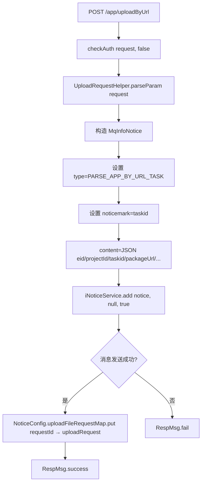

# UrlController -- URL 远程异步上传（消息队列驱动）

> 分支：syy.release.z7.8.1.0
> 源文件：`src/main/java/cn/testin/filecloud/web/controller/UrlController.java`
> 类级路由：无（根路由为 `/app/uploadByUrl`）
> 业务：接收远程文件 URL，异步发送消息队列通知，由后台消费者从 URL 下载并解析 APP。采用异步非阻塞模式，客户端提交后立即返回。

## 接口列表总表

| 方法 | 路径 | 方法名 | 说明 |
|---|---|---|---|
| POST | `/app/uploadByUrl` | uploadyByUrl | 远程 URL 异步上传任务下发 |

统一响应包装：`RespMsg<String>`。

---

## 1. POST /app/uploadByUrl -- URL 远程异步上传

### 入口

`UrlController.uploadyByUrl()` -- UrlController.java

### 请求参数

此接口通过 `UploadRequestHelper.parseParam(request)` 解析参数，`public_access_auth` 硬编码为 `false`（不做 sid 认证）。参数结构取决于 `UploadRequestHelper` 实现，一般包含：

| 字段 | 类型 | 必填 | 说明 |
|---|---|---|---|
| packageUrl | String | 是 | 远程 APP 文件的下载 URL（请求参数，`parseParam` 中 `isNullOrEmpty` 校验） |
| syspfId | Integer | 是 | 系统平台 ID（请求参数，`parseParam` 中 `isNullOrEmpty` 校验，`Integer.parseInt` 解析） |
| upload-json | String | 是 | URLEncoded JSON 请求参数（`HEADER_UPLOAD_JSON`），必须为合法 JSON，否则抛 `upload_json is invalid` |
| taskid | String | 否 | 提测任务 ID（取自 upload-json，`optString`，作为消息排重 noticemark） |
| eid | Integer | 否 | 企业 ID（取自 upload-json，`optInt`） |
| projectid | Integer | 否 | 项目组 ID（取自 upload-json，`optInt`） |
| uid | Integer | 否 | 用户 ID（取自 upload-json，`optInt`） |
| bizCode | Integer | 否 | 业务码（取自 upload-json，`optInt`） |

### 响应结构

成功（消息下发成功 > 0）：
```json
{
  "code": 0,
  "msg": "success"
}
```

失败（消息下发失败）：
```json
{
  "code": <非0>,
  "msg": "fail"
}
```

### 实现意图

1. 调用 `checkAuth(request, false)` 解析请求参数（不做 sid 鉴权）。
2. 构造 `MqInfoNotice` 消息对象：
   - `type` = `NoticeConfig.InfoNoticeType.PARSE_APP_BY_URL_TASK`
   - `noticemark` = taskid（用于消息排重）
   - `content` = JSON 包含 eid/projectId/taskid/packageUrl/temporaryFilePath/bizCode/uid/projectId/syspfId/uploadJson/requestId 等。
3. 调用 `iNoticeService.add(notice, null, true)` 发送消息到消息队列。
4. 消息发送成功后，将 `uploadRequest` 存入 `NoticeConfig.uploadFileRequestMap`（以 requestId 为 key），供消息消费者回调时使用。
5. 立即返回成功或失败，不等待文件下载完成。

### mermaid流程图



### 调用链

```
UrlController.uploadyByUrl
├─ checkAuth(request, false)
│  └─ UploadRequestHelper.parseParam(request)
├─ notice(uploadRequest)
│  ├─ new MqInfoNotice
│  ├─ notice.setVhost / setNoticemark / setType / setLevel / setPublishtime / setExpiretime
│  ├─ new JSONObject param (eid/projectId/taskid/packageUrl/...)
│  ├─ notice.setContent(param.toString)
│  ├─ iNoticeService.add(notice, null, true)
│  └─ NoticeConfig.uploadFileRequestMap.put(requestId, uploadRequest)
└─ RespMsg
```

### 涉及表

无直接数据库操作。由消息消费者异步处理时操作数据库（common_file、package_file 等）。

### 异常

| 条件 | 异常/行为 |
|---|---|
| checkAuth 异常（参数解析失败） | 抛出 RuntimeException，由 Spring 全局异常处理 | 异常包括"验证登陆信息认证失败" |
| notice() 抛出异常 | catch Exception，返回 RespMsg.fail() |
| 消息发送结果 <= 0 | 返回 RespMsg.fail() |

### 代码摘录

```java
@Controller
public class UrlController extends GenericFileProcess {

    @Resource
    private INoticeService iNoticeService;

    @RequestMapping(value = "/app/uploadByUrl", method = RequestMethod.POST)
    @ResponseBody
    public RespMsg<String> uploadyByUrl(HttpServletRequest request,
                                         HttpServletResponse response) throws Exception {
        RespMsg<String> respMsg = RespMsg.success();
        UploadFileRequest uploadRequest = checkAuth(request, false);
        try {
            Long result = notice(uploadRequest);
            if (result <= 0) {
                respMsg = RespMsg.fail();
            }
        } catch (Exception e) {
            Logit.errorLog(..., e);
            respMsg = RespMsg.fail();
        }
        return respMsg;
    }

    private Long notice(UploadFileRequest uploadRequest) throws GeneralException, JSONException {
        MqInfoNotice notice = new MqInfoNotice();
        notice.setVhost(Constants.getModule_node_id());
        notice.setNoticemark(uploadRequest.getTaskid());
        notice.setType(NoticeConfig.InfoNoticeType.PARSE_APP_BY_URL_TASK.getValue());
        notice.setLevel(NoticeConfig.InfoNoticeType.PARSE_APP_BY_URL_TASK.getLevel());
        notice.setPublishtime(System.currentTimeMillis() +
            NoticeConfig.InfoNoticeType.PARSE_APP_BY_URL_TASK.getDelaytime());
        notice.setExpiretime(System.currentTimeMillis() +
            NoticeConfig.InfoNoticeType.PARSE_APP_BY_URL_TASK.getValidPeriod());

        JSONObject param = new JSONObject();
        param.put("eid", uploadRequest.getEid());
        param.put("projectid", uploadRequest.getProjectId());
        param.put("taskid", uploadRequest.getTaskid());
        param.put("packageUrl", uploadRequest.getPackageUrl());
        // ... 更多参数 ...
        notice.setContent(param.toString());

        Long noticeResult = iNoticeService.add(notice, null, true);
        if (noticeResult > 0) {
            NoticeConfig.uploadFileRequestMap.put(
                uploadRequest.getRequestId(), uploadRequest);
        }
        return noticeResult;
    }
}
```

---

## 备注

- 此接口不做 sid 鉴权（`public_access_auth` 硬编码为 `false`），信任调用方传入的参数。
- 消息队列消费者异步处理文件下载、APP 解析、存储等耗时操作，适合大文件或网络不稳定的场景。
- `NoticeConfig.uploadFileRequestMap` 为内存 Map，用于消息消费者在处理通知时获取原始请求上下文。
- 与同步上传接口（[FileUploadController](FileUploadController.md)、[AppUploadController](AppUploadController.md)）的区别在于非阻塞，客户端提交后无需等待上传完成即可返回。

相关文档：[FileUploadController](FileUploadController.md) [AppUploadController](AppUploadController.md)
