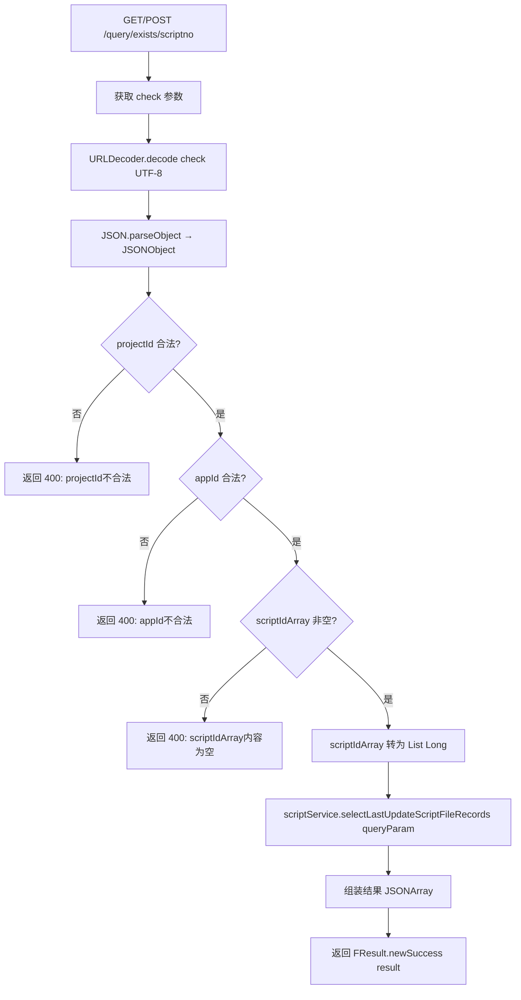
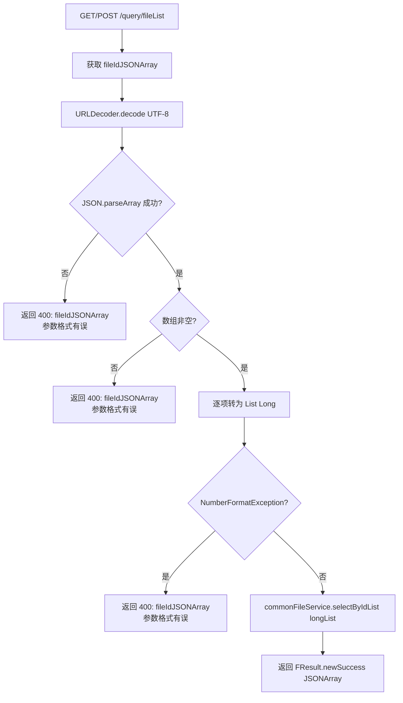

# QueryController -- 查询服务（脚本存在性/属性查询/文件查询）

> 分支：syy.release.z7.8.1.0
> 源文件：`src/main/java/cn/testin/filecloud/web/controller/QueryController.java`
> 类级路由：`/query`
> 业务：提供三个查询接口：批量查询脚本存在性（上传时间、上传人等）、按脚本属性查询脚本、按 fileId 批量查询文件信息。无鉴权。

## 接口列表总表

| 方法 | 路径 | 方法名 | 说明 |
|---|---|---|---|
| POST/GET | `/query/exists/scriptno` | exists | 批量查询脚本存在性及详情 |
| POST/GET | `/query/script/byScriptProperty` | selectByScriptProperty | 按应用版本等属性查脚本 |
| POST/GET | `/query/fileList` | files | 按 fileId 批量查文件信息 |

统一响应包装：`FResult<T>`。

---

## 1. POST / GET /query/exists/scriptno -- 查询脚本存在性

### 入口

`QueryController.exists()` -- QueryController.java

### 请求参数

| 字段 | 类型 | 必填 | 说明 |
|---|---|---|---|
| check | String | 是 | URLEncoded JSON 字符串 |

`check` 参数解码后的 JSON 结构：

| 字段 | 类型 | 必填 | 说明 |
|---|---|---|---|
| projectId | Integer | 是 | 项目组 ID |
| appId | Integer | 是 | 应用 ID |
| scriptIdArray | JSONArray | 是 | 脚本 ID 数组 |

### 响应结构

```json
{
  "code": 0,
  "data": {
    "exists": [
      {
        "projectId": <项目组ID>,
        "uploadTime": "<上传时间>",
        "userId": <用户ID>,
        "scriptId": <脚本ID>,
        "scriptNo": <脚本编号>,
        "updateDesc": "<更新描述>",
        "uploadUserName": "<上传用户名>",
        "filemd5": "<文件MD5>",
        "scriptSig": "<脚本签名>"
      }
    ]
  },
  "msg": "成功"
}
```

### 实现意图

1. URLDecode 解码 `check` 参数，反序列化为 JSONObject。
2. 校验 `projectId`、`appId` 合法（存在且 > 0）。
3. 校验 `scriptIdArray` 非空。
4. 将 scriptIdArray 中的数字项转为 `List<Long>`。
5. 调用 `scriptService.selectLastUpdateScriptFileRecords(queryParam)` 查询脚本的最近更新记录。
6. 将结果组装为 `{exists: [...]}` 返回。

### mermaid流程图



### 调用链

```
QueryController.exists
├─ URLDecoder.decode(check, "UTF-8")
├─ JSON.parseObject(deString)
├─ scriptService.selectLastUpdateScriptFileRecords(queryParam)
│  └─ scriptFileMapper 查询 LastUpdateScriptFileRecord 视图/结果集
└─ 组装 JSONArray → {exists: [...]}
```

### 涉及表

| 表 | 操作 |
|---|---|
| `script_file` | SELECT（按 projectId + appId + scriptNoList） |

### 异常

| 条件 | 错误码 |
|---|---|
| URLDecode 异常 | 400 + e.getMessage() |
| projectId 为空或 <=0 | 400 "projectId不合法" |
| appId 为空或 <=0 | 400 "appId不合法" |
| scriptIdArray 为空 | 400 "scriptIdArray内容为空" |

---

## 2. POST / GET /query/script/byScriptProperty -- 按属性查询脚本

### 入口

`QueryController.selectByScriptProperty()` -- QueryController.java

### 请求参数

| 字段 | 类型 | 必填 | 说明 |
|---|---|---|---|
| projectId | Integer | 是 | 项目组 ID |
| appId | Integer | 是 | 应用 ID |
| appVersion | String | 是 | 适配版本名称 |
| channelId | String | 否 | 渠道 ID，默认 "" |

### 响应结构

返回 `scriptService.selectByScriptProperty(queryProperties)` 的结果（`List<ScriptFile>` 脚本记录列表），单条 `ScriptFile` 字段如下：

| 字段 | 类型 | 说明 |
|---|---|---|
| scriptid | Integer | 脚本 ID |
| scriptno | Integer | 脚本编号 |
| projectid | Integer | 项目组 ID |
| scriptname | String | 脚本名称 |
| scriptcreatetime | Long | 脚本创建时间戳 |
| scriptcreateuser | Integer | 脚本创建用户 ID |
| scriptcreatedesc | String | 脚本创建描述 |
| ostype | Short | 操作系统类型 |
| appid | Integer | 应用 ID |
| build | Integer | 构建号 |
| scriptupdatetime | Long | 脚本更新时间戳 |
| scriptupdateuserid | Integer | 脚本更新用户 ID |
| scriptdesignuserid | Integer | 脚本设计用户 ID |
| scriptupdatedesc | String | 脚本更新描述 |
| scriptupdatetype | Integer | 脚本更新类型 |
| fileid | Long | 关联文件 ID |
| isdelete | Short | 删除标记：0=未删除，1=逻辑删除，2=物理删除 |
| adapterversionname | String | 适配版本名称 |
| adapterversioncode | String | 适配版本号 |
| remark | String | 备注 |
| scripttype | Integer | 脚本类型 |
| scripttags | String | 脚本标签 |
| scriptmain | String | 脚本主内容（JSON 文本） |
| uploadFileUserName | String | 上传用户名 |
| scriptSig | String | 脚本签名 |
| deleteTag | String | 删除标记 |
| recordType | Integer | 记录类型 |
| channelId | String | 渠道 ID |
| stepFileId | String | 步骤文件 ID |
| history | Integer | 历史标记 |
| eid | Integer | 企业 ID |
| pkgid | Integer | 所属应用包 ID |
| checkStatus | Integer | 检查状态 |
| packageName | String | 包名 |
| appName | String | 应用名 |
| ext | String | 扩展信息 |
| suiteId | Integer | 应用套件 ID |
| assocCaseNum | Integer | 关联用例数 |
| scriptUUID | String | 脚本唯一标识 |

### 实现意图

按 projectId + appId + appVersion + channelId 组合查询匹配的脚本列表。

### 调用链

```
QueryController.selectByScriptProperty
└─ scriptService.selectByScriptProperty(queryProperties)
   └─ scriptFileMapper 按条件查询
```

### 涉及表

| 表 | 操作 |
|---|---|
| `script_file` | SELECT（按 projectid + appid + adapterversionname + channelId） |

---

## 3. POST / GET /query/fileList -- 批量查询文件信息

### 入口

`QueryController.files()` -- QueryController.java

### 请求参数

| 字段 | 类型 | 必填 | 说明 |
|---|---|---|---|
| fileIdJSONArray | String | 是 | URLEncoded 的文件 ID JSON 数组（如 `%5B1,2,3%5D`） |

### 响应结构

返回 `commonFileService.selectByIdList(longList)` 的结果（文件记录 JSONArray）。`selectByIdList` 内部仅返回以下字段（非 `CommonFile` 全量字段）：

| 字段 | 类型 | 说明 |
|---|---|---|
| fileid | Long | 文件 ID |
| createuserid | Integer | 创建用户 ID |
| uploadusername | String | 上传用户名 |
| createtime | Long | 创建时间戳 |
| url | String | 文件下载 URL |
| filemd5 | String | 文件 MD5 |

### 实现意图

1. URLDecode 解码 `fileIdJSONArray`。
2. 反序列化为 `JSONArray`。
3. 逐项转为 `List<Long>`。
4. 调用 `commonFileService.selectByIdList(longList)` 批量查询。
5. 返回文件信息数组。

### mermaid流程图



### 调用链

```
QueryController.files
├─ URLDecoder.decode(fileIdJSONArray, "UTF-8")
├─ JSON.parseArray(deString)
├─ commonFileService.selectByIdList(longList)
│  └─ commonFileMapper.selectByIdList
└─ FResult.newSuccess(JSONArray)
```

### 涉及表

| 表 | 操作 |
|---|---|
| `common_file` | SELECT（按 id IN (...)） |

### 异常

| 条件 | 错误码 |
|---|---|
| URLDecode / JSON 解析失败 | 400 "fileIdJSONArray参数格式有误" |
| NumberFormatException | 400 "fileIdJSONArray参数格式有误" |

### 代码摘录

```java
@Controller
@RequestMapping("/query")
public class QueryController {
    @Resource
    private CommonFileService commonFileService;
    @Resource
    private ScriptService scriptService;

    // /query/exists/scriptno
    @RequestMapping(value = "/exists/scriptno", method = {RequestMethod.POST, RequestMethod.GET})
    @ResponseBody
    public FResult<JSONObject> exists(HttpServletRequest request) {
        String checkParam = request.getParameter("check");
        JSONObject params = JSON.parseObject(URLDecoder.decode(checkParam, "UTF-8"));
        // 校验 projectId, appId, scriptIdArray
        List<Long> scriptNoList = new ArrayList<>();
        for (int i = 0; i < scriptIdArray.size(); i++) {
            if (NumberUtils.isNumber(scriptIdArray.get(i).toString())) {
                scriptNoList.add(Long.parseLong(scriptIdArray.get(i).toString()));
            }
        }
        Map<String, Object> queryParam = new HashMap<>();
        queryParam.put("projectid", projectId);
        queryParam.put("appid", appId);
        queryParam.put("scriptNoList", scriptNoList);
        List<LastUpdateScriptFileRecord> scriptFiles =
            scriptService.selectLastUpdateScriptFileRecords(queryParam);
        // 组装返回 {exists: [...]}
    }

    // /query/fileList
    @RequestMapping(value = "/fileList", method = {RequestMethod.POST, RequestMethod.GET})
    @ResponseBody
    public FResult<JSONArray> files(
            @RequestParam(value = "fileIdJSONArray", required = true) String fileIdJSONArray) {
        JSONArray idJSONArray = JSON.parseArray(URLDecoder.decode(fileIdJSONArray, "UTF-8"));
        List<Long> longList = new ArrayList<>();
        for (int i = 0; i < idJSONArray.size(); i++) {
            Long id = Long.parseLong(idJSONArray.get(i) + "");
            longList.add(id);
        }
        return FResult.newSuccess(commonFileService.selectByIdList(longList));
    }
}
```

---

## 备注

- 三个接口均支持 POST 和 GET 方法，方便不同调用场景。
- `exists/scriptno` 和 `fileList` 的参数通过 URLEncoded JSON 字符串传递（与 `upload-json` 风格一致）。
- 无鉴权控制，接口对外开放但需要知道内部 ID 才能查询。
- `selectByScriptProperty` 使用的是 `com.google.common.collect.Maps`。

相关文档：[ScriptController](ScriptController.md) [ScriptV3Controller](../脚本管理/ScriptV3Controller.md)
