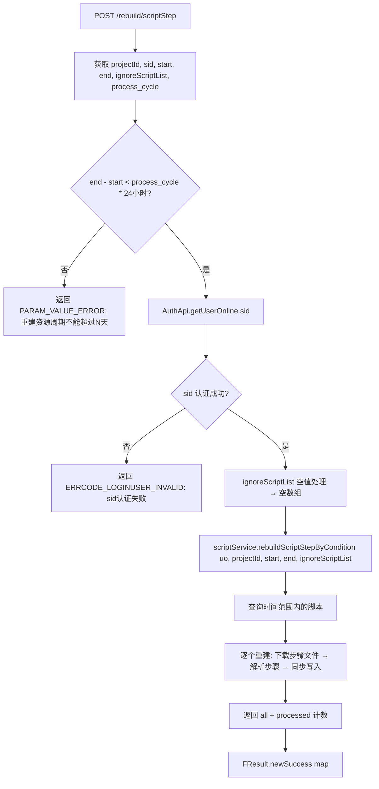

# RebuildController -- 重建脚本步骤

> 分支：syy.release.z7.8.1.0
> 源文件：`src/main/java/cn/testin/filecloud/web/controller/RebuildController.java`
> 类级路由：`/rebuild`
> 业务：重建指定时间范围内的脚本步骤。用于修复脚本步骤不完整或属性不满足最新需求的场景。需要 sid 鉴权，限制重建时间窗口防止对数据库造成过大压力。

## 接口列表总表

| 方法 | 路径 | 方法名 | 说明 |
|---|---|---|---|
| POST | `/rebuild/scriptStep` | scriptStep | 重建脚本步骤 |

统一响应包装：`FResult<Map>`。

---

## 1. POST /rebuild/scriptStep -- 重建脚本步骤

### 入口

`RebuildController.scriptStep()` -- RebuildController.java

### 请求参数

| 字段 | 类型 | 必填 | 说明 |
|---|---|---|---|
| projectId | Integer | 是 | 项目组 ID |
| sid | String | 是 | 用户登录 sid（用于鉴权） |
| start | Long | 是 | 上传起始时间戳（毫秒，13位） |
| end | Long | 是 | 上传终止时间戳（毫秒，13位） |
| ignoreScriptList | Long[] | 否 | 忽略的脚本 ID 数组（逗号分隔多值） |
| process_cycle | Integer | 否 | 处理周期天数限制，默认 30 |

### 响应结构

成功：
```json
{
  "code": 0,
  "data": {
    "all": <符合条件的脚本总数>,
    "processed": <成功处理的脚本数>
  },
  "msg": "成功"
}
```

失败：
```json
{
  "code": <错误码>,
  "data": null,
  "msg": "<错误描述>"
}
```

### 实现意图

1. 校验 `end - start` 时间窗口是否在 `process_cycle` 天内（默认 30 天，即起止周期不超过一个月），超限则返回错误。
2. `AuthApi.getUserOnline(sid)` 校验 sid 有效性（管理员身份验证）。
3. 若 `ignoreScriptList` 为 null，初始化为空数组。
4. 调用 `scriptService.rebuildScriptStepByCondition(uo, projectId, start, end, Arrays.asList(ignoreScriptList))`。
   - 根据 projectId 和时间范围查询符合条件的脚本。
   - 逐个重建脚本步骤（下载步骤文件、解析、重新入库）。
   - 跳过 `ignoreScriptList` 中的脚本和物理文件已被删除的脚本。
5. 返回 `{all: 总脚本数, processed: 已处理数}`。

### mermaid流程图



### 调用链

```
RebuildController.scriptStep
├─ AuthApi.getUserOnline(sid)
├─ Arrays.asList(ignoreScriptList)
└─ scriptService.rebuildScriptStepByCondition(uo, projectId, start, end, ignoreScriptList)
   ├─ 按 projectId + 时间范围查询 script_file
   ├─ for each script:
   │  ├─ 检查脚本物理文件是否存在
   │  ├─ HTTP GET 下载 stepFileId 中的步骤 JSON
   │  ├─ 解析步骤 JSON
   │  └─ 更新/同步 script_step 表
   └─ return Map{all, processed}
```

### 涉及表

| 表 | 操作 |
|---|---|
| `script_file` | SELECT（按 projectId + 时间范围查询） |
| `script_step` | INSERT/UPDATE（重建步骤数据） |
| `common_file` | SELECT（获取步骤文件下载 URL） |

### 异常

| 条件 | 错误码/信息 |
|---|---|
| end - start > process_cycle * 86400000 | code=204 "重建资源周期不能超过N天" |
| sid 无效 | code=10014 "sid认证失败" |
| 脚本物理文件不存在 | 跳过该脚本（不计入 processed） |

### 代码摘录

```java
@RestController
@RequestMapping("/rebuild")
public class RebuildController {
    @Resource
    private ScriptService scriptService;
    private static final Long DAY_MILLIS_SECONDS = 1000*60*60*24L;

    @RequestMapping(value="/scriptStep", method=RequestMethod.POST,
                    produces = MediaType.APPLICATION_JSON_UTF8_VALUE)
    public FResult<?> scriptStep(
            @RequestParam Integer projectId,
            @RequestParam String sid,
            @RequestParam Long start,
            @RequestParam Long end,
            @RequestParam(required = false) Long[] ignoreScriptList,
            @RequestParam(required = false, defaultValue="30") Integer cycle) throws Exception {
        long between = end - start;
        if (between > (DAY_MILLIS_SECONDS * cycle)) {
            return FResult.newFailure(HttpResponseCode.PARAM_VALUE_ERROR,
                "重建资源周期不能超过1周");  // 日志中提示"1周"但默认周期为30天
        }
        AuthApi authApi = SpringHelper.getBean(AuthApi.class);
        UserOnline uo = authApi.getUserOnline(sid);
        if (uo == null) {
            return FResult.newFailure(HttpResponseCode.ERRCODE_LOGINUSER_INVALID,
                "sid认证失败");
        }
        if(ignoreScriptList == null) {
            ignoreScriptList = new Long[0];
        }
        return FResult.newSuccess(
            scriptService.rebuildScriptStepByCondition(
                uo, projectId, start, end, Arrays.asList(ignoreScriptList)));
    }
}
```

---

## 备注

- 类注释写死了周期为"1周"，但 `process_cycle` 参数默认为 30 天，可通过参数调整。
- `ignoreScriptList` 通过 Spring MVC 自动解析逗号分隔的数组（`@RequestParam Long[]`）。
- 用于修复因程序 bug 导致的脚本步骤不完整、历史属性不满足最新需求的问题。
- 需要 sid 鉴权，确保只有授权用户才能执行重建操作。
- 物理文件被删除的脚本无法重建，不计入 `processed` 计数。

相关文档：[ScriptController](ScriptController.md) [ScriptV3Controller](ScriptV3Controller.md)
