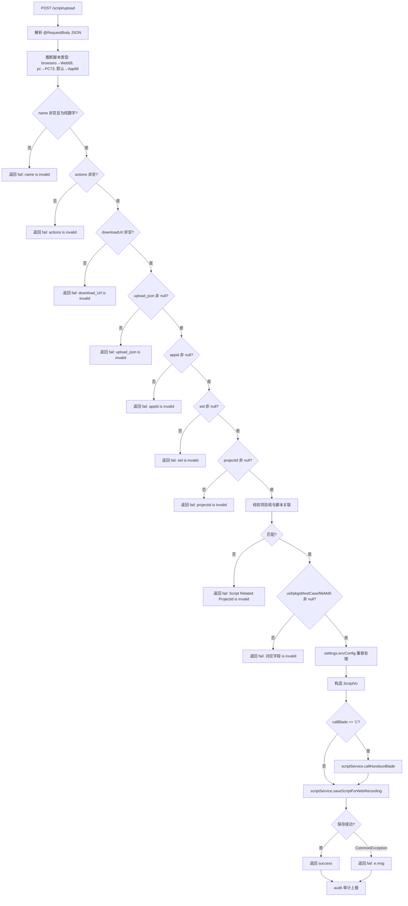

# ScriptController -- 脚本管理（上传/删除/复制/更新）

> 分支：syy.release.z7.8.1.0
> 源文件：`src/main/java/cn/testin/filecloud/web/controller/ScriptController.java`
> 类级路由：`/script`
> 业务：Web 录制端脚本的增删改查接口。scriptUpload 接收录制端提交的完整脚本数据（步骤、组件、声明变量、浏览器信息等），校验后入库并触发审核审计。delete/copy/update 提供脚本的基本管理操作。

## 接口列表总表

| 方法 | 路径 | 方法名 | 说明 |
|---|---|---|---|
| POST | `/script/upload` | scriptUpload | Web 录制脚本上传（@RequestBody JSON） |
| POST/GET | `/script/delete` | deleteByScriptId | 根据条件删除脚本 |
| POST/GET | `/script/copy` | copyScriptByScriptId | 复制脚本到指定项目/应用 |
| POST/GET | `/script/update` | updateScriptByScriptId | 更新脚本关联 |

统一响应包装：`RespMsg<String>`（upload），`FResult<T>`（delete/copy/update）。

---

## 1. POST /script/upload -- Web 录制脚本上传

### 入口

`ScriptController.scriptUpload()` -- ScriptController.java

### 请求参数

`@RequestBody String jsonParam`（JSON 字符串）：

| 字段 | 类型 | 必填 | 说明 |
|---|---|---|---|
| name | String | 是 | 脚本编号（须为纯数字） |
| actions | JSONArray | 是 | 脚本步骤数组 |
| downloadUrl | String | 是 | 脚本文件下载地址（在上传文件服务之后提供） |
| upload_json | JSONObject | 是 | 上传元数据 JSON |
| upload_json.appid | Integer | 是 | 应用 ID |
| upload_json.eid | Integer | 是 | 企业 ID |
| upload_json.projectid | Integer | 是 | 项目组 ID |
| upload_json.uid | Integer | 是 | 用户 ID |
| upload_json.pkgid | Integer | 是 | 包 ID |
| upload_json.testCase | JSONObject | 是 | 测试用例对象 |
| upload_json.fileMd5 | String | 是 | 文件 MD5 校验值 |
| suiteId | Integer | 否 | 应用套件 ID（App 脚本时必填） |
| callBlade | String | 否 | 恒生 blade 回调标识，值为 "1" 时触发回调 |
| originScriptNo | String | 否 | 原始脚本编号（复制/导入场景） |
| declareVars | JSONArray | 否 | 声明的变量 |
| components | JSONArray | 否 | 组件信息 |
| browsers | JSONArray | 否 | 浏览器信息（Web 脚本） |
| pc | JSONObject | 否 | PC 端信息（PC 脚本） |
| settings | JSONObject | 否 | 设置信息（含 envConfig） |
| upload_json.scriptType | Integer | 否 | 脚本类型，默认 1 |
| upload_json.originalFilename | String | 否 | 原始文件名 |
| upload_json.osType | Integer | 否 | 操作系统类型 |
| upload_json.fileSize | Long | 否 | 文件大小 |
| upload_json.packageName | String | 否 | 包名 |
| upload_json.channelId | String | 否 | 渠道 ID |
| upload_json.scriptUpdateDesc | String | 否 | 脚本更新描述 |

### 响应结构

成功：
```json
{
  "code": 0,
  "msg": "success"
}
```

失败：
```json
{
  "code": <非0>,
  "msg": "<具体错误描述>"
}
```

### 实现意图

1. **参数解析**：从 `@RequestBody` 接收 JSON 字符串，解析为 `org.json.JSONObject`。
2. **类型推断**：根据 browsers/pc 参数确定脚本类型：
   - 无 browsers 且无 pcInfos：type=66（App）
   - 有 browsers：type=69（Web）
   - 有 pcInfos：type=73（PC）
3. **参数校验**（依次校验，任一失败立即返回）：
   - `name` 非空且为纯数字
   - `actions` 非空且长度 >= 1
   - `downloadUrl` 非空
   - `upload_json` 非 null
   - `upload_json.appid` 非 null
   - `upload_json.eid` 非 null
   - `upload_json.projectid` 非 null
   - 项目组与脚本关联校验：`FileApi.getLastestScriptWithNoApp(scriptNo)` 查询已有脚本，若 projectId > 0 且不匹配则拒绝
   - `upload_json.uid` 非 null
   - `upload_json.pkgid` 非 null
   - `upload_json.testCase` 非 null
   - `upload_json.fileMd5` 非 null
4. **兼容处理**：若 `settings.envConfig.envId == "null"`（字符串），则重置为 0。
5. **恒生回调**：若 `callBlade == "1"`，调用 `scriptService.callHundsunBlade(vo, type)`（失败不影响主流程）。
6. **保存脚本**：`scriptService.saveScriptForWebRecording(vo, reqJson)` 执行入库。
7. **审核审计**：finally 块调用 `audit()` 上报审计数据。

### mermaid流程图



### 调用链

```
ScriptController.scriptUpload
├─ new org.json.JSONObject(jsonParam)
├─ FileApi.getLastestScriptWithNoApp(scriptNo)
├─ settings.envConfig 兼容处理
├─ new ScriptVo + 字段设置
├─ [if callBlade="1"] scriptService.callHundsunBlade(vo, type)
├─ scriptService.saveScriptForWebRecording(vo, reqJson)
│  ├─ 数据库操作（SCRIPT_FILE / COMMON_FILE）
│  └─ 文件上传服务关联
└─ audit(apiRequest, result, watch.getTime())
   └─ AuditDataApi.collect(auditServiceUrl, auditDataJson)
```

### 涉及表

| 表 | 操作 |
|---|---|
| `script_file` | INSERT 脚本记录 |
| `common_file` | INSERT 文件记录（脚本文件下载 URL） |
| `script_step` | INSERT 脚本步骤记录 |

### 异常

| 条件 | 返回信息 |
|---|---|
| name 为空或非数字 | "name is invalid" |
| actions 为空或长度为 0 | "actions is invalid" |
| downloadUrl 为空 | "download_Url is invalid" |
| upload_json 为空 | "upload_json is invalid" |
| appid 为空/null | "appId is invalid" |
| eid 为空/null | "eid is invalid" |
| projectid 为空/null | "projectid is invalid" |
| 脚本已存在且 projectid 不匹配 | "Script Related Projectid is invalid" |
| uid 为空 | "uid is invalid" |
| pkgid 为空 | "pkgid is invalid" |
| testCase 为空 | "testCase is invalid" |
| fileMd5 为空 | "fileMd5 is invalid" |
| saveScriptForWebRecording 抛 CommonException | e.msg |

---

## 2. POST / GET /script/delete -- 删除脚本

### 入口

`ScriptController.deleteByScriptId()` -- ScriptController.java

### 请求参数

| 字段 | 类型 | 必填 | 说明 |
|---|---|---|---|
| projectId | Integer | 是 | 项目组 ID |
| uid | Integer | 是 | 脚本创建者用户 ID |
| scriptNo | Integer | 否 | 脚本编号，默认 -1 |
| ostype | Short | 否 | 操作系统类型，默认 -1 |
| appid | Integer | 否 | 应用 ID，默认 -1 |
| build | Integer | 否 | 构建号，默认 -1 |
| adapterversionname | String | 否 | 适配版本名，默认 "" |
| adapterversioncode | String | 否 | 适配版本号，默认 "" |
| scriptSig | String | 否 | 脚本签名，默认 "" |

### 响应结构

```json
{
  "code": 0,
  "data": <影响行数>,
  "msg": "影响行数:<N>"
}
```

### 实现意图

多条件组合删除，构造 `ScriptFile` 条件对象，调用 `scriptService.deleteByClientCondition(deleteCondition)`。

### 涉及表

| 表 | 操作 |
|---|---|
| `script_file` | UPDATE（逻辑/物理删除） |

---

## 3. POST / GET /script/copy -- 复制脚本

### 入口

`ScriptController.copyScriptByScriptId()` -- ScriptController.java

### 请求参数

| 字段 | 类型 | 必填 | 说明 |
|---|---|---|---|
| scriptid | Integer | 是 | 源脚本 ID |
| projectid | Integer | 是 | 目标项目组 ID |
| appid | Integer | 是 | 目标应用 ID |

### 响应结构

```json
{
  "code": 0,
  "data": <影响行数>,
  "msg": "复制脚本影响行数:<N>"
}
```

### 实现意图

调用 `scriptService.copy(scriptid, projectid, appid, false)` 复制脚本及关联数据到目标项目/应用。

### 涉及表

| 表 | 操作 |
|---|---|
| `script_file` | INSERT（复制后的新记录） |
| `script_step` | INSERT（复制步骤） |

---

## 4. POST / GET /script/update -- 更新脚本

### 入口

`ScriptController.updateScriptByScriptId()` -- ScriptController.java

### 请求参数

| 字段 | 类型 | 必填 | 说明 |
|---|---|---|---|
| scriptid | Integer | 是 | 脚本 ID |
| projectid | Integer | 是 | 项目组 ID |
| appid | Integer | 是 | 应用 ID |

### 响应结构

```json
{
  "code": 0,
  "data": <影响行数>,
  "msg": "更新成功" | "更新失败"
}
```

### 实现意图

调用 `scriptService.updateScript(scriptid, projectid, appid)` 更新脚本的项目组/应用关联。

### 涉及表

| 表 | 操作 |
|---|---|
| `script_file` | UPDATE |

---

## 代码摘录（核心校验逻辑）

```java
@Controller
@RequestMapping("/script")
public class ScriptController {
    @Resource
    private ScriptService scriptService;

    // 脚本类型推断
    String type = "66";
    if (browsers != null) { type = "69"; }
    else if (pcInfos != null) { type = "73"; }

    // 核心校验链
    if (Strings.isNullOrEmpty(name) || !NumberUtils.isDigits(name)) {
        result = RespMsg.fail("name is invalid"); audit(...); return result;
    }
    if (actions == null || actions.length() < 1) {
        result = RespMsg.fail("actions is invalid"); audit(...); return result;
    }
    if (Strings.isNullOrEmpty(downloadUrl)) {
        result = RespMsg.fail("download_Url is invalid"); audit(...); return result;
    }
    // ... 更多 upload_json 字段校验 ...

    // 项目组与脚本关联校验
    Integer scriptNo = Integer.parseInt(name);
    ScriptFileIce script = FileApi.getLastestScriptWithNoApp(scriptNo);
    if (null != script && script.getProjectId() > 0 &&
        (!projectid.equals(script.getProjectId()))) {
        result = RespMsg.fail("Script Related Projectid is invalid");
        audit(...); return result;
    }

    // 保存
    scriptService.saveScriptForWebRecording(vo, reqJson);
    audit(apiRequest, result.toString(), watch.getTime());
}
```

---

## 备注

- `scriptUpload` 是唯一使用 `@RequestBody` 接收 JSON 的接口，其他三个使用 `@RequestParam`。
- 每次校验失败后均调用 `audit()` 上报审计，确保操作可追溯。
- 脚本类型推断逻辑：Web（browsers 非空）> PC（pcInfos 非空）> App（默认）。
- `settings.envConfig.envId` 做 `"null"` 字符串兼容处理，用于修复导入导出导致的字段异常。
- `callHundsunBlade` 回调失败不阻断主流程（仅日志记录）。

相关文档：[ScriptV3Controller](ScriptV3Controller.md) [RebuildController](RebuildController.md) [QueryController](../查询服务/QueryController.md)
