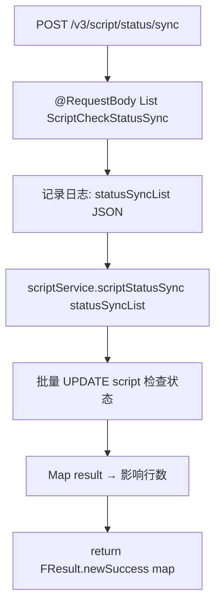

# ScriptV3Controller -- 脚本状态同步

> 分支：syy.release.z7.8.1.0
> 源文件：`src/main/java/cn/testin/filecloud/web/controller/v3/ScriptV3Controller.java`
> 类级路由：`/script`
> 完整路径前缀：web.xml 中 dispatcher 映射 `/openapi/v3/*`，本文接口路径按规范以 `/v3` 前缀记录
> 业务：接收批量脚本校验状态同步请求，将脚本检查结果写入数据库。由脚本校验服务回调使用。

## 接口列表总表

| 方法 | 路径 | 方法名 | 说明 |
|---|---|---|---|
| POST | `/v3/script/status/sync` | scriptStatusSync | 批量同步脚本检查状态 |

统一响应包装：`FResult<Map<String, Integer>>`。

---

## 1. POST /v3/script/status/sync -- 脚本状态同步

### 入口

`ScriptV3Controller.scriptStatusSync()` -- ScriptV3Controller.java

### 请求参数

`@RequestBody List<ScriptCheckStatusSync>`（JSON 数组）：

`ScriptCheckStatusSync` 为模型对象，包含以下字段（`@RequestBody` 未标注字段级校验注解，字段级均为非必填）：

| 字段 | 类型 | 必填 | 说明 |
|---|---|---|---|
| id | Long | 否 | 记录主键 ID |
| scriptNo | Integer | 否 | 脚本编号 |
| scriptId | Integer | 否 | 脚本 ID |
| checkStatus | Integer | 否 | 脚本检查状态 |
| syncCount | Integer | 否 | 同步次数 |

### 响应结构

```json
{
  "code": 0,
  "data": { "result": <N> },
  "msg": "成功"
}
```

`result` 为同步影响的记录数。

### 实现意图

1. 接收 `List<ScriptCheckStatusSync>` 批量数据。
2. 调用 `scriptService.scriptStatusSync(statusSyncList)` 批量更新脚本检查状态。
3. 返回处理结果数量。

### mermaid流程图



### 调用链

```
ScriptV3Controller.scriptStatusSync
├─ GsonUtils.toJsonStr(statusSyncList) → 日志
└─ scriptService.scriptStatusSync(statusSyncList)
   └─ scriptCheckMapper / scriptFileMapper → UPDATE 脚本检查状态
```

### 涉及表

| 表 | 操作 |
|---|---|
| `script_check` | INSERT 或 UPDATE（脚本检查结果记录） |
| `script_file` | UPDATE（脚本状态字段更新） |

### 异常

无显式异常捕获，异常由 Spring 全局处理器处理。

### 代码摘录

```java
@RestController
@RequestMapping("/script")
public class ScriptV3Controller {
    @Resource
    private ScriptService scriptService;

    @RequestMapping(value = "/status/sync", method = RequestMethod.POST)
    public FResult<?> scriptStatusSync(
            @RequestBody List<ScriptCheckStatusSync> statusSyncList) {
        Logit.messageLog("scriptStatusSync, statusSyncList: " +
            GsonUtils.toJsonStr(statusSyncList));
        int result = scriptService.scriptStatusSync(statusSyncList);
        Map<String, Integer> map = new HashMap<>();
        map.put("result", result);
        return FResult.newSuccess(map);
    }
}
```

---

## 备注

- 使用 `@RestController` 注解，与 v3 包下其他 Controller 风格一致。
- 路由 `/script` 与主包 `ScriptController` 相同，但由于在不同包（v3 子包），Spring MVC 可正确区分。
- 此接口为异步回调接口，接收脚本校验服务处理完成后的状态同步请求。

相关文档：[ScriptController](ScriptController.md) [ApiController](../内部工具/ApiController.md)
