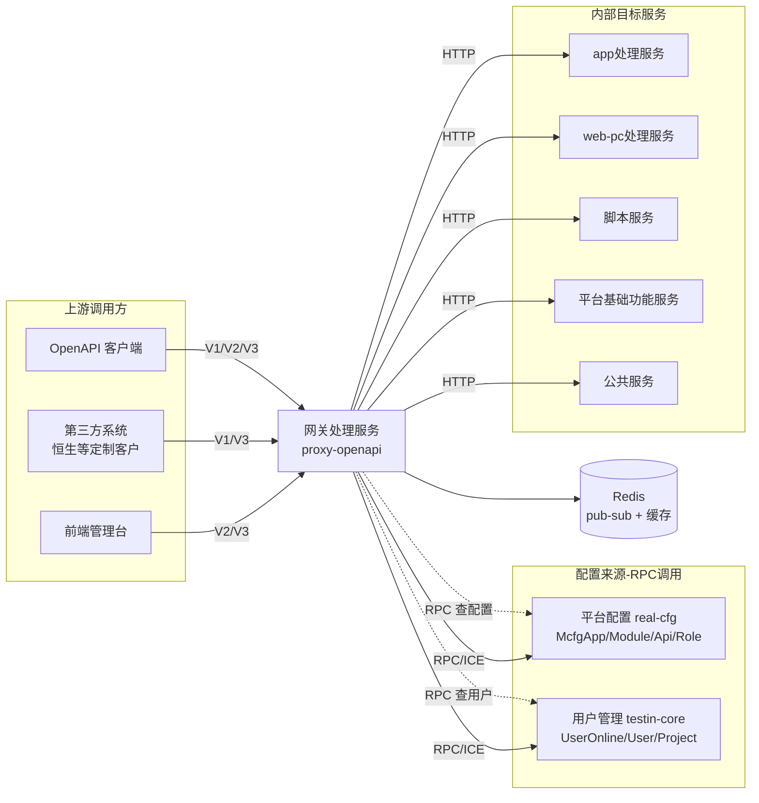
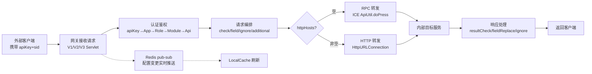

# 产品概述

> **Git 仓库**：`git@git.testin.cn:stock/backend/proxy-openapi.git`　**分支**：`syy.release.z7.8.1.0`

## 这是什么

网关处理服务（Java 工程 `proxy-openapi`，Spring Boot 1.5.4 / JDK 1.8 / Undertow，`pom.xml`）是 Testin 平台的**统一 API 网关**，是所有外部调用方访问 Testin 内部服务的唯一入口。它不存储业务数据，通过 RPC 从平台配置（real-cfg）和用户管理（testin-core）实时查询配置，缓存在本地内存中。

对外提供**三套并存的 API 版本**（`cn/testin/startup/Boot.java`）：

| 版本 | URL 模式 | Servlet | 协议风格 |
|---|---|---|---|
| V1 | `/*` | `ApiProxyServlet` | JSON-RPC：body 内 `action` + `op` |
| V2 | `/v2/*`, `/openapi/v2/*` | `ApiV2ProxyServlet` | REST：`/v2/{mkey}/{action}/{op}` |
| V3 | `/v3/*`, `/openapi/v3/*` | `ApiV3ProxyServlet` | RESTful：GET/POST/PUT/DELETE + 路径占位符 + query 参数映射 |

核心解决的问题：
1. **统一认证**：apiKey + sid（登录态）+ timestamp 多因子校验，一处接入全平台通行
2. **四层鉴权**：McfgApp（应用）→ McfgRole（角色）→ McfgModule（模块）→ McfgApi（接口），配置驱动、Redis pub/sub 实时生效
3. **请求编排**：按接口配置执行 checkJson（必填校验）、fieldJson（白名单过滤）、ignoreJson（黑名单裁剪）、additionalJson（字段注入），无需各服务重复实现
4. **双模代理**：自动判断 RPC（ICE）或 HTTP 透传，支持 multipart/form-data、GET query 拼接、响应字段重命名
5. **缓存热更新**：配置变更通过 Redis pub/sub 推送，秒级刷新本地缓存，无需重启

## 上下游

- 下游服务 HTTP 地址集中配置在 `src/main/resources/service.api.properties`（`Boot.java` 通过 `DbConfigUtil.loadConfig()` 加载）。
- RPC 目标通过 ICE Locator 路由（`iceclient.properties`），prefixName 来自 McfgModule.rpcPrefixName。
- Redis 连接信息来自 `cfg/db/config.json`，订阅频道 `real.cfg` 和 `usermanager`。

## 核心概念

| 概念 | 说明 | 载体 |
|---|---|---|
| McfgApp | 接入应用身份：apiKey（唯一标识）、secretKey/ivKey（加密密钥）、ips（IP 白名单）、roles[]（角色列表）、bindEid（绑定企业）、appConfig（checkIp/checkSig/checkTimestamp/ignoreSid） | MySQL `mcfg_app`（平台配置库） |
| McfgRole | 角色，关联一组 McfgApi 权限（经 McfgRoleApi 中间表），`STATUS_ON` 时生效 | MySQL `mcfg_role` |
| McfgModule | 目标模块：mkey（模块标识，URL 中的模块名）、rpcPrefixName（RPC 寻址前缀）或 httpHosts（HTTP 地址，`;` 分隔多地址随机负载均衡） | MySQL `mcfg_module` |
| McfgApi | 接口权限：action+op（V1/V2）或 url+method（V3）、needLogin（是否需要登录）、protocolConfig（请求/响应编排规则 JSON） | MySQL `mcfg_api` |
| protocolConfig | 每接口的请求/响应编排规则 JSON：checkKeys / fieldKeys / ignoreKeys / additionalKeys / resultCheckKeys / ignoreSidKeys / queryParamKeys / pathPlaceholderParamKeys / responseFieldReplaceKeys / bodyRequestFieldReplaceKeys / passThroughType | `mcfg_api.protocol_config` 字段 |
| passThroughType | V3 专用转发模式：0=走 V3→V1 转换（构建 V1 风格 body 后 executeRequest），1=直接透传原始请求到目标服务 | `protocolConfig.passThroughType` |
| LocalCache | 10 段 × 50000 容量的本地内存缓存，60 分钟过期，LockUtil 双重检查锁防击穿 | `cfg/spring/Spring-LocalCache.xml` |
| sid（Session ID） | 登录态令牌，来源：Cookie `authtoken_pro` 或 body `onlineUserInfo` 或第三方 ID 映射；对应 `UserOnline`（过期时间/eid/userid/projectid） | `mcfg_app.online_user_info` / Cookie |
| Hundsun 定制 | 恒生客户专用：请求携带 `hundsunInfo`（productNo/projectId）→ 网关自动映射为 Testin 内部 sid/projectid/userid | `ApiProxyServlet.conversionRequest()` |

## 典型使用动线

## 延伸阅读

- [功能总览](功能总览.md) — 按功能域的清单与接口索引
- [总体架构](../02-技术架构/总体架构.md) — 系统上下文与核心架构决策
- [请求代理主流程实现](../03-实现逻辑/请求代理主流程实现.md) — V1 全链路代码级详解
- [V3代理与透传实现](../03-实现逻辑/V3代理与透传实现.md) — V3 REST 与 passThrough 详解
- [网关处理服务 总览](../00-首页.md)
