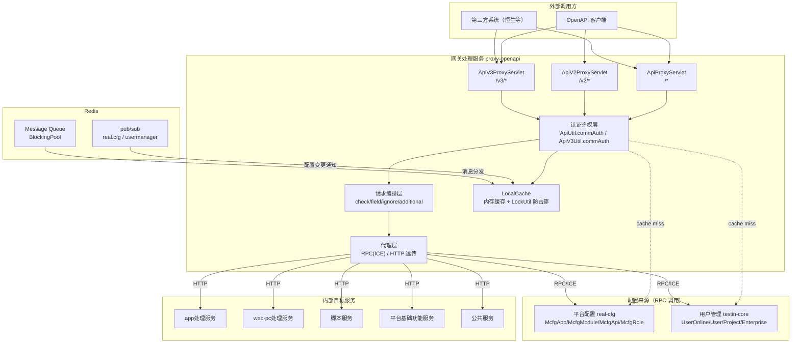

# 总体架构

> 网关处理服务（proxy-openapi）是 Testin 平台对外的统一入口，负责认证、鉴权、请求编排与代理转发。

## 1. 平台定位

```
外部调用方（OpenAPI / 第三方系统 / 恒生等定制客户）
        │
        ▼
┌──────────────────────────────┐
│     网关处理服务              │
│     proxy-openapi       │
│                              │
│  ┌─────────────────────────┐ │
│  │  ApiProxyServlet    /*  │ │  ← V1：JSON action/op 模式
│  │  ApiV2ProxyServlet /v2/*│ │  ← V2：URI /v2/{mkey}/{action}/{op}
│  │  ApiV3ProxyServlet /v3/*│ │  ← V3：RESTful GET/POST/PUT/DELETE
│  │  LocalCacheServlet     │ │  ← 缓存管理
│  └─────────────────────────┘ │
│              │               │
│  ┌─────────────────────────┐ │
│  │  认证鉴权（commAuth）     │ │
│  │  apiKey → McfgApp       │ │  ← 应用有效性、IP白名单、timestamp
│  │  mkey → McfgModule      │ │  ← 目标服务与路由（rpcPrefixName / httpHosts）
│  │  action+op → McfgApi    │ │  ← 接口权限、needLogin、checkJson...
│  │  roleId → McfgRole      │ │  ← 角色绑定
│  │  sid → UserOnline       │ │  ← 登录态与用户信息
│  └─────────────────────────┘ │
│              │               │
│  ┌─────────────────────────┐ │
│  │  请求编排                 │ │
│  │  handleCheck / handleField│ │
│  │  handleIgnore / additional│ │
│  │  body field replace      │ │
│  └─────────────────────────┘ │
│              │               │
│  ┌─────────────────────────┐ │
│  │  代理转发                 │ │
│  │  httpHosts 为空 → RPC    │ │  ← ICE (ApiUtil.doPress)
│  │  httpHosts 不为空 → HTTP │ │  ← HttpURLConnection 透传
│  └─────────────────────────┘ │
│              │               │
│  ┌─────────────────────────┐ │
│  │  响应处理                 │ │
│  │  resultCheckJson /       │ │
│  │  responseFieldReplace /  │ │
│  │  ignoreJson              │ │
│  └─────────────────────────┘ │
└──────────────────────────────┘
        │ RPC (ICE) / HTTP
        ▼
┌───────────────────────────────────────────────────────────────┐
│  内部目标服务                                                   │
│  RealCfg | UserManager | RealTest | script | Plan | common... │
└───────────────────────────────────────────────────────────────┘
```

## 2. 系统上下文（Mermaid）



## 3. 核心架构决策

### 3.1 无数据库，纯代理

网关本身不存储业务数据，无 MySQL/PostgreSQL 等关系型数据库。所有配置数据通过 RPC 从 real-cfg 和 testin-core 实时查询，缓存在 LocalCache 中。

**优势**：网关无状态，可水平扩展；配置变更通过 Redis pub/sub 秒级生效。

### 3.2 四层配置驱动鉴权

```
apiKey ──→ McfgApp ──→ McfgRole ──→ McfgApi
                │                        │
                │ mkey                   │ action + op / url + method
                ▼                        ▼
           McfgModule             接口配置（checkJson/fieldJson/ignoreJson...）
           (rpcPrefixName/
            httpHosts)
```

- **McfgApp**：应用身份，含 apiKey/secretKey/IP 白名单/角色列表/AppConfig（checkIp/checkSig/checkTimestamp/ignoreSid）
- **McfgRole**：角色，关联一组 API 权限
- **McfgModule**：目标模块，含 mkey（模块标识）、rpcPrefixName（RPC 前缀）、httpHosts（HTTP 地址列表，`;` 分隔多地址随机负载均衡）
- **McfgApi**：接口权限，含 action+op（V1）或 url+method（V3）、needLogin、以及完整的请求/响应编排配置

### 3.3 双模代理转发

执行 `executeRequest` 时根据 `McfgModule.httpHosts` 判断：

- **httpHosts 为空** → RPC 模式：通过 ICE 框架调用 `ApiUtil.doPress(prefixName, reqJson)`，prefixName 来自 `McfgModule.rpcPrefixName`
- **httpHosts 不为空** → HTTP 模式：通过 `HttpURLConnection` 透传到目标服务，支持 GZIP 解压、multipart/form-data、GET query 拼接、pass-through 直通

### 3.4 LocalCache + Redis pub/sub 配置热更新

- **LocalCache**：10 段 × 50000 容量，5 分钟清理一次，60 分钟过期
- **LockUtil**：基于 KEY 对象的本地锁，防止缓存击穿（并发查同一个 key 时只有第一个去 RPC 查 real-cfg）
- **Redis pub/sub**：`SubscribeFactory` 订阅 `real.cfg` 和 `usermanager` 两个频道，配置变更时 `MessageDispatchThread`（5 核心/50 最大线程池）分发给 `MessageHandlerThread`，调用对应 Service 的 refresh 方法刷新 LocalCache
- **支持的消息目标**：McfgApp、McfgModule、McfgRoleApi/McfgRole、EnterpriseUserRelation、UserOnline、UserInfo.thirdPartyUserid、ProjectInfo.thirdPartyProjectid、EnterpriseInfo.thirdPartyEid

### 3.5 请求编排（协议配置）

McfgApi.protocolConfig 定义了每接口的请求/响应处理规则：

| 配置项 | 阶段 | 作用 |
|---|---|---|
| `checkKeys` | 请求前 | 校验必填字段存在且非空 |
| `fieldKeys` | 请求前 | 白名单过滤，只保留指定字段 |
| `ignoreKeys` | 请求前+响应后 | 黑名单裁剪，移除指定字段 |
| `additionalKeys` | 请求前 | 注入附加字段，支持 `${app.bindEid}` / `${app.appName}` 占位符 |
| `resultCheckKeys` | 响应后 | 校验响应中必须包含的字段（如 `projectid` 对比用户项目列表） |
| `ignoreSidKeys` | 请求前 | 控制是否注入 sid 信息（userid/username/eid/projectid） |
| `queryParamKeys` | V3 请求前 | URL query 参数 → body JSON 字段转换 |
| `pathPlaceholderParamKeys` | V3 请求前 | URL 路径变量 `/user/{id}` → body JSON 字段 |
| `responseFieldReplaceKeys` | 响应后 | 字段重命名（非驼峰→驼峰） |
| `bodyRequestFieldReplaceKeys` | 请求前 | body 字段重命名（驼峰→目标格式） |
| `passThroughType` | V3 请求前 | =1 时直接透传，跳过 V1 风格的 body 组装 |

### 3.6 恒生（Hundsun）定制支持

`ApiProxyServlet` 中内嵌恒生定制逻辑：在 `checkRequest` → `hundsunConvert` 阶段，如果请求携带 `hundsunInfo`，则调用 `ProjectApi.hengsunCustomize` 将恒生的 productNo/projectId → Testin 的 sid/projectid/userid，实现两套账户体系的映射。

### 3.7 用户在线信息（SID）注入

三种获取登录态的方式：

1. **Cookie**：从 `authtoken_pro` Cookie 读取 sid
2. **请求参数**：`data.onlineUserInfo` JSON 对象（email + eid/projectid → 查用户表构造虚拟 UserOnline）
3. **第三方 ID 映射**：`onlineUserInfo.thirdPartyUserid` / `thirdPartyProjectid` / `thirdPartyEid` → 查映射表转为 Testin 内部 ID

支持 `ignoreSid` 配置跳过 sid 信息注入（针对 `prodatatrans` / `saasdatatrans` 等数据同步模块，或显式配置 `ignoreSidKeys.infoBySid=1` 的 API）。

## 4. 代码工程一览

```
proxy-openapi/src/main/java/cn/testin/
├── startup/
│   ├── Boot.java                  ← Spring Boot 启动类，注册 4 Servlet
│   └── CORSFilter.java            ← 跨域过滤器
├── web/servlet/
│   ├── ApiProxyServlet.java       ← V1 网关（/*），JSON action/op 模式
│   ├── ApiV2ProxyServlet.java     ← V2 网关（/v2/*），URI /v2/{mkey}/{action}/{op}
│   ├── ApiV3ProxyServlet.java     ← V3 网关（/v3/*,/openapi/v3/*），RESTful 全方法
│   └── LocalCacheServlet.java     ← 本地缓存管理（/localcache/*）
├── web/util/
│   ├── ApiUtil.java               ← V1 认证 + 响应工具（commAuth/response）
│   ├── ApiV2Util.java             ← V2 请求解析工具
│   ├── ApiV3Util.java             ← V3 认证工具（commAuth）
│   ├── SigUtil.java               ← MD5 签名计算（key 排序 + JSON 递归拼接）
│   ├── JsonUtil.java              ← JSON 操作工具
│   └── ThreadPoolUtil.java        ← 线程池工具
├── business/
│   ├── AbstractGenericServiceImpl.java ← 业务基类（注入 8 个 API + LocalCache）
│   ├── impl/
│   │   ├── ApiServiceImpl.java    ← McfgApi 查询（按 roleId 取 API 列表，缓存）
│   │   ├── AppServiceImpl.java    ← McfgApp 查询（按 apiKey，缓存 + 锁防击穿）
│   │   ├── ModuleServiceImpl.java ← McfgModule 查询（按 mkey/id，缓存 + 锁）
│   │   ├── RpcServiceImpl.java    ← RPC 代理（调 ApiUtil.doPress）
│   │   ├── HttpServiceImpl.java   ← HTTP 代理（HttpURLConnection 透传 + passThrough）
│   │   ├── MessageServiceImpl.java← Redis MQ 消息处理（8 种 target 的缓存刷新）
│   │   ├── UserServiceImpl.java   ← 用户相关查询（在线/信息/项目列表/第三方映射）
│   │   └── UserActivityServiceImpl.java ← 用户活动记录
│   └── RedisService.java          ← Redis 操作服务
├── api/
│   ├── AbstractApi.java           ← API 基类（realcfgPrefixName / userPrefixName）
│   ├── realcfg/mcfg/
│   │   ├── ApiCfgApi.java         ← RPC: mcfg.ApiCfg.listByRole
│   │   ├── AppCfgApi.java         ← RPC: mcfg.AppCfg.get
│   │   ├── ModuleCfgApi.java      ← RPC: mcfg.ModuleCfg.get
│   │   └── RoleCfgApi.java        ← RPC: mcfg.RoleCfg.get
│   ├── user/user/
│   │   ├── UserApi.java           ← RPC: user.User.getUser
│   │   ├── ProjectApi.java        ← RPC: user.Project.getUserProjectList / getByThirdPartyProjectid / hengsunCustomize
│   │   ├── EnterpriseApi.java     ← RPC: user.Enterprise.getByThirdPartyEid
│   │   ├── OnlineApi.java         ← RPC: user.Online.getUserOnline
│   │   └── UserActivityApi.java   ← RPC: 用户活动记录
│   ├── ServiceRemoteV3Api.java    ← V3 远程服务调用
│   └── bean/                      ← POJO：McfgApp/McfgModule/McfgApi/McfgRole/HundsunInfo/UserInfo...
├── schedule/mq/
│   ├── MessageDispatchThread.java ← Redis MQ 消息分发（线程池 5 核心/50 最大）
│   └── MessageHandlerThread.java  ← 单条消息处理（调 MessageServiceImpl.Handler）
├── config/
│   └── RestTemplateConfig.java    ← RestTemplate 配置
└── util/
    └── Config.java                ← Gson 实例 + 代理头信息加载
```

## 5. 端口与地址速查

| 项目 | 值 |
|---|---|
| 服务端口 | 8080 |
| V1 入口 | `/*` → ApiProxyServlet |
| V2 入口 | `/v2/*` → ApiV2ProxyServlet |
| V3 入口 | `/v3/*`, `/openapi/v3/*` → ApiV3ProxyServlet |
| 缓存管理 | `/localcache/*` → LocalCacheServlet |
| Redis 连接 | redis.pro.testin.cn:6379（来自 cfg/db/config.json） |
| Redis pub/sub 频道 | `real.cfg`, `usermanager` |
| RPC 目标（ICE） | RealCfg（realcfg.api.pro.testin.cn:8080）、UserManager（usermanager.api.pro.testin.cn:8080） |

## 6. 延伸阅读

- [存储总览](00-存储总览.md) — Redis/LocalCache 存储详解
- [开放接口文档索引](../07-开放接口文档/00-模块索引.md) — 4 个 Servlet 入口与认证流程
- [平台配置服务](../../平台配置（real-cfg）/00-首页.md) — 上游 McfgApp/McfgModule/McfgApi/McfgRole 配置管理
- [平台基础功能服务](../../平台基础功能服务/00-首页.md) — 上游 UserManager（用户/登录/项目/企业）
