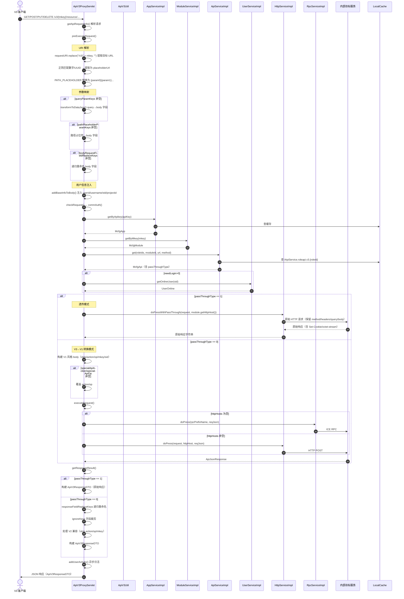

# V3代理与透传实现

> 本文串联 V3 `ApiV3ProxyServlet.doPress` 的完整请求处理管道，聚焦 V3 独有的 RESTful 特性：URI 路径占位符解析、query/path→body 参数映射、body/response 字段重命名，以及 passThroughType=1 的原始透传模式。**V3→V1 转换模式与 V1 共用的 executeRequest 部分详见 V1 主流程文档**。

## 一句话链路

V3 REST 请求 → `preExecuteRequest`（URI 解析 + 占位符提取 + 参数映射 + body fieldReplace + 用户信息注入）→ 如果 `passThroughType=1`：`doPressWithPassThrough`（原始 HTTP 透传，跳过编排）→ 否则：构建 V1 风格 body → `executeRequest`（走 RPC/HTTP）→ `getResponseResult`（V3 响应处理：fieldReplace + ignore + 构建 ApiV3ResponseDTO）→ 返回响应。

## 概述

V3 代理相比 V1 的最大差异：
1. **RESTful URI 解析**：提取 mkey 后的路径段，自动识别数字/UUID 为占位符
2. **参数映射**：queryParamKeys 将 URL query 参数映射为 body JSON 字段，pathPlaceholderParamKeys 将路径占位符映射为 body JSON 字段
3. **字段重命名**：bodyRequestFieldReplaceKeys（请求前）、responseFieldReplaceKeys（响应后）
4. **passThroughType 分流**：=1 直接透传原始请求，=0 走 V3→V1 转换
5. **GET 请求处理**：将 query 参数拼接为 body JSON

## 全链路时序图



## 逻辑详解

### 1. URI 解析与占位符提取

`ApiV3ProxyServlet.preExecuteRequest(ApiV3Request, McfgApp, McfgModule, McfgApi, IUserService)`

```
输入：GET /v3/user/users/123/projects/456
                        ↑ mkey 后的部分 = "/users/123/projects/456"

处理流程：
1. requestURI = "/users/123/projects/456"
2. PATTERN_PLACEHOLDER 正则匹配数字 123, 456 → placeholderUrl = "/users/{param0}/projects/{param1}"
3. 提取的参数值：param0="123", param1="456"
```

这段 placeholderUrl 后续用于匹配 McfgApi（数据库中存的是带占位符的 URL 模板如 `/users/{param0}/projects/{param1}`），而具体参数值用于 pathPlaceholderParamKeys 映射。

### 2. V3 请求编排（preExecuteRequest 阶段）

所有 V3 独有编排在 `preExecuteRequest` 中完成，位于 commAuth 鉴权之前（但依赖 mkey 已解析）：

| 编排项 | 方法 | 行号 | 说明 |
|---|---|---|---|
| queryParamKeys | `transformToDataJson` | `ApiV3ProxyServlet.java` | URL query → body JSON，支持 `Integer`/`Long`/`Boolean` 类型转换 |
| pathPlaceholderParamKeys | 内联 | `ApiV3ProxyServlet.java` | 路径占位符值 → body JSON |
| bodyRequestFieldReplaceKeys | 递归方法 | `ApiV3ProxyServlet.java` | 递归遍历 body JSON 重命名字段 |
| addBaseInfoToBody | `addBaseInfoToBody` | `ApiV3ProxyServlet.java` | 注入 userid/username/userip/eid/projectid/projectId/userprojectids；校验 projectid 归属；处理 ignoreSid |

**addBaseInfoToBody 的复杂度最高**，需要处理：
- 双命名兼容：同时写 `userid` 和 `userId`、`username` 和 `userName`
- `ignoreSid` 三种触发方式（App 级 / mkey 级 / API 级）
- `prodatatrans` / `saasdatatrans` mkey 硬编码跳过
- `projectid` 归属校验（必须在 userprojectids 内）

### 3. V3 鉴权（checkRequest → commAuth）

`ApiV3Util.commAuth(ApiV3Request, HttpServletRequest, IAppService, IModuleService, IApiService, IUserService)`

与 V1 `ApiUtil.commAuth` 的区别：
- **无 IP 校验、无 timestamp 校验**（代码已注释）
- **Api 匹配用 `url+method`** 而非 `action+op`：`apiService.get(roleIds, moduleId, placeholderUrl, httpMethod)` → 查 `IApiService.roleapi.v3.{roleId}` 缓存
- **needLogin>0 时才查 UserOnline**（V1 所有接口都查）
- **无 Hundsun 定制**（仅 V1 支持）

### 4. passThroughType 分流

`ApiV3ProxyServlet.preExecuteRequest`（读 passThroughType）→ `ApiV3ProxyServlet.getResponseResult`（执行分流）

```java
if (passThroughType == 1) {
    // 透传模式
    result = httpservice.doPressWithPassThrough(request, module.getHttpHost());
    // 结果直接作为字符串返回，不经过 JSON 解析
} else {
    // V3→V1 转换模式
    // 构建 V1 风格 body → executeRequest() → RPC/HTTP
}
```

**透传模式的关键行为**（`HttpServiceImpl.doPressWithPassThrough`）：
- 保留原始 HTTP 方法（GET/POST/PUT/DELETE）
- 合并 query 参数到目标 URL
- 流式转发 multipart/form-data body
- 转发允许的 headers（通过 `httpservice.proxy.headers` 配置）
- 回传 `Set-Cookie` 响应头
- 处理 `application/octet-stream` + `Content-Disposition` 文件下载

**转换模式**：构建 V1 风格的 `{data, action, op, mkey, sid}` JSON，走标准的 `executeRequest()` → RPC/HTTP。如果 McfgApi 有 `specialApiAction`/`specialApiOp`，覆盖 action/op（实现 V3 URL → V1 action/op 的映射）。

### 5. 响应处理（getResponseResult）

`ApiV3ProxyServlet.getResponseResult(ApiV3Request, ApiJsonResponse, McfgApi)`

透传模式响应处理：
- 直接返回原始字符串，跳过所有 JSON 编排
- 包装为 `ApiV3ResponseDTO`

转换模式响应处理：
1. `responseFieldReplaceKeys` 递归重命名（`ApiV3ProxyServlet.java`）
2. `ignoreKeys` 字段裁剪
3. 从响应 JSON 中 strip 掉 `action`、`op`、`mkey`、`defaultop` 等 V1 协议字段
4. 包装为 `ApiV3ResponseDTO(code, data, msg)`

## 关键代码位置表

| 环节 | 类/方法 | 位置 |
|---|---|---|
| V3 主入口 | `ApiV3ProxyServlet.doPress` | `web/servlet/ApiV3ProxyServlet.java` |
| 请求解析 | `ApiV3ProxyServlet.getApiRequestInfo` | `ApiV3ProxyServlet.java` |
| URI 解析 + 参数映射 + 编排 | `ApiV3ProxyServlet.preExecuteRequest` | `ApiV3ProxyServlet.java` |
| transformToDataJson | `ApiV3ProxyServlet.transformToDataJson` | `ApiV3ProxyServlet.java` |
| addBaseInfoToBody | `ApiV3ProxyServlet.addBaseInfoToBody` | `ApiV3ProxyServlet.java` |
| V3 认证鉴权 | `ApiV3Util.commAuth` | `web/util/ApiV3Util.java` |
| V3 Api 匹配 | `ApiServiceImpl.get(roleIds, moduleId, url, method, isV3)` | `business/impl/ApiServiceImpl.java` |
| HTTP 透传 | `HttpServiceImpl.doPressWithPassThrough` | `business/impl/HttpServiceImpl.java` |
| 响应处理 | `ApiV3ProxyServlet.getResponseResult` | `ApiV3ProxyServlet.java` |
| 字段重命名（响应） | `ApiV3ProxyServlet` 递归方法 | `ApiV3ProxyServlet.java` |

## 注意事项与坑

1. **passThroughType=1 必须同时有 httpHosts**：透传只能走 HTTP 模式，如果 passThroughType=1 但 httpHosts 为空，会走到错误分支。数据库约束应确保这一点。
2. **同一 URL 多角色可能有不同 passThroughType**：例如 realtest 的 `/task/share GET`，有的角色走 passThroughType=0（V3→V1 转换），有的走 passThroughType=1（V3 透传）。调试时注意请求所用的 apiKey 和角色。
3. **GET 请求的 body 构造**：V3 GET 请求没有 request body，网关需将 query 参数拼接为 JSON body 再走后续流程。这一逻辑在 `getApiRequestInfo` 中处理。
4. **占位符解析依赖正则**：`PATTERN_PLACEHOLDER` 匹配纯数字和 UUID 格式。如果真实路径段恰好是纯数字但不是占位符（如 `/v3/script/scripts/123`），会被错误识别为占位符，依赖后续 Api 匹配去纠正。
5. **V3 无 timestamp 防重放**：V3 的 `commAuth` 中 timestamp 校验已被注释，V3 接口缺少防重放保护。如需要可取消注释恢复。
6. **ignoreSid 硬编码**：`prodatatrans` 和 `saasdatatrans` 两个 mkey 在 `ApiV3Util` 和 `ApiUtil` 中硬编码跳过 sid 注入，新增类似数据同步模块时需在代码中同步添加。

## 延伸阅读

- [请求代理主流程实现](请求代理主流程实现.md) — V1 全链路（executeRequest 共用部分）
- [核心链路-V3透传](../04-复杂功能细节/核心链路-V3透传.md) — passThroughType=1 透传详解
- [核心链路-V3→V1转换](../04-复杂功能细节/核心链路-V3转V1.md) — passThroughType=0 转换详解
- [多版本入口](../04-复杂功能细节/横切-多版本入口（V1-V2-V3）.md) — 三版本差异对比
- [请求响应转换引擎](../04-复杂功能细节/横切-请求响应转换引擎.md) — 所有编排配置项详解
