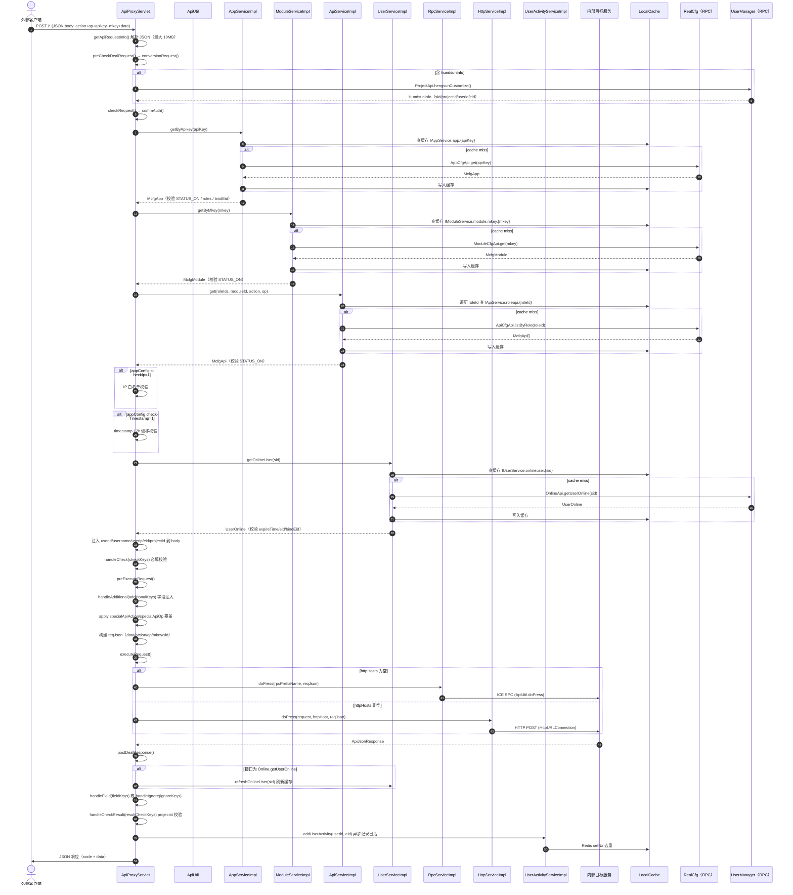

# 请求代理主流程实现

> 本文串联 V1 `ApiProxyServlet.doPress` 的完整请求处理管道，从接收 JSON 请求到返回响应。每一步只写主干代码依据，**鉴权模型、编排引擎、双模代理等细节一律链接到 04 专题**。

## 一句话链路

`doPress` → `getApiRequestInfo`（解析 JSON）→ `preCheckDealRequest`（恒生转换）→ `checkRequest`（commAuth 四层鉴权 + handleCheck）→ `preExecuteRequest`（additional 注入 + specialApi 覆盖）→ `executeRequest`（RPC 或 HTTP）→ `postDealResponse`（登录态刷新 + field/ignore/resultCheck）→ `addUserActivity`（异步日活）→ 返回响应。

## 概述

V1 API 代理是网关最复杂的管道，承担网关的全部核心能力：Hundsun 定制转换、四层鉴权（App/Role/Module/Api）、请求编排（check/field/ignore/additional/resultCheck）、双模代理转发、登录态刷新。V2/V3 Servlet 以此为基础做裁剪和扩展。

## 全链路时序图



## 逻辑详解

### 1. 请求解析（getApiRequestInfo）

`ApiProxyServlet.getApiRequestInfo(HttpServletRequest)`

从 `UPLOAD-JSON` header 或 `request.getInputStream()` 读取 JSON，限制最大 10MB（`protocolSizeInvalid`）。解析为 `ApiRequest` 对象：`action`、`op`、`apikey`、`mkey`、`data` 等字段。

### 2. 恒生定制转换（preCheckDealRequest → conversionRequest）

`ApiProxyServlet.conversionRequest(ApiRequest)`

如果 `data.hundsunInfo` 不为空，调用 `ProjectApi.hengsunCustomize(productNo, projectId)` 映射恒生账户体系到 Testin 内部 sid/projectid/userid/eid/email。映射后的 sid 写入 data，后续鉴权流程复用标准 sid 逻辑。

### 3. 认证鉴权（checkRequest → commAuth）

`ApiUtil.commAuth(ApiRequest, HttpServletRequest, IAppService, IModuleService, IApiService, IUserService)`

核心流程：

1. **参数校验**：`action`、`op`、`apikey`、`mkey` 非空
2. **App 校验**：`appService.getByApikey(apiKey)` → 校验 STATUS_ON、roles[] 非空、bindEid 已设；如果 appConfig.checkIp=1 则校验来源 IP；如果 checkTimestamp=1 则校验时间戳偏移 < 12h
3. **Module 校验**：`moduleService.getByMkey(mkey)` → 校验 STATUS_ON
4. **Api 校验**：`apiService.get(roleIds, moduleId, action, op)` → 遍历每个 roleId 查找匹配的 McfgApi，校验 STATUS_ON
5. **用户信息**：`userService.getOnlineUser(sid)` → 校验 expireTime 未过期、eid 非空且匹配 app.bindEid；注入 userid/username/userip 到请求 data
6. **项目权限**：查 `userService.getMyProjects(userid, eid)` → 校验 data.projectid 在用户项目列表中
7. **handleCheck**：`ApiProxyServlet.handleCheck(ApiRequest, McfgApi)` — 遍历 checkKeys，校验请求 data 中存在且非空

### 4. 请求前编排（preExecuteRequest）

`ApiProxyServlet.preExecuteRequest(ApiRequest, McfgApi, McfgModule, IAppService)`

1. **handleAdditional**：遍历 additionalKeys，注入到 data。支持 `${app.bindEid}` 和 `${app.appName}` 占位符替换
2. **specialApi 覆盖**：如果 McfgApi.specialApiAction 非空，替换 action；如果 specialApiOp 非空，替换 op（用于 V3→V1 转换场景）
3. **构建 reqJson**：组装 `{data, action, op, mkey, sid, userid, userip, apikey}` JSON 字符串

### 5. 代理转发（executeRequest）

`ApiProxyServlet.executeRequest(McfgModule, reqJson, HttpServletRequest)`

```java
if (StringUtils.isBlank(module.getHttpHosts())) {
    apiJsonResponse = irpcservice.doPress(module.getRpcPrefixName(), reqJson);
} else {
    apiJsonResponse = ihttpservice.doPress(request, module.getHttpHost(), reqJson);
}
```

- RPC 模式：`RpcServiceImpl.doPress` 调 `cn.testin.common.service.util.ApiUtil.doPress(prefixName, json, true)`（ICE 框架）
- HTTP 模式：`HttpServiceImpl.doPress` 用 `HttpURLConnection` POST 到随机选取的目标地址，支持 GZIP

### 6. 响应后处理（postDealResponse）

`ApiProxyServlet.postDealResponse(ApiRequest, ApiJsonResponse, McfgApi, IUserService)`

1. **登录态刷新**：如果 `action=Online` 且 `op=getUserOnline`，调用 `userService.refreshOnlineUser(sid)` 更新缓存
2. **field/ignore 处理**：如果 `fieldKeys` 非空→ `handleField`（白名单过滤）；否则如果 `ignoreKeys` 非空→ `handleIgnore`（黑名单裁剪）
3. **handleCheckResult**：如果 `resultCheckKeys` 非空→ 校验响应 projectid 在用户项目列表中

### 7. 用户活动记录（addUserActivity）

`UserActivityServiceImpl.addUserActivity(userid, eid)`

异步通过 `ThreadPoolUtil`（5 线程池）执行：用 `RedisService.setNx` 以当天日期为 key 去重，首次记录时调用 `UserActivityApi` POST `/v3/user/user_activity/add_user_activity`。

### 8. 异常处理

`ApiProxyServlet.doPress` 用 `try/catch (GeneralException)` 包裹整个管道，捕获后调用 `ApiUtil.response(request, response, ApiDispatch.getResult(apiRequest, code, msg))` 返回统一错误 JSON。

## 关键代码位置表

| 环节 | 类/方法 | 位置 |
|---|---|---|
| 主入口 | `ApiProxyServlet.doPress` | `web/servlet/ApiProxyServlet.java` |
| 请求解析 | `ApiProxyServlet.getApiRequestInfo` | `ApiProxyServlet.java` |
| 恒生转换 | `ApiProxyServlet.conversionRequest` | `ApiProxyServlet.java` |
| 认证鉴权 | `ApiUtil.commAuth` | `web/util/ApiUtil.java` |
| App 校验 | `AppServiceImpl.getByApikey` | `business/impl/AppServiceImpl.java` |
| Module 校验 | `ModuleServiceImpl.getByMkey` | `business/impl/ModuleServiceImpl.java` |
| Api 校验 | `ApiServiceImpl.get` | `business/impl/ApiServiceImpl.java` |
| 用户查询 | `UserServiceImpl.getOnlineUser` | `business/impl/UserServiceImpl.java` |
| handleCheck | `ApiProxyServlet.handleCheck` | `ApiProxyServlet.java` |
| handleAdditional | `ApiProxyServlet.handleAdditional` | `ApiProxyServlet.java` |
| handleField | `ApiProxyServlet.handleField` | `ApiProxyServlet.java` |
| handleIgnore | `ApiProxyServlet.handleIgnore` | `ApiProxyServlet.java` |
| handleCheckResult | `ApiProxyServlet.handleCheckResult` | `ApiProxyServlet.java` |
| RPC 代理 | `RpcServiceImpl.doPress` | `business/impl/RpcServiceImpl.java` |
| HTTP 代理 | `HttpServiceImpl.doPress` | `business/impl/HttpServiceImpl.java` |
| 用户活动 | `UserActivityServiceImpl.addUserActivity` | `business/impl/UserActivityServiceImpl.java` |
| 异常处理 | `ApiProxyServlet.doPress` | `ApiProxyServlet.java` |
| 响应输出 | `ApiUtil.response` | `web/util/ApiUtil.java` |

## 注意事项与坑

1. **checkSig 未接线**：`commAuth` 中 `checkSig` 从 appConfig 读取但无校验 block，当前签名校验不生效。如需启用需补全服务端校验逻辑。
2. **timestamp 仅 V1 生效**：V2 (`ApiV2Util.commAuth`) 和 V3 (`ApiV3Util.commAuth`) 的 timestamp 校验已注释，意味着 V2/V3 接口没有防重放保护。
3. **HTTP 模式默认超时 20 分钟**：`OPENAPI_CONNECT_TIMEOUT` 和 `OPENAPI_READ_TIMEOUT` 环境变量未设置时默认 1,200,000ms，可能导致上游超时积累。生产环境建议显式设置。
4. **三个 Servlet 重复实现编排逻辑**：check/field/ignore/additional 在 ApiProxyServlet/ApiV2ProxyServlet/ApiV3ProxyServlet 中各实现一遍，修改编排逻辑时需三处同步。
5. **缓存击穿保护不完整**：只有 `AppServiceImpl`、`ModuleServiceImpl` 使用了 `LockUtil` 双重检查锁；`ApiServiceImpl` 的缓存加载也用了 LockUtil，但 `UserServiceImpl` 的部分缓存方法未加锁。
6. **sid 多来源优先级**：header `sid` > Cookie `authtoken_pro` > body `onlineUserInfo`。如果 header 和 Cookie 同时存在不同值，header 优先生效，可能导致调试困惑。
7. **HttpURLConnection 未复用连接**：`HttpServiceImpl.doPress` 每次 new `HttpURLConnection`，高并发下连接池未复用，建议评估是否迁移到 OkHttp3 RestTemplate 统一管理。

## 延伸阅读

- [四层鉴权模型](../04-复杂功能细节/横切-四层鉴权模型.md) — McfgApp→Role→Module→Api 详解
- [双模代理](../04-复杂功能细节/横切-双模代理（RPC与HTTP）.md) — RPC(ICE) 与 HTTP 转发差异
- [请求响应转换引擎](../04-复杂功能细节/横切-请求响应转换引擎.md) — 所有编排配置项详解
- [缓存与配置热更新](../04-复杂功能细节/横切-缓存与配置热更新.md) — Redis pub/sub → LocalCache 刷新链路
- [核心链路-恒生定制](../04-复杂功能细节/核心链路-恒生定制.md)
- [V3代理与透传实现](V3代理与透传实现.md)
