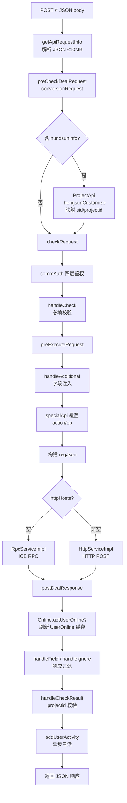

# 核心链路-V1请求代理全流程

> 管道：`doPress` → `getApiRequestInfo` → `preCheckDealRequest` → `checkRequest` → `preExecuteRequest` → `executeRequest` → `postDealResponse` → `addUserActivity`
> 线程：Undertow Worker 线程全程同步执行（用户活动除外）

## 概述

V1 请求代理是网关最完整的管道，包含网关全部核心能力。其他版本（V2/V3）在此管道基础上做裁剪和扩展。

## 管道总览

## 阶段详解

### 阶段 1：请求解析

**方法**：`ApiProxyServlet.getApiRequestInfo(HttpServletRequest)`
**涉及类**：`ApiRequest`（来自 `real-common`）

从 `UPLOAD-JSON` header 或 `request.getInputStream()` 读取 JSON，最大 10MB。解析为 `ApiRequest(action, op, apikey, mkey, data, sid)`。

### 阶段 2：恒生定制转换

**方法**：`ApiProxyServlet.conversionRequest(ApiRequest)`
**涉及 API**：`ProjectApi.hengsunCustomize(productNo, projectId)`
**涉及表**：`project_info.third_party_project_id`、`user_info.third_party_userid`（UserManager 侧）

仅在 `data.hundsunInfo` 非空时触发。将恒生外部 ID 映射为 Testin 内部 sid/projectid/userid/eid，写入 data 供后续鉴权使用。

### 阶段 3：四层鉴权

**方法**：`ApiUtil.commAuth(ApiRequest, request, ...)`
**涉及缓存**：`IAppService.app.{apiKey}`、`IModuleService.module.mkey.{mkey}`、`IApiService.roleapi.{roleId}`、`IUserService.onlineuser.{sid}`

按顺序校验：App（apiKey→McfgApp）→ Role（通过 ApiServiceImpl）→ Module（mkey→McfgModule）→ Api（action+op→McfgApi）→ User（sid→UserOnline）→ Project（projectid 校验）。

### 阶段 4：请求编排

**方法**：`ApiProxyServlet.preExecuteRequest(ApiRequest, McfgApi, McfgModule, IAppService)`

包括 `handleAdditional`（注入字段+占位符替换）、`specialApi` 覆盖 action/op、构建 V1 风格 reqJson。

### 阶段 5：代理转发

**方法**：`ApiProxyServlet.executeRequest(McfgModule, reqJson, request)`

根据 `module.httpHosts` 是否为空选择 RPC（ICE）或 HTTP（POST）转发。

### 阶段 6：响应处理

**方法**：`ApiProxyServlet.postDealResponse(ApiRequest, ApiJsonResponse, McfgApi, IUserService)`

登录态刷新 + field/ignore 过滤 + resultCheck 校验。

### 阶段 7：用户活动

**方法**：`UserActivityServiceImpl.addUserActivity(userid, eid)`

异步通过 `ThreadPoolUtil` 记录日活（Redis setNx 去重）。

## 涉及表

网关本身无 MySQL 表。以下是通过 RPC 间接读取的表（位于 real-cfg / UserManager）：

| 表 | 用途 | 所属库 |
|---|---|---|
| `mcfg_app` | 应用身份 + apiKey | 平台配置库 |
| `mcfg_role` | 角色 | 平台配置库 |
| `mcfg_module` | 目标服务模块 | 平台配置库 |
| `mcfg_api` | 接口权限 + 编排配置 | 平台配置库 |
| `mcfg_role_api` | 角色-API 关联 | 平台配置库 |
| `user_online` | 在线用户会话（Redis + MySQL） | UserManager |
| `user_info` | 用户信息 + 第三方 ID 映射 | UserManager |
| `project_info` | 项目信息 + 第三方 ID 映射 | UserManager |
| `enterprise_info` | 企业信息 + 第三方 ID 映射 | UserManager |
| `enterprise_user_relation` | 企业-用户关联 | UserManager |
