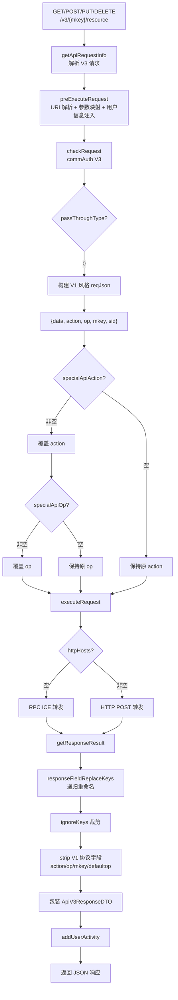

# 核心链路-V3转V1

> 管道：V3 REST 请求 → 鉴权 → 构建 V1 风格 body → `specialApiAction/Op` 覆盖 → `executeRequest`（RPC/HTTP）→ 响应处理
> 线程：Undertow Worker 线程
> 判定：`passThroughType == 0` 且 `McfgApi.specialApiAction` 或 `specialApiOp` 非空

## 概述

V3→V1 转换是网关的"桥接"模式：对外暴露 V3 RESTful 风格的 URL，内部将请求转换为 V1 JSON-RPC 风格 body（`{data, action, op, mkey, sid}`），走标准 `executeRequest()` 转发。响应回来后再 strip 掉 V1 协议字段（action/op/mkey），还原为干净的 JSON 返回给 V3 客户端。

## 为什么需要 V3→V1 转换

- 历史原因：大量后端服务（RealCfg、UserManager、script 等）只提供 V1 ICE/HTTP 接口
- 网关升级 V3 对外 API 时，后端没有同步升级
- 通过 `specialApiAction` + `specialApiOp` 将 V3 URL 映射到 V1 的 action+op
- 约 218 条 API 走此模式

## 管道总览



## 阶段详解

### 阶段 1：URI 解析 + 参数映射

**同 V3 透传**：执行 `preExecuteRequest` 中的 URI 占位符提取、queryParamKeys、pathPlaceholderParamKeys、bodyRequestFieldReplaceKeys、addBaseInfoToBody。

与透传模式不同：转换模式会额外处理参数映射的结果，因为后续要组装 V1 风格的 body。

### 阶段 2：鉴权

同 V3 标准鉴权（`ApiV3Util.commAuth`），匹配 McfgApi 时用 `placeholderUrl + method`。

### 阶段 3：构建 V1 body + specialApi 覆盖

```java
// ApiV3ProxyServlet.preExecuteRequest
JSONObject reqJson = new JSONObject();
reqJson.put("data", data);       // V3 请求 data
reqJson.put("action", action);   // 从 URI 或默认值
reqJson.put("op", op);           // 从 URI 或默认值
reqJson.put("mkey", mkey);
reqJson.put("sid", sid);
// ...
if (StringUtils.isNotBlank(api.getSpecialApiAction())) {
    reqJson.put("action", api.getSpecialApiAction());
}
if (StringUtils.isNotBlank(api.getSpecialApiOp())) {
    reqJson.put("op", api.getSpecialApiOp());
}
```

### 阶段 4：executeRequest

走标准 V1 代理转发（RPC 或 HTTP），与 V1 完全相同的 `executeRequest` 逻辑。

### 阶段 5：响应处理

**方法**：`ApiV3ProxyServlet.getResponseResult`

1. `responseFieldReplaceKeys`：递归重命名响应字段
2. `ignoreKeys`：裁剪指定字段
3. Strip V1 协议字段：从响应 JSON 中移除 `action`、`op`、`mkey`、`defaultop`
4. 包装为 `ApiV3ResponseDTO(code, data, msg)` 返回

## 典型案例

| V3 接口 | specialApiAction | specialApiOp | 后端服务 |
|---|---|---|---|
| `realtest /task/share GET` | `app` | `Task.share` | real-cfg（ICE RPC） |
| `realtest /task/stop_task PUT` | `app` | `Task.cancel` | real-cfg（ICE RPC） |
| `script /dirs/*` | `Collections` | `*` | filemanagement（ICE RPC） |
| — | 其他 | 不一 | 取决于 real-cfg 配置 |

完整列表见 [API 路由映射表](../07-开放接口文档/01-API路由映射表.md)（标记为 🟡 的接口）。

## 涉及表

同 [V1 全流程-涉及表](核心链路-V1请求代理全流程.md#涉及表)。
