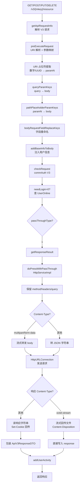

# 核心链路-V3透传

> 管道：V3 REST 请求 → `preExecuteRequest`（URI 解析+参数映射）→ `checkRequest`（commAuth）→ `getResponseResult` → `doPressWithPassThrough`（原始 HTTP 透传）
> 线程：Undertow Worker 线程同步执行
> 判定：`passThroughType == 1` 且 `httpHosts` 非空

## 概述

V3 透传是网关最"轻量"的转发模式：保留原始 HTTP 方法/headers/query/body 全部转发到目标服务，响应同样原样回传（含 Set-Cookie、文件下载等）。网关在此模式下不做 V1 风格 body 组装和任何 JSON 编排，仅执行鉴权。

## 管道总览

## 阶段详解

### 阶段 1：URI 解析与参数映射

**方法**：`ApiV3ProxyServlet.preExecuteRequest`

1. 从 URI 提取 mkey 后的路径段：`/v3/real_task/task/123` → `"/task/123"`
2. 正则匹配数字/UUID → 占位符：`"/task/{param0}"`, param0="123"
3. `placeholderUrl` 用于后续 Api 匹配（数据库中存的是 `/task/{param0}` 模板）
4. queryParamKeys → body 字段映射
5. pathPlaceholderParamKeys → body 字段映射
6. bodyRequestFieldReplaceKeys → 递归重命名 body 字段
7. addBaseInfoToBody → 注入 userid/username/eid/projectid

### 阶段 2：鉴权

**方法**：`ApiV3Util.commAuth`

与 V1 鉴权的关键差异：
- Api 匹配用 `placeholderUrl + httpMethod`（而非 action+op）
- needLogin>0 时才查 UserOnline
- 无 IP 校验、无 timestamp 校验、无 Hundsun 定制

### 阶段 3：透传转发

**方法**：`HttpServiceImpl.doPressWithPassThrough`

这是透传模式的核心，保留原始请求的全部特征：

1. **HTTP 方法**：`request.getMethod()` 直接设置到 `HttpURLConnection`
2. **URL 拼接**：`targetHost + requestURI + (queryString ? "?" + queryString : "")`
3. **Headers 转发**：遍历 `request.getHeaderNames()`，过滤后设置到 conn（通过 `HttpHeaderUtil` + `httpservice.proxy.headers` 配置）
4. **Body 处理**：
   - `multipart/form-data`：流式转发（`IOUtils.copy(is, os)`）
   - 其他：转为 JSON 字符串
5. **响应处理**：
   - `Set-Cookie`：从 conn 取 `Set-Cookie` header → 回传到 response
   - `application/octet-stream`：流式回传 + 设置 `Content-Disposition` header
   - 其他：读为字符串，包装为 `ApiV3ResponseDTO`

### 阶段 4：用户活动

同 V1，异步通过 `ThreadPoolUtil` 记录日活。

## 涉及表

与 V1 相同，网关无直接表操作。间接读取的表参见 [V1 全流程-涉及表](核心链路-V1请求代理全流程.md#涉及表)。

## 透传模式典型接口

| mkey | URL | method | 说明 |
|---|---|---|---|
| `real_task` | `/*` | ALL | real-task 全部接口走透传 |
| `script` | `/scripts/*` | ALL | 脚本相关 REST 接口 |
| 其他 V3 原生服务 | 不一 | 不一 | 取决于 real-cfg 中 McfgApi 的 passThroughType 配置 |

完整映射见 [API 路由映射表](../07-开放接口文档/01-API路由映射表.md)（标记为 🔵 的接口）。
