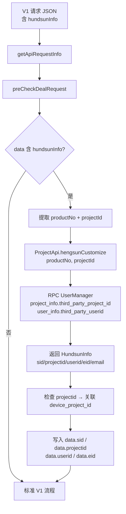

# 核心链路-恒生定制

> 管道：V1 请求携带 `hundsunInfo` → `conversionRequest` → `ProjectApi.hengsunCustomize` → 映射 sid/projectid/userid/eid → 后续复用标准 V1 鉴权流程
> 线程：Undertow Worker 线程
> 版本限制：仅 V1（`ApiProxyServlet`）

## 概述

恒生（Hundsun）客户使用自己的产品/项目账户体系，不直接持有 Testin 的 sid。网关在 V1 请求管道的 `preCheckDealRequest` 阶段识别 `hundsunInfo`，调用 `ProjectApi.hengsunCustomize` 将恒生 ID 映射为 Testin 内部 sid/projectid/userid/eid。映射后的 sid 写入请求 data，后续鉴权流程完全复用标准 V1 逻辑。

## 管道总览



## 阶段详解

### 阶段 1：识别 hundsunInfo

**方法**：`ApiProxyServlet.preCheckDealRequest`
**触发条件**：`data.hundsunInfo` 不为 null

```java
if (apiRequest.getData() != null
    && apiRequest.getData().containsKey("hundsunInfo")) {
    conversionRequest(apiRequest);
}
```

### 阶段 2：映射调用

**方法**：`ApiProxyServlet.conversionRequest(ApiRequest)`

```java
JSONObject hundsunInfo = data.getJSONObject("hundsunInfo");
String productNo = hundsunInfo.getString("productNo");
String projectId = hundsunInfo.getString("projectId");

// 调用 RPC 映射
HundsunInfo info = ProjectApi.hengsunCustomize(productNo, projectId);
```

**`ProjectApi.hengsunCustomize` 内部逻辑**（`api/user/user/ProjectApi.java`）：
1. 通过 `project_info` 表的 `third_party_project_id` 字段查 `projectId` → Testin 内部 `projectid`
2. 通过 `user_info` 表的 `third_party_userid` 字段查关联用户 → Testin 内部 `userid` / `eid`
3. 构造 `UserOnline` → 获取 `sid`
4. 返回 `HundsunInfo(sid, projectid, userid, eid, email)`

### 阶段 3：写入请求

映射结果写回 `data`，后续流程透明复用：

```java
data.put("sid", info.getSid());
data.put("projectid", info.getProjectid());
data.put("userid", info.getUserid());
data.put("eid", info.getEid());
```

### 阶段 4：后续标准流程

从 `checkRequest → commAuth` 开始完全复用标准 V1 鉴权：`dealOnlineUser` 用映射后的 sid 查 `UserOnline`，按标准逻辑校验 eid → bindEid、projectid → userProjectIds。恒生定制只做账户映射，不改变鉴权规则。

## 涉及表（UserManager 侧）

| 表 | 字段 | 用途 |
|---|---|---|
| `project_info` | `third_party_project_id` | 恒生 projectId → Testin projectid |
| `user_info` | `third_party_userid` | 恒生 user → Testin userid |
| `user_online` | `sid` | 通过 userid/eid 构造或查询会话 |

## 恒生请求示例

```json
{
  "action": "app",
  "op": "Task.add",
  "apikey": "hundsun_api_key",
  "mkey": "realtest",
  "data": {
    "hundsunInfo": {
      "productNo": "HS_PRODUCT_001",
      "projectId": "HS_PROJECT_12345",
      "productName": "某产品"
    },
    "taskName": "测试任务"
  }
}
```

## 注意事项

1. **仅 V1 支持**：恒生定制逻辑只在 `ApiProxyServlet.conversionRequest` 中，V2/V3 不触发。
2. **映射失败无降级**：如果 `hengsunCustomize` 找不到对应的映射记录，抛异常，请求失败。不会降级为其他认证方式。
3. **映射后的 sid 可能过期**：映射得到的 sid 来自 `UserOnline` 表，如果该会话已过期，后续 `dealOnlineUser` 会返回 `paraSidInvalid`。
4. **projectid 的 device_project_id 关联**：映射后额外检查 `device_project_id` 字段（`conversionRequest` 内），具体逻辑在 `ProjectApi.hengsunCustomize` 中。
