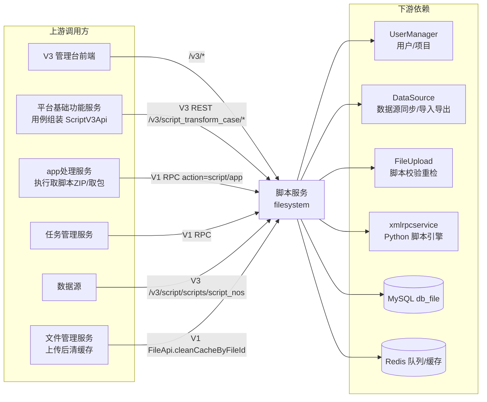
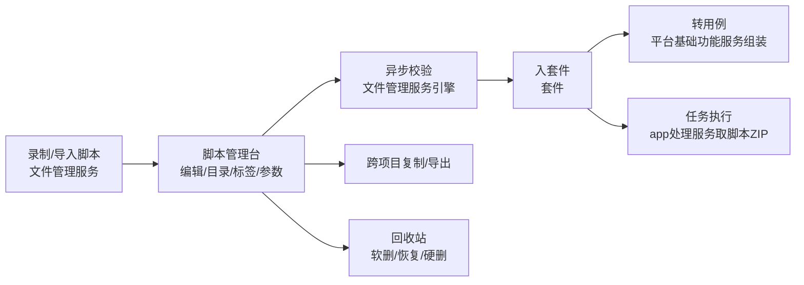

# 产品概述

> **Git 仓库**：`git@git.testin.cn:stock/backend/filemanagement.git`　**分支**：`syy.release.z7.8.1.0`

## 这是什么

脚本服务（Java 工程 `filemanagement`，Maven 制品名 `filesystem`，`pom.xml`）是 Testin 云真机平台的**脚本管理中台**：所有 UI 自动化脚本的全生命周期（创建、编辑、目录、套件、参数与数据源、导入导出、复制、回收站、校验状态维护、转用例）都归它管；同时兼任 **App 包（AppPackage）查询服务**——包的上传解析在文件管理服务完成，查询与提测选包走本服务。

它对外提供**两套并存的接口形态**（详见 [横切-双入口路由机制](../04-复杂功能细节/横切-双入口路由机制.md)）：

| 形态 | 入口 | 路由 | 主要使用方 |
|---|---|---|---|
| V1 ApiServlet | `/*` | `action=包名` + `op=类.方法` 反射调用 `cn.testin.service.*`（`cn/testin/startup/Boot.java`） | 平台内部各服务 RPC（app处理服务、任务管理服务等） |
| V3 REST | `/v3/*` | Spring MVC `@RequestMapping`（`cn/testin/startup/Boot.java`） | V3 管理台前端、平台基础功能服务 |

## 与文件管理服务的表共享关系

脚本服务与**文件管理服务**（fileupload）共享同一个 MySQL 库 `db_file` 和同一套脚本/文件表（`script_file`、`script_step`、`script_check`、`common_file`、`common_app`、`package_file` 等，共约 40 张表，见 [存储总览](../02-技术架构/00-存储总览.md)）。两服务按职责分工：

| 职责 | 脚本服务（本服务） | 文件管理服务 |
|---|---|---|
| 脚本 CRUD / 目录 / 套件 | **核心**（V3 管理台） | — |
| 脚本导入导出 / 批量复制 / 转用例 | **核心** | — |
| 参数与数据源（本服务侧表） | **核心** | — |
| App 包/脚本 ZIP **查询**、缓存 | **核心** | — |
| 脚本录制上传、脚本解析入库 | — | **核心**（写共享表） |
| 脚本异步校验引擎（URL 可达/依赖/环形） | 发起重检（V1 RPC） | **核心**（消费 Redis 队列） |
| App 包上传、解析、存储（FastDFS/MinIO） | — | **核心**（写共享表 + 清本服务缓存） |

因为两服务写同一张表，**跨服务缓存一致性**靠显式清缓存保证：文件管理服务更新 `common_file` 后远程调用本服务 `action=file, op=FileApi.cleanCacheByFileId` 清 Guava 本地缓存（见 [AppPackage包查询实现](../03-实现逻辑/AppPackage包查询实现.md)）。

## 上下游

- 下游服务地址集中配置在 `src/main/resources/service.api.properties`（UserManager / FileUpload / DataSource / xmlrpcservice）。
- 查询类流量走独立域名 `script.api.pro.testin.cn` / `apppackage.api.pro.testin.cn` 接入（V1 网关按域名分流到本服务）。

## 核心概念

| 概念 | 说明 | 主表 |
|---|---|---|
| 脚本（Script） | 最小资产。双重标识：**scriptNo**（项目内编号，面向用户）与 **scriptId**（每次保存产生新版本的行主键）；`script_file` 按 scriptNo 存多版本 | `script_file` |
| 脚本步骤（Step） | 脚本的执行步骤；调用子脚本步骤类型为 `CALL`，记录 `stepcallscriptno` | `script_step` |
| 脚本依赖（Relation） | 父子脚本调用关系，供依赖展开与环形检测 | `script_relation` |
| 目录（Dir） | 树形目录组织脚本，脚本经关联表挂载 | `script_dir` / `script_dir_child` |
| 套件（Suite） | 应用级测试套件：关联多个 App 包 + 脚本 + AI 资源 | `suite_info` / `suite_app` / `suite_script` / `suite_group_script` |
| 参数与数据源 | 脚本参数定义、参数数据源配置与数据 | `script_param` / `script_param_source` / `script_param_data` |
| 校验状态（Check） | 脚本有效性状态（有效/无效），由文件管理服务校验引擎写入，本服务发起重检 | `script_check` |
| 用例转换（Transform Case） | 把"主脚本 + CALL 子脚本链"转成平台基础功能服务的接口自动化用例（`case_info`/`case_step`），本服务只出数据不落用例表 | — |
| AppPackage | 上传解析后的应用包（APK/IPA/HAP）：`package_file` 存包版本，`common_app` 存应用，`common_file` 存文件 URL/MD5 | `package_file` / `common_app` / `common_file` |
| 回收站 | 软删除（`isdelete`）→ 恢复 → 硬删除三级 | `script_file.isdelete` / `script_recover_info` |

## 典型使用动线

## 延伸阅读

- [功能总览](功能总览.md) — 按功能域的清单与接口索引
- [端到端-脚本全生命周期](../../跨模块链路/端到端-脚本全生命周期.md) — 录制→校验→参数化→组装→执行全链路
- [端到端-App包上传与使用](../../跨模块链路/端到端-App包上传与使用.md) — 包上传→查询→提测→下发安装
- [脚本服务 总览](../00-首页.md) — 分支无关的模块总览
