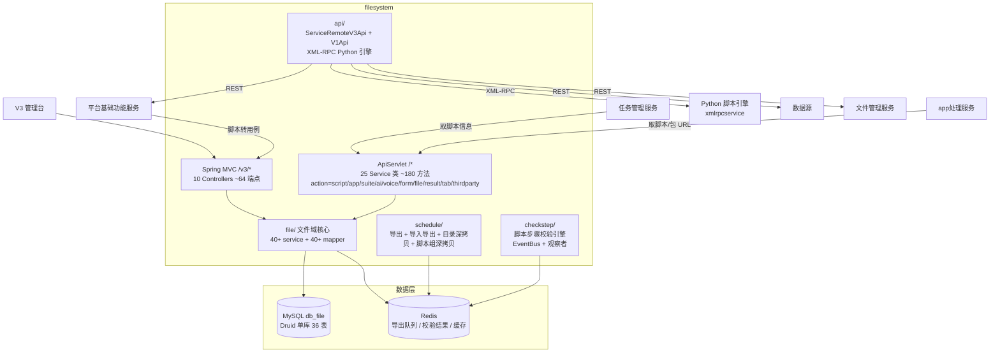

# 总体架构

## 平台定位

脚本服务（filesystem / filemanagement）是 Testin 平台的**脚本管理中台**，负责所有测试脚本的全生命周期管理：脚本 CRUD、目录树、版本管理、套件/App 包管理、数据源/参数管理、导入导出（异步队列）、回收站、标签管理、Python 脚本引擎（XML-RPC）、AI 标注资源、脚本校验。

它与文件管理服务（fileupload）**共享 db_file 数据库**——文件管理服务管上传解析与校验引擎，脚本服务管 V3 管理台与业务编排。

## 系统上下文

## 核心架构决策

### 1. 双入口架构（V1 ApiServlet + V3 Spring MVC）

`/*` → `ApiServlet`：action/op 参数决定 `cn.testin.service.{action}.{ClassName}` 反射调用，action 包括 script、app、suite、ai、voice、form、file、result、tab、thirdparty（voice/form 已下线）。
`/v3/*` → `DispatcherServlet`：`@RestController` 注解路由，10 个 Controller 提供管理台接口。

详见 [横切-双入口路由机制](横切-双入口路由机制.md)。

### 2. 非 Spring Boot 自动装配数据源

Druid 连接池由 `SessionFactoryUtil` 手动管理 SqlSession，启动类显式 `exclude={DataSourceAutoConfiguration.class}`。这是历史遗留架构——脚本服务是最早的服务之一，先于公司 Spring Boot 标准化。

### 3. 脚本导入导出异步队列

DispatchThread 轮询 Redis 队列 → WorkThread 处理 → 结果回写 Redis。脚本导出和数据源导入导出两套系统各自独立的队列。`CleanScriptExportFileThread` 每小时清理过期导出文件。详见 [横切-脚本导入导出异步队列](../04-复杂功能细节/横切-脚本导入导出异步队列.md)。

### 4. 脚本校验引擎（EventBus + 观察者模式）

文件管理服务上传脚本后触发校验，校验结果通过 Redis 队列回到脚本服务。引擎基于 EventBus 事件总线 + 观察者模式，支持步骤合法性校验、URL 可达性校验、依赖环检测。详见 [横切-脚本校验引擎](../04-复杂功能细节/横切-脚本校验引擎.md)。

### 5. Python 脚本引擎通过 XML-RPC 远程调用

脚本服务不内嵌 Python 运行时，而是通过 Apache XmlRpcClient 远程调用独立的 `xmlrpcservice`。支持执行、调试、函数发现、参数解析。仅 V3 入口（`pythonController`，9 端点）。

## 代码工程一览

| 工程 | 技术栈 | 产物 | 说明 |
|---|---|---|---|
| `filemanagement` | Java 1.8 / Spring Boot 2.x / Undertow / MyBatis / Druid 手动 / Kryo / XML-RPC | jar | 独立 Maven 工程，`Boot.main()` 双 Servlet 注册 + 18 线程 fixedThreadPool |

## 延伸阅读

- [存储总览](00-存储总览.md) — db_file 41 张表/视图 + Redis
- [专题索引](../04-复杂功能细节/专题-索引.md)
- [横切-双入口路由机制](../04-复杂功能细节/横切-双入口路由机制.md)
- [横切-脚本导入导出异步队列](../04-复杂功能细节/横切-脚本导入导出异步队列.md)
- [横切-脚本校验引擎](../04-复杂功能细节/横切-脚本校验引擎.md)
- [跨模块：脚本全生命周期](../../跨模块链路/端到端-脚本全生命周期.md) / [App包上传与使用](../../跨模块链路/端到端-App包上传与使用.md)
