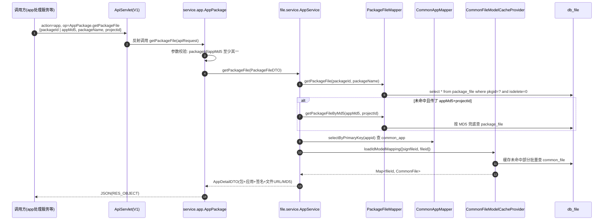

# AppPackage 包查询实现

## 概述

App 包（APK/IPA/HAP）的**上传与解析在文件管理服务完成**（写共享库 `db_file`），脚本服务只负责**查询与管理**：按 packageId/MD5 查包、按项目/套件分页列包、取下载 URL、补签名、移除。全部走 **V1 ApiServlet** 形态（`action=app`，op=`AppPackage.*` / `App.*` / `AppSubInfo.*`），是 app处理服务、任务管理服务等下游"提测选包"的数据来源。端到端视角见 [端到端-App包上传与使用](../../跨模块链路/端到端-App包上传与使用.md)。

查询性能靠两级手段：**JVM 内 Guava 本地缓存**（`CommonFileModelCacheProvider` / `CommonAppModelCacheProvider`）+ 跨服务显式清缓存接口 `FileApi.cleanCacheByFileId`。

## 入口与路由

`src/main/java/cn/testin/service/app/AppPackage.java`，继承 `GenericBaseService`。V1 网关按 `action=app` 定位到 `cn.testin.service.app` 包，`op=AppPackage.getPackageFile` 反射调方法（路由机制见 [横切-双入口路由机制](../04-复杂功能细节/横切-双入口路由机制.md)）。所有方法入参统一是 `ApiRequest`（`reqjson` 为 org.json JSONObject），返回 JSON 字符串。

| op | 方法 | 说明 |
|---|---|---|
| `AppPackage.listPackageFile` |  | 条件分页列包（appId/版本/渠道/osType/projectId/包名/userIds/suiteId/packageId/ids） |
| `AppPackage.listAppVersion` |  | 按 appId+projectId 列版本（可选 suiteId 过滤） |
| `AppPackage.getPackageFile` |  | 按 packageId 或 appMd5 查单包详情（含签名、文件 URL/MD5） |
| `AppPackage.getPackageFileByAppMd5` |  | 按 MD5 直接取 App 下载 URL |
| `AppPackage.completeSingInfo` |  | 补全签名信息（写 `common_app` 签名字段） |
| `AppPackage.listAppByProjectid` |  | 按项目列 App |
| `AppPackage.get` |  | 按 pkgid 查包扩展信息（`PackageExt`，对齐旧 ICE FileQueryPrx.findPkgById） |
| `AppPackage.remove` |  | 按 pkgid+suiteId 移除包 |

## 调用链

### getPackageFile —— 核心查询

代码链：

1. `AppPackage.getPackageFile`（AppPackage.java）：`preCheck` 校验 reqjson 非空（`GenericBaseService.java`），参数构造 `PackageFileDTO.Builder(packageId, packageName, appMd5, projectid)`；
2. `AppService.getPackageFile`（file/service/AppService.java）：手动开 SqlSession（`SessionFactoryUtil.getSqlSession(Constants.FILE_DB)`）；
   - 先 `packageFileMapper.getPackageFile`（SQL：`PackageFileMapper.xml`，`pkgid + isdelete=0`，可选 packageName）；
   - 未命中且带了 appMd5+projectId 时走 `getPackageFileByMd5` 兜底（XML:670）；
   - `commonAppMapper.selectByPrimaryKey(appid)` 取应用；
   - 签名文件 id + 包文件 id 交给 `CommonFileModelCacheProvider.INSTANCE.loadIdModelMapping`批量取 `common_file`；
   - 组装 `AppDetailDTO`：包版本信息 + 应用信息 + `common_app.appExt`（JSON 解析 appType）+ 签名文件 URL + 文件 MD5/URL/大小。
3. 注意：**异常被吞**：`AppService.getPackageFile` 的 catch 只打 error 日志返回空 DTO，调用方拿不到失败原因。

### listPackageFile —— 条件分页

`AppService.listPackageFile`（AppService.java）：常规条件直拼 params；**suiteId 特殊处理**——先 `suiteAppService.getSuitePkgs`查 `suite_app` 拿该套件绑定的 pkgid 集合，空集直接返回空；同时传 suiteId 和 packageId 时校验包必须属于套件。返回 `BaseList<SuitePackageFile>`，由 `GenericBaseService.respWithMultiObjectAndPager`输出分页结构。

### get / remove —— 旧 ICE 兼容接口

- `AppPackage.get`→ `TestinPkgManageService.findPkgById`（file/service/impl/TestinPkgManageService.java）：`package_file` + `common_app` + 签名/文件信息组装 `PackageExt`。**注意  的注释**：`common_app` 查询**故意不走缓存**（"同一个包需要支持改名字的情况"），签名文件和包文件仍走 `CommonFileModelCacheProvider`——同一服务内两种缓存策略并存。
- `AppPackage.remove`→ `TestinPkgManageService.deletePkgById(pkgid, suiteId, type)`。

### getPackageFileByAppMd5 —— 只取下载 URL

`AppService.getAppUrl`（AppService.java）：`commonAppMapper.getAppByMd5(appMd5)` 一条 SQL 直出 URL，不组装 DTO。下游拿到 URL 后自行下载（见 [端到端-App包上传与使用](../../跨模块链路/端到端-App包上传与使用.md)：全链路只传 appUrl，上位机下载安装）。

## 缓存设计

### 两个 Guava 本地缓存 Provider

`cn/testin/file/configure/cache/` 下两个静态单例，结构完全对称：

| Provider | 缓存对象 | 源表 |
|---|---|---|
| `CommonFileModelCacheProvider` | `Cache<Long, CommonFile>` | `common_file`（文件 URL/MD5/大小） |
| `CommonAppModelCacheProvider` | `Cache<Long, CommonApp>` | `common_app`（应用信息） |

参数（CommonFileModelCacheProvider.java）：`maximumSize(1000)` + `expireAfterWrite(2分钟)`，写后 2 分钟过期。

三种读法：

1. `getCommonFileModelById`：`cache.get(fileId, callable)`  miss 时回源 `selectUsefulOneByPrimaryKey`；
2. `loadIdModelMapping`：**批量接口专用**——先逐个查缓存，miss 的 id 收集起来一条 `getFileListByIdList` 批量回源并回填缓存，避免 N+1；
3. `selectWithCache`：先缓存，miss 回源并 `put`。

### 缓存失效：cleanCacheByFileId

`src/main/java/cn/testin/service/file/FileApi.java`（V1 端点 `action=file, op=FileApi.cleanCacheByFileId`）：核心只有一行 `CommonFileModelCacheProvider.cacheFormCallable.invalidate(fileId)`。

两个触发方：

| 触发方 | 场景 | 代码 |
|---|---|---|
| 文件管理服务（远程 V1 RPC） | 上传/更新 App 包改写 `common_file` 后跨服务清缓存 | 见 [端到端-App包上传与使用](../../跨模块链路/端到端-App包上传与使用.md) 上传段 |
| 本服务自调用 | `AppService.saveCommonFile` 发现同 MD5 文件已存在、执行更新而非新增时，直接 `new FileApi().cleanCacheByFileId(...)` 清掉旧缓存 | AppService.java |

失效粒度的局限：**只有 `common_file` 的清缓存入口，没有 `common_app` 的**。因此 `TestinPkgManageService.findPkgById` 对 `common_app` 干脆不走缓存（TestinPkgManageService.java 注释），而 `AppService.getPackageFile` 仍走 `commonAppMapper` 直查（AppService.java）——实际上 `common_app` 的 Guava 缓存只在 `listPackageFile` 等少数路径使用（AppService.java）。

### 涉及表

`package_file`（包版本，`PackageFileMapper`）、`common_app`（应用，`CommonAppMapper`）、`common_file`（文件元数据，`CommonFileMapper`）、`suite_app`（套件绑定，`suiteAppService.getSuitePkgs`）。

## 关键代码位置表

| 环节 | 类 / 方法 | 位置 |
|---|---|---|
| V1 入口 | service.app.AppPackage | src/main/java/cn/testin/service/app/AppPackage.java |
| 单包查询入口 | AppPackage.getPackageFile | src/main/java/cn/testin/service/app/AppPackage.java |
| 单包查询实现 | AppService.getPackageFile | src/main/java/cn/testin/file/service/AppService.java |
| 分页列包 | AppService.listPackageFile | src/main/java/cn/testin/file/service/AppService.java |
| 取下载 URL | AppService.getAppUrl | src/main/java/cn/testin/file/service/AppService.java |
| 包主表 SQL | PackageFileMapper.getPackageFile / getPackageFileByMd5 | src/main/java/cn/testin/file/mapping/PackageFileMapper.xml |
| 旧 ICE 兼容查询 | TestinPkgManageService.findPkgById | src/main/java/cn/testin/file/service/impl/TestinPkgManageService.java |
| 文件缓存 | CommonFileModelCacheProvider | src/main/java/cn/testin/file/configure/cache/CommonFileModelCacheProvider.java |
| 应用缓存 | CommonAppModelCacheProvider | src/main/java/cn/testin/file/configure/cache/CommonAppModelCacheProvider.java |
| 清缓存端点 | FileApi.cleanCacheByFileId | src/main/java/cn/testin/service/file/FileApi.java |
| 本服务自清缓存 | AppService.saveCommonFile | src/main/java/cn/testin/file/service/AppService.java |

## 注意事项与坑

1. **缓存只覆盖 file/app 两级、失效只覆盖 file 一级**：改 `common_app` 的调用方没有清缓存手段，只能等 2 分钟自然过期；这也是 `findPkgById` 弃用 app 缓存的直接原因（TestinPkgManageService.java）。
2. **缓存 TTL 仅 2 分钟 + 容量 1000**：大项目包多时会频繁回源；`loadIdModelMapping` 的批量回源把 miss 合并成一条 IN 查询，是热点路径的主要保护。
3. **查询异常被吞**：`AppService.getPackageFile`与 `getAppUrl`catch 后只打日志返回空结果/null，排障时先看服务日志别先怀疑数据。
4. **projectid 大小写兼容**：`GenericBaseService.getInteger`（GenericBaseService.java）取不到原 key 会再试小写——V1 老调用方传 `projectid`、新调用方传 `projectId` 都能工作，新增参数时沿用这个工具方法。
5. **V1 注释里的 FileQueryPrx.\***：方法注释（如 AppPackage.java）标注的是旧 ICE 接口名，现在只剩 HTTP 形态，注释仅用于和老的调用文档对照。
6. **fileupload 仓的 `cn.testin.api.file.FileApi` 是客户端**：那是文件管理服务调本服务 `FileApi` 端点的封装，不是服务端实现，别混淆（服务端实现在本仓 `cn/testin/service/file/FileApi.java`）。
