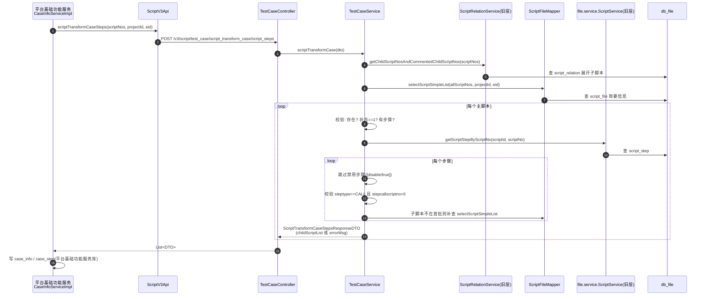

# 脚本管理与转用例实现

## 概述

本文覆盖脚本服务最核心的两条 V3 REST 链路：

1. **脚本管理**：`/v3/script/*`（`ScriptController`）的 CRUD、批量操作、回收站、导入导出、复制——代码级调用链与涉及表；
2. **脚本转用例**：`/v3/script/test_case/script_transform_case/*`（`TestCaseController`）——把"主脚本 + CALL 子脚本链"转换成接口自动化用例的数据供给链路。

复杂异步链路（导入导出队列、复制深拷贝、校验）已有专题，本文只挂入口：**导入导出**见 [横切-脚本导入导出异步队列](../04-复杂功能细节/横切-脚本导入导出异步队列.md) 与 [核心链路-脚本解析与导入](../04-复杂功能细节/核心链路-脚本解析与导入.md) / [核心链路-脚本导出](../04-复杂功能细节/核心链路-脚本导出.md)；**批量复制**见 [核心链路-脚本复制](../04-复杂功能细节/核心链路-脚本复制.md)；**校验**见 [核心链路-脚本校验](../04-复杂功能细节/核心链路-脚本校验.md)。

## V3 脚本管理调用链

### 端点总览（ScriptController）

`src/main/java/cn/testin/mvc/controller/ScriptController.java`，类级 `@RequestMapping("/script")`，经 DispatcherServlet 挂到 `/v3/script/*`。

| 端点                                                                         | 方法                   | Service                                                                         | 说明                                                    |
| -------------------------------------------------------------------------- | -------------------- | ------------------------------------------------------------------------------- | ----------------------------------------------------- |
| POST `/scripts`                                                            | listByCondition | `ScriptService.listScriptsByCondition`（mvc/ScriptService.java）              | 条件分页列表；`dealListByConditionRequest`强制分页上限与目录参数校验 |
| POST `/scripts/relation_status`                                            |                | `getScriptNoRelationStatus`                                                     | 批量查脚本是否存在父子依赖                                         |
| POST `/scripts/datasources/export`                                         |                | `ScriptExportService.scriptExport`                                              | 导出新版：先拿 key，再 `ThreadPoolUtils.execute` 异步导出    |
| POST `/scripts/datasources/export/old`                                     |                | `ScriptService.scriptExport`                                              | 导出走老链路（同步入队）                                          |
| PUT `/scripts/{scriptNo}`                                                  | updateScript   | `ScriptService.updateScript`                                              | 更新名称/标签/设计人；`@OperateLog` 记操作日志                       |
| POST `/scripts/hard_delete`                                                |                | `hardDelete`                                                              | 回收站硬删除                                                |
| POST `/scripts/batch_recover`                                              |                | `refreshUUUIdForRepeatScripts`→ `batchRecover`                      | 恢复前处理同名冲突（保留两者/替换）                                    |
| POST `/scripts/create_empty`                                               |                | `scriptCreateEmpty`                                                      | 创建空脚本，返回新 scriptNo                                    |
| POST `/scripts/recheck`                                                    |                | `invalidScriptRecheck`                                                   | 无效脚本重检（跨服务，见下）                                        |
| POST `/scripts/batch_copy`                                                 |                | `checkScriptCopyParamAndGetRequestId`+ 异步 `oldScriptService.copyScripts` | 复制：同步校验生成 requestId，异步执行                              |
| POST `/scripts/move/dir`                                                   |                | `moveScriptsDir`                                                         | 批量移动目录                                                |
| POST `/scripts/remove`                                                     | batchDelete    | `batchDelete`                                                            | 批量软删除；`@OperateLog`                                   |
| PUT `/scripts/tags`                                                        |                | `batchUpdateTags`                                                        | 批量更新标签（支持全选条件）                                        |
| POST `/scripts/script_nos`                                                 |                | `selectAllScriptNosByRequestCondition`                                   | 内部接口，供数据源按条件取 scriptNo                                |
| PUT `/scripts/assoc_case_num`                                              |                | `updateAssocCaseNum`                                                     | 回写脚本关联用例数                                             |
| POST `/scripts/case_num` / GET `/scripts/count` / GET `/scripts/tag_count` |      | 统计系列                                                                            | 用例数/脚本数/标签分布                                          |
| GET `/scripts/tag_count/download`                                          |                | `downloadTagFile`                                                        | 标签统计 CSV 下载                                           |
| POST `/scripts/sync_tags`                                                  |                | `syncTags`                                                               | 标签同步修复                                                |
| POST `/scripts/import_script`                                              |                | `ScriptImportService.importScript`                                              | 异步导入，`finally` 删临时文件                            |
| POST `/scripts/pre_import_script`                                          |                | `ScriptImportService.preImportScript`                                           | 导入预检（冲突清单）                                            |
| POST `/scripts/list_simple`                                                |                | `getScriptSimpleList`                                                    | 按 scriptNo 批量取简要信息                                    |
| POST `/scripts/check_script_repeat`                                        |                | `getScriptRepeat`                                                        | 恢复前查重                                                 |

### 关键实现点

1. **双层 Service 并存**：Controller 同时注入新层 `cn.testin.mvc.service.ScriptService` 和旧层 `cn.testin.file.service.ScriptService`（`ScriptController.java`，字段名 `oldScriptService`）。批量复制等老逻辑直接复用旧层，新旧两层操作同一套 MyBatis Mapper（`cn.testin.file.mapping`）。
2. **更新脚本（updateScript）**：`@Transactional`；scriptId 为空时先按 scriptNo 查最新版；更新 `script_file` 后调 `tagService.updateTags` 维护 `script_tag`；`syncSourceName=1` 时同步调 `DataSourceApi.syncSourceName`通知**数据源**服务改数据源名——失败抛错回滚。
3. **硬删除（hardDelete）**：只处理 `isdelete=已删除` 的数据；先 `scriptCaseRelationMapper.removeBatchScriptCaseRelation`清理 `script_interface_case_relation`（与接口自动化用例的关联），再把 `isdelete` 置为硬删除态。
4. **重检跨服务（invalidScriptRecheck）**：本服务**不做校验**，按 scriptNo 查到 scriptId 后经 `serviceRemoteV1Api.remoteApi` 发 V1 RPC 到**文件管理服务**的 `/checkScript`，由文件管理服务校验引擎异步消费 Redis 队列（见 [端到端-脚本全生命周期](../../跨模块链路/端到端-脚本全生命周期.md) 第 2 节）。
5. **复制/导入/导出全部异步化**：Controller 只生成 requestId 立即返回，任务经 `ThreadPoolUtils.execute`（复制/导入）或 Redis 队列（导出）后台执行，前端轮询进度。

### 涉及表

| 操作 | 写表 |
|---|---|
| 更新脚本 | `script_file`、`script_tag`（+ 数据源服务侧） |
| 创建空脚本 | `script_file`、`script_dir_child`、`script_at_last`、`suite_script` |
| 软删/恢复/硬删 | `script_file.isdelete`、`script_recover_info`、硬删连带 `script_interface_case_relation` |
| 移动目录 | `script_dir_child` |
| 复制 | `script_file`、`script_step`、`script_relation`、`script_dir_child`、`script_tag` 等（深拷贝，见专题） |
| 导入 | `script_file`/`common_file` → `script_relation` → `script_recover_info` → `script_at_last` → `script_check` → `script_dir(_child)` → `suite_script` → `script_tag` → `script_step_fast_search`（见专题） |

## 脚本转用例（script_transform_case）

### 链路定位

平台基础功能服务在用例管理里提供"脚本转用例"：入口 `CaseInfoServiceImpl.scriptTransformCase`，通过 `ScriptV3Api` 调本服务三个端点取数据，最终把用例写入平台基础功能服务自己的 `case_info` / `case_step`（**本服务不落用例表，只做数据供给**）。端到端视角见 [端到端-脚本全生命周期](../../跨模块链路/端到端-脚本全生命周期.md) 第 4 节。

### 端点

`src/main/java/cn/testin/mvc/controller/TestCaseController.java`，类级 `@RequestMapping("/script/test_case")`：

| 端点 | Service 方法 | 用途 |
|---|---|---|
| POST `/script_transform_case/script_steps` | `TestCaseService.scriptTransformCase` | 主接口：按 scriptNo 列表返回每个主脚本的有效 CALL 子脚本步骤序列（含校验错误信息） |
| POST `/script_transform_case/script_no_list` | `getScriptNosByDirId` | 按目录（递归子目录）列出可转换的有效 scriptNo |
| POST `/script_transform_case/dirs` | `scriptTransformCaseGetDir` | 返回每个 scriptNo 的父级目录名路径 |

### 时序图

### 转换规则（TestCaseService.scriptTransformCase，mvc/service/TestCaseService.java）

- **一次性展开依赖**：先 `scriptRelationService.getChildScriptNosAndCommentedChildScriptNos`把全部子脚本（含注释掉的）查出，再 `selectScriptSimpleList`批量取 `script_file` 简要信息，避免 N+1；
- **主脚本三级校验**：不存在→ 状态非 1（scriptStatus!=1 即"脚本状态异常"）→ 无步骤；
- **步骤过滤与校验**：
  - expr 含 `[disable/true]` 或 `"disable":true` 的禁用步骤直接跳过；
  - 步骤类型必须是 `ActionTypeEnums.CALL`（调用子脚本），出现其他类型整个主脚本报错"脚本中存在非调用脚本的步骤"——**意味着只有纯"壳脚本"（全部由调用子脚本组成）才能转用例**；
  - `stepcallscriptno == 0` 或子脚本查不出唯一记录 → "非法调用脚本"；子脚本状态非 1 → 同样报错；
- **输出**：每个主脚本返回 `childScriptList`（子脚本 scriptNo/scriptId/scriptType/scriptName + 步骤序号 order）与主脚本元信息（创建/更新人、创建/更新时间、类型、状态），供平台基础功能服务生成用例步骤；
- **目录接口**：`scriptTransformCaseGetDir`经 `script_dir_child` 定位目录后，用 `ScriptCopyDirDTO` 递归拼父级目录名（`getAllParentDirName`），并用 `dirNameMap` 做递归记忆化；
- **编号接口**：`getScriptNosByDirId`先 `getAllChildDirIdByDirId` 递归取子目录，再按 `checkStatus=有效` + `unassigned=0` 过滤，**只返回校验有效且已分配目录的脚本**。

### 涉及表

`script_file`（简要信息/状态）、`script_relation`（子脚本展开）、`script_step`（步骤与 CALL 关系）、`script_dir` / `script_dir_child`（目录路径）。用例结果表 `case_info` / `case_step` 在平台基础功能服务库，不在本服务。

## 关键代码位置表

| 环节 | 类 / 方法 | 位置 |
|---|---|---|
| V3 脚本入口 | ScriptController | src/main/java/cn/testin/mvc/controller/ScriptController.java |
| 条件分页 | mvc ScriptService.listScriptsByCondition | src/main/java/cn/testin/mvc/service/ScriptService.java |
| 更新脚本+数据源联动 | mvc ScriptService.updateScript | src/main/java/cn/testin/mvc/service/ScriptService.java |
| 硬删除+用例关联清理 | mvc ScriptService.hardDelete | src/main/java/cn/testin/mvc/service/ScriptService.java |
| 重检（V1 RPC 到文件管理服务） | mvc ScriptService.invalidScriptRecheck | src/main/java/cn/testin/mvc/service/ScriptService.java |
| 复制参数校验+requestId | mvc ScriptService.checkScriptCopyParamAndGetRequestId | src/main/java/cn/testin/mvc/service/ScriptService.java |
| 转用例入口 | TestCaseController | src/main/java/cn/testin/mvc/controller/TestCaseController.java |
| 转用例主逻辑 | TestCaseService.scriptTransformCase | src/main/java/cn/testin/mvc/service/TestCaseService.java |
| 依赖展开 | TestCaseService.getSimpleScriptInfoMap | src/main/java/cn/testin/mvc/service/TestCaseService.java |
| 目录路径 | TestCaseService.scriptTransformCaseGetDir | src/main/java/cn/testin/mvc/service/TestCaseService.java |
| 目录下有效脚本 | TestCaseService.getScriptNosByDirId | src/main/java/cn/testin/mvc/service/TestCaseService.java |

## 注意事项与坑

1. **新旧双层 Service 同名**：`cn.testin.mvc.service.ScriptService`（Spring Bean）与 `cn.testin.file.service.ScriptService`（旧层，部分地方直接 `new`，如 `TestCaseService.java`）都叫 ScriptService，改代码时先确认在哪一层；`@Transactional` 只对新层 Spring Bean 生效，旧层手动管 SqlSession。
2. **转用例只认 CALL 步骤**：混合了录制步骤（非 CALL）的脚本无法整体转用例，报"脚本中存在非调用脚本的步骤"——这是产品规则，不是缺陷（TestCaseService.java）。
3. **禁用步骤靠字符串匹配**：`expr.contains("[disable/true]")`，两种序列化格式都判；新增禁用标记格式时这里要同步。
4. **scriptNo 与 scriptId 混用**：转用例入参是 scriptNo 列表，查步骤时用的是 scriptId（最新版行 id），跨表对位时不要把两个 id 搞混。
5. **重检是异步的**：`/scripts/recheck` 返回成功只代表 RPC 入队成功，校验结果要等文件管理服务引擎写回 `script_check`。
