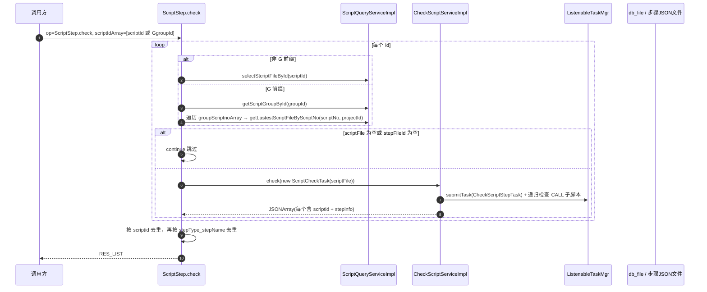

# 核心链路：脚本校验（埋点/区域监控步骤检测）

> 本文描述 `ScriptStep.check` 这条 V1 链路的真实实现：它**不是**做脚本"有效/无效"判定，而是从脚本步骤里挑出**埋点（screenAreaMonitor）与性能打点（perf_start_point / perf_summary_point）步骤**，供提测侧使用。脚本的"有效性校验（checkStatus）"由**文件管理服务（fileupload）**的校验引擎完成，本服务只负责"发起重检"。

## 两条易混淆的"校验"

| 链路 | 入口 | 作用 | 落点 |
|---|---|---|---|
| 埋点步骤检测（本文） | `ScriptStep.check`（V1） | 挑出埋点/区域监控/性能点步骤，输出 stepType+stepName 列表 | 内存结果，返回调用方 |
| 有效性重检 | `CheckApi.checkScript` + V1 RPC | 触发 fileupload 校验引擎重新判定 checkStatus | `script_check`（fileupload 写回） |

## 入口

`cn.testin.service.script.ScriptStep.check(ApiRequest)`，V1 路由 `action=script op=ScriptStep.check`（路由机制见 [横切-双入口路由机制](横切-双入口路由机制.md)）。

入参只有一个：`reqjson.scriptIdArray`（JSONArray），元素要么是脚本 `scriptId`，要么是以 `G` 前缀开头的**脚本组 id**（如 `G123`）。

## 处理流程

## CheckScriptServiceImpl.check 五段式

`cn.testin.checkstep.CheckScriptServiceImpl.check`，方法体按 StopWatch 分 5 段：

1. **init**：`ListenableTaskMgr.getInstance()`，`new ReportWatcher(scriptid)`（注册到 EventBusCenter，见 [横切-脚本校验引擎](横切-脚本校验引擎.md)）。
2. **checkSelf**：`taskMgr.submitTask(CheckScriptStepTask.TAG, new CheckScriptStepTask(task))` 提交自身步骤检测任务。
3. **checkDepends**：`scriptQueryService.getScriptStepByScriptId(scriptid)` 取步骤（**步骤存在 JSON 文件里**，按 `script_file.stepFileId` 通过 `HttpUtils.execute` 拉取），遇到 `ActionType.call` 的步骤，按 `step.childScriptNo + projectId` 查子脚本最新版，递归提交子脚本检测任务（`ScriptCheckTask` 带 parentId/level 元数据）。
4. **handleResult**：`Futures.allAsList(futureList).get(5, TimeUnit.MINUTES)`，5 分钟超时；每个 future 通过 `Futures.addCallback` 把 `CHECK_RESULT` 收进 `checkResultArray`。
5. **analysisResult**：把 `checkResultArray` 里每个 `script_step_check_key` 子对象取出，组装成最终 JSONArray。**destory**：`taskMgr.clear()` + 重置 `checkResultArray`（watcher 不注销，unregister 被注释掉）。

## CheckScriptStepTask.call —— 真正的"检测"逻辑

`cn.testin.checkstep.CheckScriptStepTask.call` 是唯一做实事的步骤级任务：

- 取该脚本全部步骤，只保留 `steptype` 为 `screenAreaMonitor`、`perf_start_point`、`perf_summary_point` 三种；
- 每个命中步骤拼 `{"stepType": steptype, "stepName": ...}`，stepName 取值规则：
  - `screenAreaMonitor` → `stepdesc`；
  - `perf_summary_point` → 解析 `ext` JSON 的 `name`；
  - `perf_start_point` → `stepname`；
- 结果包成 `{"scriptid": ..., "stepinfo": [...]}`，经 `buildCheckResult(CheckTaskSupport.SCRIPT_STEP_CHECK_KEY, result)` 返回；**没有命中步骤时返回 null**。

## 结果去重（ScriptStep.check 收尾）

`ScriptStep.check` 汇总所有脚本结果后做两级去重：先按 `scriptid` 去重，再按 `stepType + "_" + stepName` 去重，避免同一埋点/性能点步骤重复输出。

## 触发重检（有效/无效判定在 fileupload）

本服务的"脚本有效性"是**被动读取**：`script_check.checkStatus` 由 fileupload 校验引擎写回。需要重新判定时走 `cn.testin.api.script.CheckApi.checkScript(scriptId)` —— 直接 HTTP GET `{Config.UPLOAD_HOST}/api/checkScript?key={fileupload.auth.key}&scriptId={scriptId}`，返回 code=200 才视为触发成功。

触发点集中在写脚本的地方：`file.service.ScriptService`（保存/批量操作后）、`mvc.service.ScriptService`（V3 保存）、`service.script.CleanScript`（清理后）。

## 涉及表

- `script_file`（scriptid / scriptNo / stepFileId / projectid）
- `app_script_group`（脚本组的 `groupScriptnoArray`）
- 步骤内容不落 `script_step` 表，而是按 `stepFileId` 指向的 JSON 文件动态拉取
- `script_check`（只读；写入方是 fileupload）

## 注意事项

1. **别把这条链路当"质量校验"**：它只挑埋点/性能点步骤，不校验步骤配置合法性、不判循环依赖、不判脚本有效/无效。
2. **步骤来源是 JSON 文件不是表**：`ScriptQueryServiceImpl.getScriptStepByScriptId` 先查 `script_file.stepFileId`，再 `HttpUtils.execute(stepFileId)` 拉取步骤 JSON；改脚本步骤后这里读到的是最新文件内容。
3. **5 分钟整体超时**：`handleResult` 用 `Futures.allAsList.get(5, MINUTES)`，超时抛 `CheckScriptException(TimeoutException)`。
4. **G 前缀 = 脚本组**：`scriptIdArray` 里以 `G` 开头的字符串会被 strip 掉 `G` 后按脚本组 id 处理，再展开组内 `scriptNoArray`。
5. **无命中步骤的脚本返回 null 不报错**：最终结果可能为空数组，调用方要能处理空列表。
