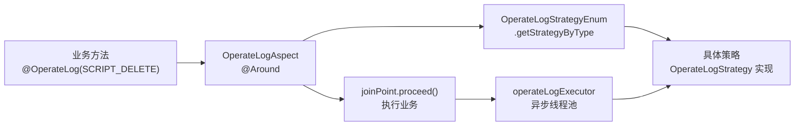

# AOP 与操作日志

脚本服务 通过自定义注解 + Spring AOP + 策略模式实现操作日志的自动记录，与业务代码完全解耦。

## 架构总览

## 核心组件

### @OperateLog 注解（cn.testin.aop.OperateLog）
- 方法级注解，参数为 `OperateLogEnum` 枚举，声明该方法需要记录哪类操作日志。

### OperateLogAspect（cn.testin.aop.OperateLogAspect）
`@Around` 环绕通知，三段式处理：

| 时机 | 调用 | 执行方式 | 说明 |
|------|------|----------|------|
| 业务前 | `strategy.preOperateLog(args, threadId)` | **同步** | 前置必须同步：业务执行过快时异步前置会查到错误数据（如删除前未快照） |
| 业务后 | `strategy.postOperateLog(args, threadId, operateTime)` | 异步（operateLogExecutor） | 不阻塞主流程；若要求 100% 记录需改回同步（代码注释原话） |
| 异常时 | `strategy.exceptionOperateLog(args, threadId, operateTime, e)` | 异步 | 异常同样记录后原样抛出 |

### 策略注册（OperateLogStrategyEnum）
枚举即注册表，`OperateLogEnum → OperateLogStrategy` 映射：

| OperateLogEnum | 策略实现 | 当前使用点 |
|----------------|----------|------------|
| SCRIPT_DELETE | ScriptDeleteStrategyService | ScriptController.delete（ScriptController.java） |
| SCRIPT_GROUP_DELETE | ScriptGroupDeleteStrategyService | ScriptGroupController（ScriptGroupController.java） |
| SCRIPT_UPDATE | ScriptUpdateStrategyService | ScriptController.update（ScriptController.java） |
| SUITE_DELETE | SuiteDeleteStrategyService | SuiteService（SuiteService.java） |

> 装配说明：策略实现是 Spring Bean，而枚举不是。`InitOperateLogStrategy`（@Component）在 `@PostConstruct` 中把 4 个策略 Bean 注入到对应枚举常量并调用 `initMap()` 建立 `OperateLogEnum → 策略枚举` 索引。

## 与异步操作日志的关系（易混淆点）

本模块存在**两套**日志机制，不要混淆：

| 机制 | 入口 | 落库方式 | 适用场景 |
|------|------|----------|----------|
| @OperateLog AOP（本文） | Controller/Service 方法注解 | 策略类直接处理 | 同步请求的操作审计（删除/更新） |
| ActionLogService + Redis 队列 | 导出/复制业务流程显式调用 | LPUSH `queue:action_log` → 平台基础功能服务 消费落库 [script_action_log](../../数据库管理/db_file/script_action_log.md) | 长耗时异步任务的进度/结果记录 |

## 全局异常处理（GlobalExceptionHandler）

`cn.testin.mvc.exception.GlobalExceptionHandler`（@RestControllerAdvice）统一处理 /v3 入口异常：

| 异常类型 | 处理 |
|----------|------|
| GeneralException | 返回业务错误码 + 消息 |
| MethodArgumentNotValidException | 参数校验失败，返回首个字段错误 |
| Exception / Throwable | 兜底，返回未知错误 |

> 注意：该 Handler 只覆盖 DispatcherServlet（/v3/*）入口；ApiServlet（/*）入口的异常由各自 Service 类自行处理，见 [双入口路由机制](横切-双入口路由机制.md)。
