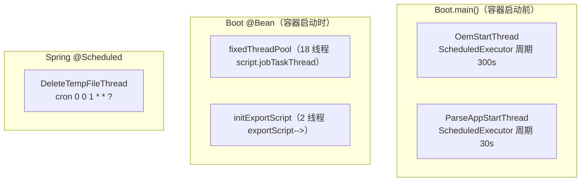

# 后台线程全景

脚本服务 模块所有后台线程的总览。线程启动点集中在两处：`Boot.main()`（Spring 容器启动前）与 `Boot` 的 `@Bean fixedThreadPool()` / `initExportScript()`（容器启动时）。另有 Spring `@Scheduled` 定时任务与事件驱动的工作线程。

## 启动点总览

## 线程清单

### 启动即常驻（Boot.main）

| 线程 | 周期/方式 | 职责 | 关键点 |
|------|-----------|------|--------|
| OemStartThread | scheduleAtFixedRate(1s, 300s) | 启动加载 OEM 参数组 `enterprise-info`/`system-config`，写入 `LocalConfig.setClientName`、`CommonConstant.WEB_DOMAIN`、`TESTIN_PRO_SYSTEM_VERSION` | 失败延迟 10s 无限重试；经 [UserManager](../../平台基础功能服务/00-首页.md) 的 SystemParam.list（OemSystemApi 封装） |
| ParseAppStartThread | scheduleAtFixedRate(1s, 30s) | 消费 Redis 队列 `parseAppQueue` 中的待解析 App，调 [FileUpload](../../文件管理服务/00-首页.md) 侧 AppParse 解析后由 `AppService.handleApp` 落库 | 双队列缓冲：`parseAppQueue` → `processParseApp`（处理中），成功才从 processMap 弹出，失败 `AppParse.localQueueCheck` 回滚；接口异常 sleep 5s |

### fixedThreadPool（18 线程池，daemon）

| 线程 | 职责 | 关联专题 |
|------|------|----------|
| TestinScriptManageService.getParseJobTaskThread() | 脚本解析任务消费 | [脚本解析与导入](核心链路-脚本解析与导入.md) |
| TestinScriptManageService.getImportJobTaskThread() | 脚本导入任务消费 | [脚本解析与导入](核心链路-脚本解析与导入.md) |
| ScriptService.getBatchRfJob() | 脚本批量刷新任务 | — |
| ExportDispatchThread | 资源（AI 标注等）导出调度 | [导入导出异步队列](横切-脚本导入导出异步队列.md) |
| ImportDispatchThread | 资源导入调度 | [导入导出异步队列](横切-脚本导入导出异步队列.md) |

### initExportScript（2 线程池，daemon）

| 线程 | 职责 | 关联专题 |
|------|------|----------|
| ScriptExportDispatchThread | 脚本导出任务调度 → ScriptExportWorkThread 执行 | [脚本导出](核心链路-脚本导出.md) |
| CleanScriptExportFileThread | 清理过期导出文件 | [脚本导出](核心链路-脚本导出.md) |

### Spring @Scheduled

| 任务 | cron | 职责 |
|------|------|------|
| DeleteTempFileThread.deleteTempFile | `0 0 1 * * ?`（每日 01:00） | 递归删除 `${temp.directory}/IMPORT_SCRIPT_FILE` 下最后修改时间超过 1 天的导入临时文件 |

### 事件/按需线程

| 线程 | 触发方式 | 职责 |
|------|----------|------|
| ListenableTaskMgr（checkstep 包） | 埋点步骤检测任务提交时 | 用 `MoreExecutors.listeningDecorator(cachedThreadPool)` 跑 CheckScriptStepTask，见 [脚本校验引擎](横切-脚本校验引擎.md)（`ValidatorWorker` 无调用点，属遗留类） |
| FileDownLoadWorkThread | 导出需下载远程文件时 | 导出过程中的文件下载工作线程，见 [脚本导出](核心链路-脚本导出.md) |
| operateLogExecutor（ThreadPoolTaskExecutor） | @OperateLog 注解方法调用后 | 异步写操作日志，见 [AOP与操作日志](横切-AOP与操作日志.md) |

## 备注

- `ApplicationInitRunConfig`（ApplicationRunner）中的线程启动代码已**全部注释**，当前实际启动点只有上表所列。
- 导出文件清理是双保险：Admin 后台（[Admin](../../外部服务/Admin.md) addToDel）+ CleanScriptExportFileThread 本地清理 + DeleteTempFileThread 清理导入侧临时目录。
