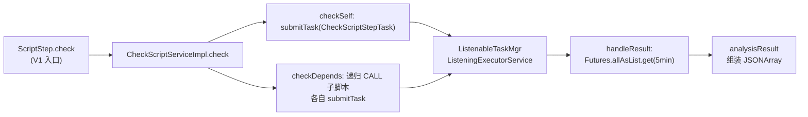

# 脚本校验引擎（checkstep 包）

脚本服务 的 `cn.testin.checkstep` 包是一套基于 **Guava ListenableFuture + 自定义任务管理器** 的步骤检测框架，用于从脚本步骤里挑出埋点/性能点步骤（`screenAreaMonitor` / `perf_start_point` / `perf_summary_point`）。它**不做**脚本有效/无效判定——有效性校验在 fileupload 服务。

## 包结构（cn.testin.checkstep）

| 类 | 实际职责 |
|----|----------|
| `CheckScriptService` / `CheckScriptServiceImpl` | 检测服务入口，五段式（init/checkSelf/checkDepends/handleResult/analysisResult/destory） |
| `ScriptCheckTask` | 待检测脚本的上下文对象（scriptFile + requestId + isChild/level/id/parentId） |
| `CheckScriptStepTask` | **唯一做实事的步骤任务**，筛选埋点/性能点步骤并组装结果 |
| `ListenableTaskMgr` | 任务管理器：`ListeningExecutorService` 提交任务，收集 `ListenableFuture` 结果 |
| `ScriptQueryService` / `ScriptQueryServiceImpl` | 查 `script_file`、脚本组、按 `stepFileId` 拉取步骤 JSON |
| `ScriptNode` | 依赖树节点定义（**主流程未使用**，仅定义 latch/watcher 等字段） |
| `ValidatorWorker` | Runnable 包装（**当前无调用点，属遗留类**，只在其自身构造器出现） |
| `EventBusCenter` / `ReportWatcher` / `Watcher` | Guava EventBus 封装与监听器（**注册了但主流程无 post 消费**） |

## 执行模型

- **线程池**：`ListenableTaskMgr.service` 是 `MoreExecutors.listeningDecorator(Executors.newCachedThreadPool())` 单例。
- **并发**：自身步骤任务 + 每个 CALL 子脚本任务各自提交，靠 `Futures.allAsList` 统一等待。
- **结果收集**：`checkResultArray`（JSONArray）经 `Futures.addCallback` 回填，`analysisResult` 再抽出 `script_step_check_key`。

## 与旧文档/直觉不符的点（以代码为准）

1. **没有 BuriedPointValidator / RegionMonitorValidator / CommonValidator**：这些校验器类在代码里不存在。步骤级逻辑只有 `CheckScriptStepTask.call` 里的字符串匹配（`steptype` 等于三种值）。
2. **没有"远程校验合并"**：本包不调用任何远程校验端点。远程 `/api/checkScript` 是 `cn.testin.api.script.CheckApi.checkScript` 独立触发重检用的，和本检测框架无调用关系。
3. **没有 Redis 缓存 / 30 分钟 TTL / 30 秒超时**：检测结果直接返回调用方，不落 Redis；唯一超时是 `Futures.allAsList.get(5, MINUTES)` 的 5 分钟。
4. **EventBus 是"注册了没派发"的半成品**：`init` 里 `new ReportWatcher(scriptid)` 会 `EventBusCenter.register`，但 `destory` 的 `watcher.unregister()` 被注释掉，主流程也没有 `EventBusCenter.post` 的调用点。
5. **ScriptNode / ValidatorWorker 是遗留定义**：依赖展开实际靠 `CheckScriptServiceImpl.checkDepends` 的直接递归（`ScriptCheckTask` 父子关系），不是构建 `ScriptNode` 树；`ValidatorWorker` 无人 new。

## 配置项

本包无独立配置项。线程池为 cachedThreadPool（无固定大小），整体超时硬编码 5 分钟。

## 延伸阅读

- [核心链路-脚本校验](核心链路-脚本校验.md) — 端到端流程与去重规则
- [端到端-脚本全生命周期](../../跨模块链路/端到端-脚本全生命周期.md) — 有效性校验在 fileupload 的定位
