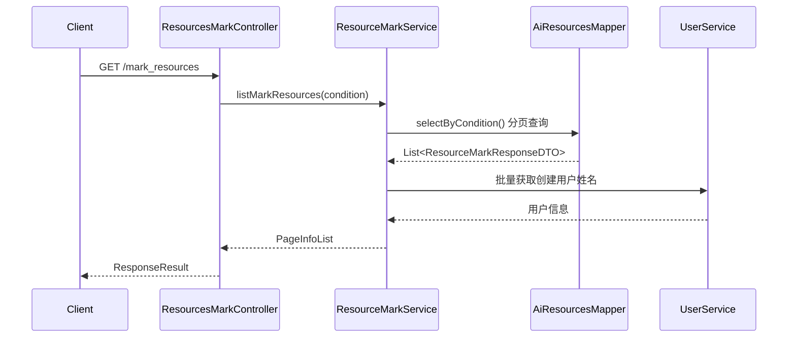
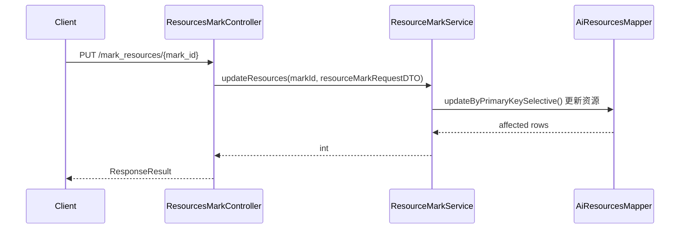
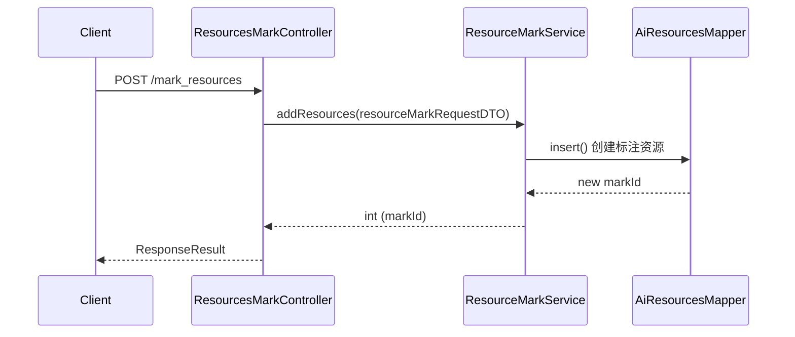
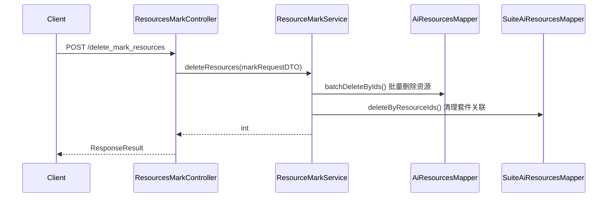
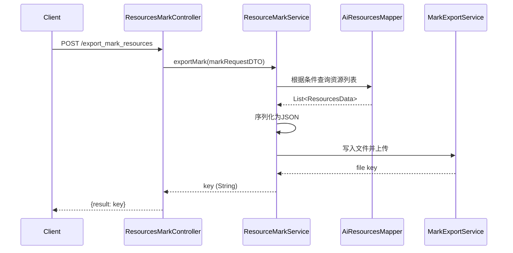
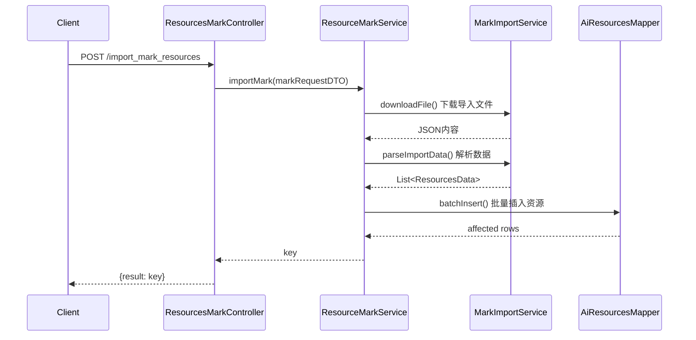

# ResourcesMarkController

> 包路径：cn.testin.mvc.controller.ResourcesMarkController
> 基础路径：/v3/script/mark

## 接口列表

### GET /v3/script/mark/mark_resources
分页获取数据标注资源。按条件查询标注资源列表，支持名称、状态等筛选条件。

**请求参数：** ResourceMarkRequestDTO 实体字段
| 参数 | 类型 | 必填 | 说明 |
|------|------|------|------|
| sourceType | Integer | 是 | 标注来源类型（checkSourceType 校验非空且为 APP/WEB/PC） |
| projectId | Integer | 是 | 项目ID（继承 BaseRequestDTO，@NotNull） |
| userId | Integer | 是 | 用户ID（继承 BaseRequestDTO，@NotNull） |
| eid | Integer | 否 | 企业ID |
| markName | String | 否 | 标注名称过滤 |
| status | Integer | 否 | 状态过滤 |
| suiteId | Integer | 否 | 套件ID |
| fuzzyByMarkName | Integer | 否 | 是否模糊匹配标注名 |
| page | Integer | 否 | 页码，默认1 |
| pageSize | Integer | 否 | 每页大小，默认20 |

**响应结构：** data 为 PageInfoList\<ResourceMarkResponseDTO\>
```json
{
  "code": 200,
  "data": {
    "page": 1,
    "pageSize": 20,
    "totalRow": 100,
    "totalPage": 5,
    "list": [
      {
        "id": 1,
        "markName": "标注资源1",
        "projectId": 100,
        "packageName": "com.example.app",
        "appName": "示例APP",
        "appVersion": "1.0.0",
        "status": 1,
        "sourceType": 1,
        "createTime": 1690800000000,
        "updateTime": 1690800000000
      }
    ]
  }
}
```

**实现意图：**
设置默认分页参数 → 调用ResourceMarkService.listMarkResources() → 分页查询ai_resources表（数据标注资源表） → 关联查询user_info表获取创建人姓名 → 返回分页结果。

**流程图：**


**涉及表：**
- ai_resources

**跨服务调用：**
- UserService (获取创建人姓名)

---

### PUT /v3/script/mark/mark_resources/{mark_id}
更新数据标注资源。修改指定标注资源的信息。

**请求参数：** mark_id 路径参数 + ResourceMarkRequestDTO 实体字段
| 参数 | 类型 | 必填 | 说明 |
|------|------|------|------|
| mark_id | Integer(路径) | 是 | 标注资源ID |
| markName | String | 否 | 新标注名称 |
| userId | Integer | 否 | 更新用户ID（继承 BaseRequestDTO，@NotNull 但 @RequestBody 未加 @Valid） |

**响应结构：** data 为 BaseResponseDTO（result 为受影响行数）
```json
{
  "code": 200,
  "data": {
    "result": 1
  }
}
```

**实现意图：**
通过markId更新ai_resources表中的资源信息 → 返回受影响行数。

**流程图：**


**涉及表：**
- ai_resources

---

### POST /v3/script/mark/mark_resources
添加数据标注资源。创建新的标注资源记录。

**请求参数：** ResourceMarkRequestDTO 实体字段
| 参数 | 类型 | 必填 | 说明 |
|------|------|------|------|
| sourceType | Integer | 是 | 标注来源类型（checkSourceType 校验非空且为 APP/WEB/PC） |
| projectId | Integer | 是 | 项目ID（继承 BaseRequestDTO，@NotNull） |
| userId | Integer | 是 | 创建用户ID（继承 BaseRequestDTO，@NotNull） |
| markName | String | 否 | 标注名称 |
| smallUrl | String | 否 | 小图URL |
| bounds | String | 否 | 位置范围 |
| rotation | String | 否 | 旋转 |
| resolution | String | 否 | 分辨率 |
| suiteId | Integer | 否 | 套件ID（APP 类型时写入关联表） |

**响应结构：** data 为 BaseResponseDTO（result 为新增结果）
```json
{
  "code": 200,
  "data": {
    "result": 1
  }
}
```

**实现意图：**
校验必填参数 → 构建ResourcesData实体 → 插入ai_resources表 → 返回新记录ID。

**流程图：**


**涉及表：**
- ai_resources

---

### POST /v3/script/mark/delete_mark_resources
批量删除标注资源。根据资源ID列表批量删除标注资源。

**请求参数：** MarkRequestDTO 实体字段
| 参数 | 类型 | 必填 | 说明 |
|------|------|------|------|
| sourceType | Integer | 是 | 标注来源类型（checkSourceType 校验非空且为 APP/WEB/PC） |
| ids | List\<Integer\> | 否 | 标注资源ID列表（为空时按 condition 全选删除） |
| suiteId | Integer | 否 | 套件ID（APP 类型清理关联时必填） |
| condition | MarkExportRequestDTO | 否 | 全选删除的过滤条件 |

**响应结构：** data 为 BaseResponseDTO（result 为受影响行数）
```json
{
  "code": 200,
  "data": {
    "result": 3
  }
}
```

**实现意图：**
根据markIds列表 → 调用ResourceMarkService.deleteResources() → 批量删除ai_resources表中的记录 → 同时清理suite_ai_resources表中的关联数据。

**流程图：**


**涉及表：**
- ai_resources
- suite_ai_resources

---

### POST /v3/script/mark/export_mark_resources
导出标注资源。根据条件导出标注资源，生成JSON文件并上传，返回下载key。

**请求参数：** MarkRequestDTO 实体字段
| 参数 | 类型 | 必填 | 说明 |
|------|------|------|------|
| sourceType | Integer | 是 | 标注来源类型（checkSourceType 校验非空且为 APP/WEB/PC） |
| ids | List\<Integer\> | 否 | 资源ID列表（按 ID 导出） |
| suiteId | Integer | 否 | 套件ID |
| condition | MarkExportRequestDTO | 否 | 导出过滤条件（全选导出时使用） |

**响应结构：** data 为 Map（result 为导出文件标识 key）
```json
{
  "code": 200,
  "data": {
    "result": "abc123-def456"
  }
}
```

**实现意图：**
调用ResourceMarkService.exportMark() → 根据条件查询ai_resources表获取资源列表 → 序列化为JSON → 调用MarkExportService将数据写入文件并上传 → 返回文件标识key → 前端根据key下载文件。

**流程图：**


**涉及表：**
- ai_resources

**跨服务调用：**
- MarkExportService (文件导出和上传)

---

### POST /v3/script/mark/import_mark_resources
导入标注资源。下载并解析导入文件，将标注资源数据写入数据库。

**请求参数：** MarkRequestDTO 实体字段
| 参数 | 类型 | 必填 | 说明 |
|------|------|------|------|
| sourceType | Integer | 是 | 标注来源类型（checkSourceType 校验非空且为 APP/WEB/PC） |
| filePath | String | 否 | 导入文件路径 |
| suiteId | Integer | 否 | 套件ID |

**响应结构：** data 为 Map（result 为导入文件标识 key）
```json
{
  "code": 200,
  "data": {
    "result": "import-key"
  }
}
```

**实现意图：**
调用ResourceMarkService.importMark() → 根据url下载导入文件 → 调用MarkImportService解析JSON → 校验数据格式 → 批量插入ai_resources表 → 返回导入标识key。

**流程图：**


**涉及表：**
- ai_resources

**跨服务调用：**
- MarkImportService (文件解析和导入处理)
