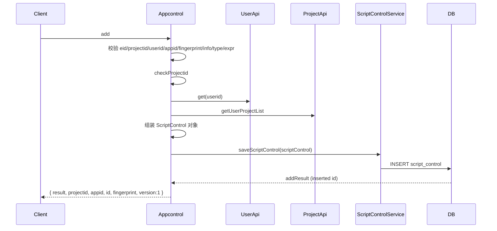
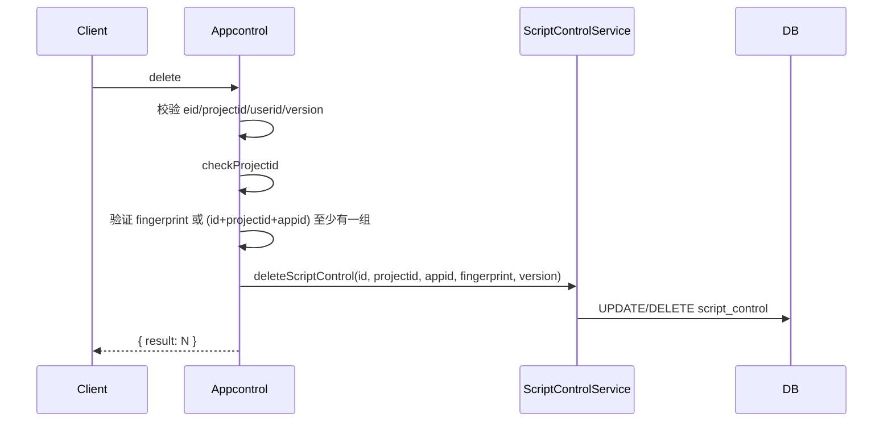
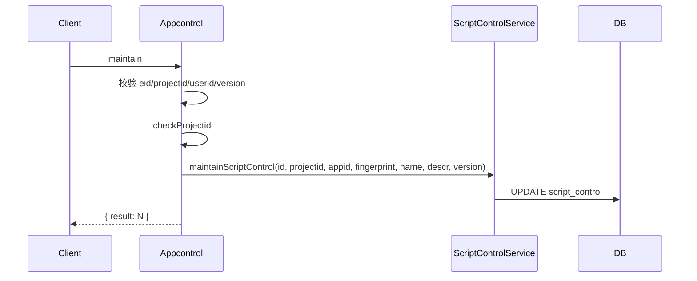
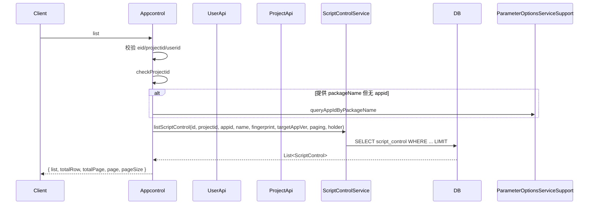
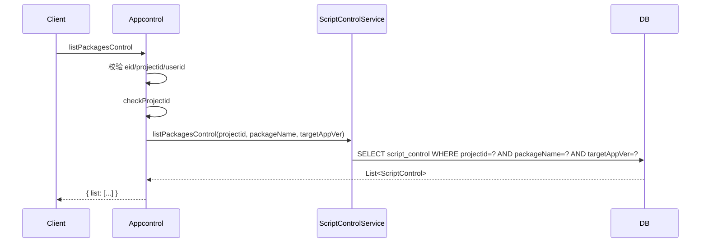

# Appcontrol (ApiServlet)

> 包路径：cn.testin.service.script.Appcontrol
> 调用方式：action=script op=Appcontrol.{method}

## 职责
脚本控件管理 API，提供控件的增删改查，支持按包名批量查询某应用下的所有控件。所有操作均经过企业-用户-项目三方权限校验。

---

## 方法列表

### add
新增控件信息。

**请求参数（data字段）：**
| 参数 | 类型 | 必填 | 说明 |
|------|------|------|------|
| eid | Integer | 是 | 企业ID |
| projectid | Integer | 是 | 项目组ID |
| userid | Integer | 是 | 用户ID |
| appid | Integer | 是 | 应用ID |
| fingerprint | String | 是 | 控件指纹信息 |
| info | String | 是 | 控件信息（JSON） |
| type | String | 是 | 控件类型 |
| expr | String | 是 | 控件表达式 |
| name | String | 否 | 控件名称 |
| bigImage | String | 否 | 大图路径 |
| smallImage | String | 否 | 小图路径 |
| thumbImage | String | 否 | 缩略图路径 |
| targetAppVer | String | 否 | 目标应用版本 |

**返回参数：**
| 字段 | 类型 | 说明 |
|------|------|------|
| code | Integer | 状态码，0=成功 |
| message | String | 提示信息 |
| data | Object | 返回数据 |
| data.result | Integer | 新增结果（inserted id） |
| data.projectid | Integer | 项目组ID（仅新增成功时返回） |
| data.appid | Integer | 应用ID（仅新增成功时返回） |
| data.id | Integer | 控件ID（仅新增成功时返回） |
| data.fingerprint | String | 控件指纹（仅新增成功时返回） |
| data.name | String | 控件名称（仅新增成功时返回；未传名称时等于 id） |
| data.version | Integer | 版本号（仅新增成功时返回，固定 1） |

**流程图：**

**涉及表：**
- [script_control](../../../数据库管理/db_file/script_control.md)

**跨服务调用：**
- [UserApi](../../../平台基础功能服务/00-首页.md)
- [ProjectApi](../../../平台基础功能服务/00-首页.md)

---

### delete
删除控件信息。

**请求参数（data字段）：**
| 参数 | 类型 | 必填 | 说明 |
|------|------|------|------|
| eid | Integer | 是 | 企业ID |
| projectid | Integer | 是 | 项目组ID |
| userid | Integer | 是 | 用户ID |
| version | Integer | 是 | 控件版本号 |
| controlid | Integer | 否 | 控件ID（与 fingerprint 二选一） |
| appid | Integer | 否 | 应用ID |
| fingerprint | String | 否 | 控件指纹（与 controlid+appid+projectid 二选一） |

**返回参数：**
| 字段 | 类型 | 说明 |
|------|------|------|
| code | Integer | 状态码，0=成功 |
| message | String | 提示信息 |
| data | Object | 返回数据 |
| data.result | Integer | 删除条数 |

**流程图：**

**涉及表：**
- [script_control](../../../数据库管理/db_file/script_control.md)

**跨服务调用：**
- [UserApi](../../../平台基础功能服务/00-首页.md)
- [ProjectApi](../../../平台基础功能服务/00-首页.md)

---

### maintain
维护控件信息（更新名称、描述）。

**请求参数（data字段）：**
| 参数 | 类型 | 必填 | 说明 |
|------|------|------|------|
| eid | Integer | 是 | 企业ID |
| projectid | Integer | 是 | 项目组ID |
| userid | Integer | 是 | 用户ID |
| version | Integer | 是 | 控件版本号 |
| controlid | Integer | 否 | 控件ID |
| appid | Integer | 否 | 应用ID |
| fingerprint | String | 否 | 控件指纹 |
| name | String | 否 | 控件名称 |
| descr | String | 否 | 控件描述 |

**返回参数：**
| 字段 | 类型 | 说明 |
|------|------|------|
| code | Integer | 状态码，0=成功 |
| message | String | 提示信息 |
| data | Object | 返回数据 |
| data.result | Integer | 更新条数 |

**实现意图：**
与 delete 类似，通过 fingerprint 或 (controlid+appid+projectid) 定位控件，更新 name/descr，使用 version 做乐观锁。

**流程图：**

**涉及表：**
- [script_control](../../../数据库管理/db_file/script_control.md)

**跨服务调用：**
- [UserApi](../../../平台基础功能服务/00-首页.md)
- [ProjectApi](../../../平台基础功能服务/00-首页.md)

---

### list
分页查询控件列表。

**请求参数（data字段）：**
| 参数 | 类型 | 必填 | 说明 |
|------|------|------|------|
| eid | Integer | 是 | 企业ID |
| projectid | Integer | 是 | 项目组ID |
| userid | Integer | 是 | 用户ID |
| controlid | Integer | 否 | 控件ID |
| fingerprint | String | 否 | 控件指纹 |
| name | String | 否 | 控件名称 |
| packageName | String | 否 | 应用包名 |
| appid | Integer | 否 | 应用ID |
| targetAppVer | String | 否 | 目标应用版本 |
| page | Integer | 否 | 页码，默认1 |
| pageSize | Integer | 否 | 每页条数，默认20 |

**返回参数：**
| 字段 | 类型 | 说明 |
|------|------|------|
| code | Integer | 状态码，0=成功 |
| message | String | 提示信息 |
| data | Object | 返回数据 |
| data.list | JSONArray | 控件列表，元素为 ScriptControl |
| data.totalRow | Integer | 总行数 |
| data.totalPage | Integer | 总页数 |
| data.page | Integer | 当前页码 |
| data.pageSize | Integer | 每页条数 |

**流程图：**

**涉及表：**
- [script_control](../../../数据库管理/db_file/script_control.md)

**跨服务调用：**
- [UserApi](../../../平台基础功能服务/00-首页.md)
- [ProjectApi](../../../平台基础功能服务/00-首页.md)

---

### listPackagesControl
查询指定包下的所有控件信息（不分页）。

**请求参数（data字段）：**
| 参数 | 类型 | 必填 | 说明 |
|------|------|------|------|
| eid | Integer | 是 | 企业ID |
| projectid | Integer | 是 | 项目组ID |
| userid | Integer | 是 | 用户ID |
| packageName | String | 否 | 应用包名 |
| targetAppVer | String | 否 | 目标应用版本 |

**返回参数：**
| 字段 | 类型 | 说明 |
|------|------|------|
| code | Integer | 状态码，0=成功 |
| message | String | 提示信息 |
| data | Object | 返回数据 |
| data.list | JSONArray | 控件列表，元素为 ScriptControl |

**流程图：**

**涉及表：**
- [script_control](../../../数据库管理/db_file/script_control.md)

**跨服务调用：**
- [UserApi](../../../平台基础功能服务/00-首页.md)
- [ProjectApi](../../../平台基础功能服务/00-首页.md)
