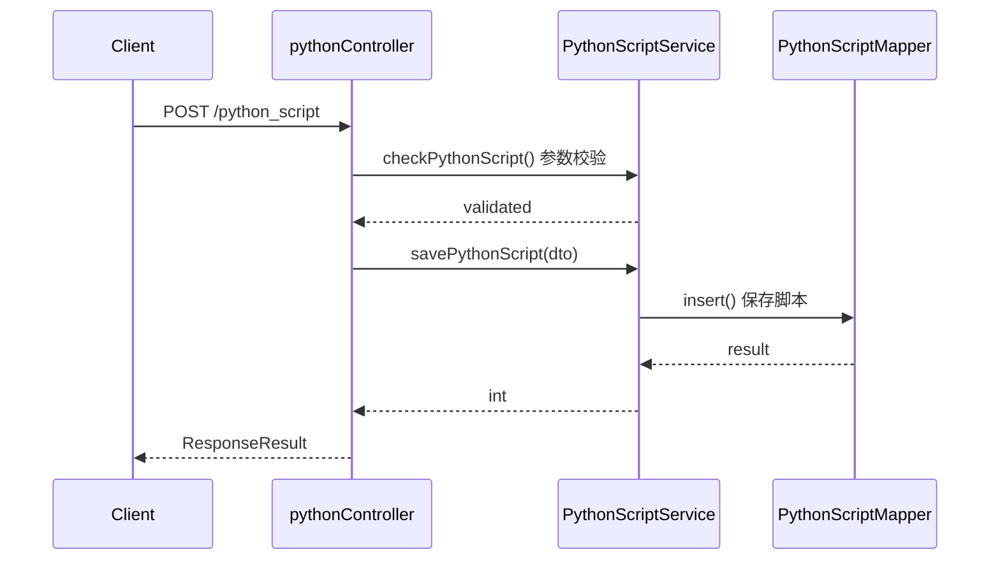
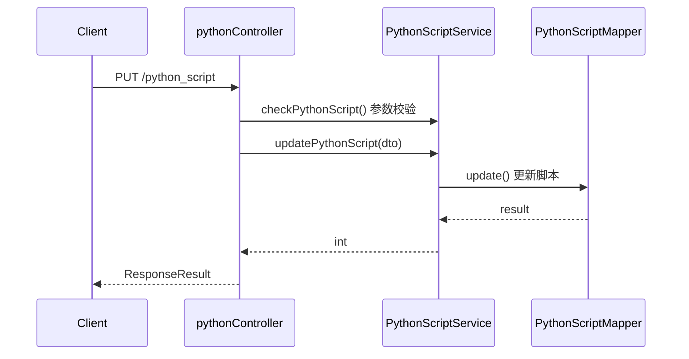
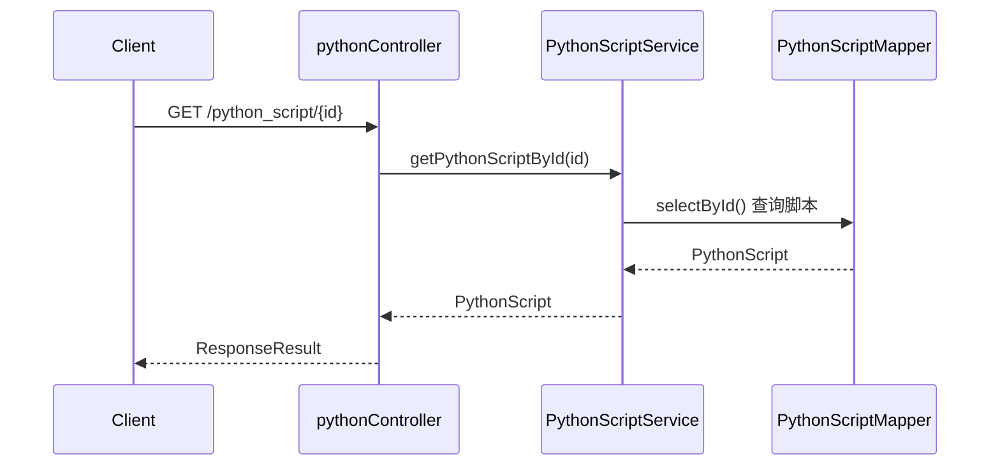
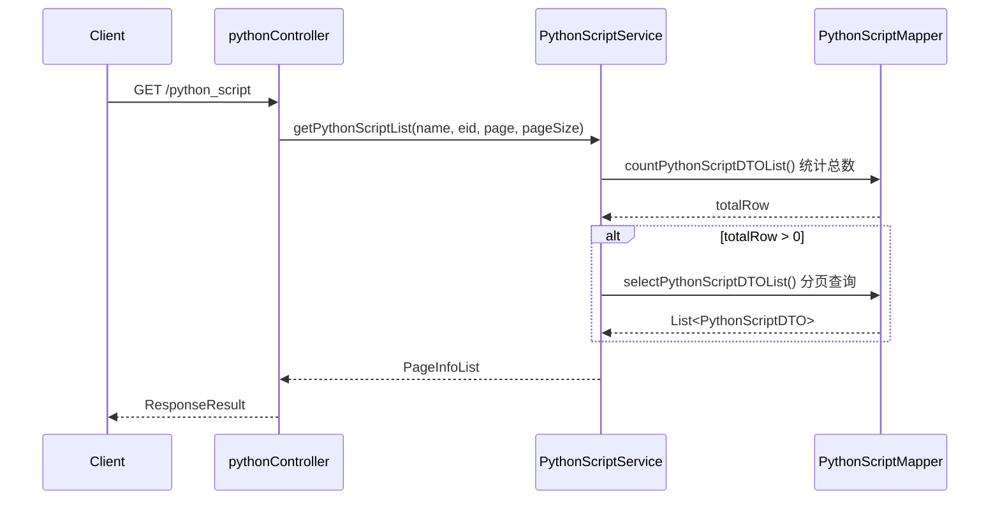
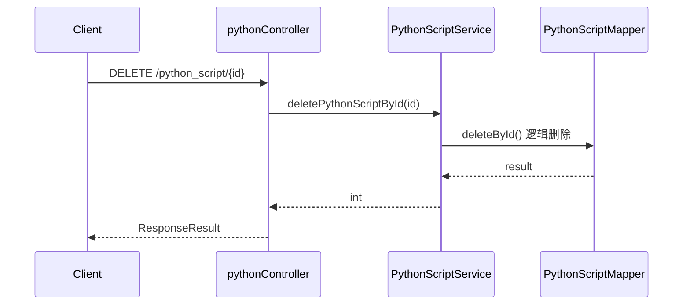
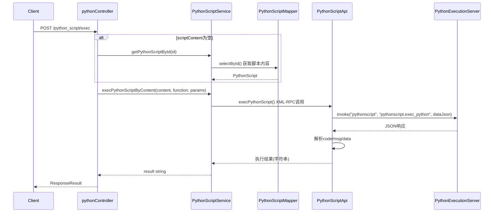
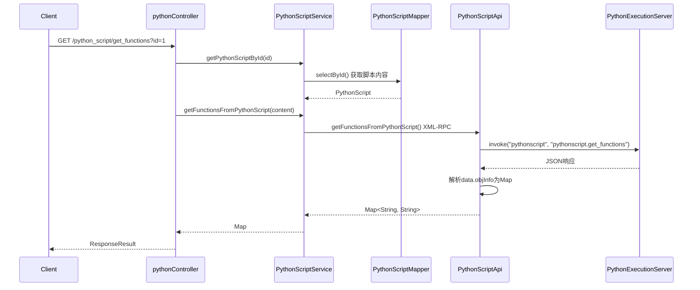
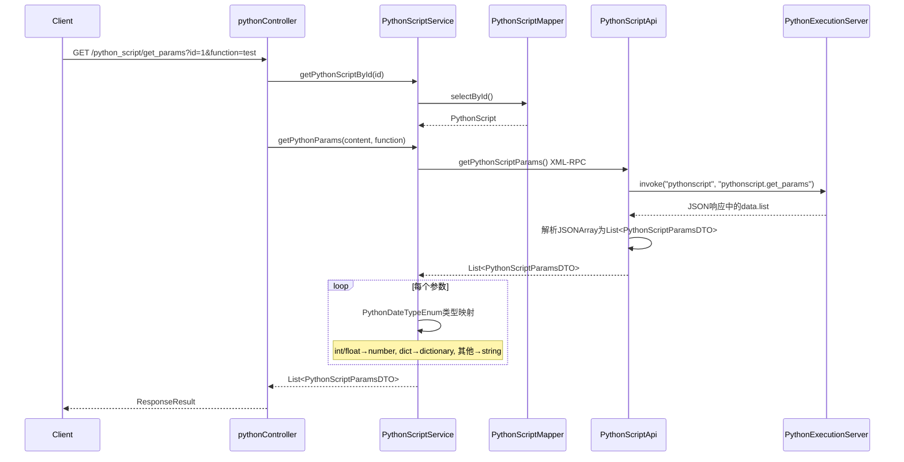
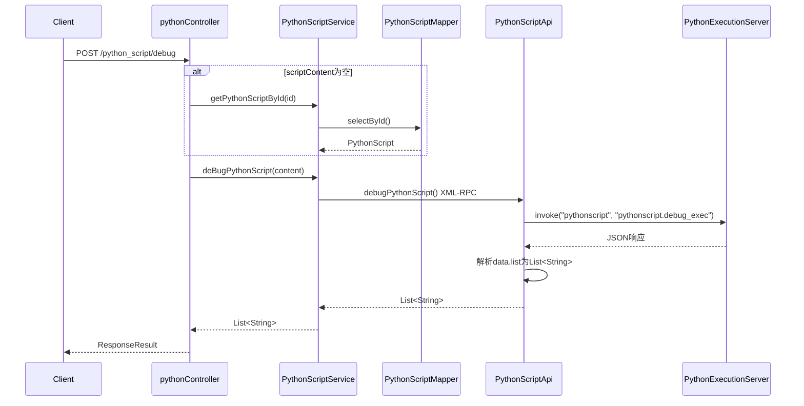

# pythonController

> 包路径：cn.testin.mvc.controller.pythonController
> 基础路径：/v3/script

## 接口列表

### POST /v3/script/python_script
保存Python脚本。创建一个新的Python脚本记录到数据库。

**请求参数：** PythonScriptRequestDTO 实体字段
| 参数 | 类型 | 必填 | 说明 |
|------|------|------|------|
| name | String | 是 | 脚本名称（checkPythonScript 校验非空+正则） |
| scriptContent | String | 是 | Python脚本内容（校验非空） |
| execLocation | Integer | 是 | 执行位置（1=平台，2=上位机，校验须为1或2） |
| eid | Integer | 否 | 企业ID |
| projectId | Integer | 否 | 项目ID |
| userId | Integer | 否 | 创建用户ID |
| userName | String | 否 | 创建用户名 |

**响应结构：** data 为 BaseResponseDTO（result 为受影响行数）
```json
{
  "code": 200,
  "data": {
    "result": 1
  }
}
```

**实现意图：**
调用PythonScriptService.checkPythonScript()校验：名称正则匹配、内容非空、execLocation有效 → 构建PythonScript实体 → 通过PythonScriptMapper.insert()写入python_script表 → 返回新记录ID。

**流程图：**


**涉及表：**
- python_script

---

### PUT /v3/script/python_script
更新Python脚本。根据ID修改脚本的名称、内容和执行位置。

**请求参数：** PythonScriptRequestDTO 实体字段
| 参数 | 类型 | 必填 | 说明 |
|------|------|------|------|
| id | Integer | 是 | 脚本ID |
| name | String | 是 | 新名称（校验非空+正则） |
| scriptContent | String | 是 | 新脚本内容（校验非空） |
| execLocation | Integer | 是 | 执行位置（1=平台，2=上位机） |
| eid | Integer | 否 | 企业ID |
| projectId | Integer | 否 | 项目ID |
| userId | Integer | 否 | 更新用户ID |
| userName | String | 否 | 更新用户名 |

**响应结构：** data 为 BaseResponseDTO（result 为受影响行数）
```json
{
  "code": 200,
  "data": {
    "result": 1
  }
}
```

**实现意图：**
校验参数 → 调用PythonScriptMapper.update()更新python_script表 → 如名称重复则PersistenceException捕获并提示"该名称已存在"。

**流程图：**


**涉及表：**
- python_script

---

### GET /v3/script/python_script/{id}
根据ID获取Python脚本详情。返回Python脚本的完整信息包括脚本内容。

**请求参数：**
| 参数 | 类型 | 必填 | 说明 |
|------|------|------|------|
| id | Integer(路径) | 是 | 脚本ID |

**响应结构：**
```json
{
  "code": 200,
  "data": {
    "id": 1,
    "name": "测试脚本",
    "scriptContent": "def test():\n    pass",
    "execLocation": "PLATFORM",
    "eid": 100,
    "projectId": 200,
    "createUserName": "张三",
    "createTime": 1690800000000,
    "updateTime": 1690800000000
  }
}
```

**实现意图：**
根据id查询python_script表 → 返回PythonScript实体。

**流程图：**


**涉及表：**
- python_script

---

### GET /v3/script/python_script
分页获取Python脚本列表。按企业和名称条件查询脚本列表。

**请求参数：**
| 参数 | 类型 | 必填 | 说明 |
|------|------|------|------|
| eid | Integer | 是 | 企业ID |
| page | Integer | 是 | 页码 |
| page_size | Integer | 是 | 每页大小 |
| name | String | 否 | 脚本名称（模糊匹配） |

**响应结构：**
```json
{
  "code": 200,
  "data": {
    "page": 1,
    "pageSize": 20,
    "totalRow": 10,
    "totalPage": 1,
    "list": [
      {
        "id": 1,
        "eid": 100,
        "projectId": 200,
        "name": "测试脚本",
        "createUserName": "张三",
        "updateUserName": "李四",
        "updateTime": 1690800000000
      }
    ]
  }
}
```

**实现意图：**
参数校验（eid>0, page>0, pageSize>0） → 手动分页：先count总行数，再分页查询列表 → 组装PageInfoList返回。不返回scriptContent字段以减小数据传输量。

**流程图：**


**涉及表：**
- python_script

---

### DELETE /v3/script/python_script/{id}
删除Python脚本。根据ID逻辑删除（标记isDelete）。

**请求参数：**
| 参数 | 类型 | 必填 | 说明 |
|------|------|------|------|
| id | Integer(路径) | 是 | 脚本ID |

**响应结构：** data 为 BaseResponseDTO（result 为受影响行数）
```json
{
  "code": 200,
  "data": {
    "result": 1
  }
}
```

**实现意图：**
校验id>0 → 调用PythonScriptMapper.deleteById()逻辑删除python_script表中的记录（设置isDelete标志，不物理删除）。

**流程图：**


**涉及表：**
- python_script

---

### POST /v3/script/python_script/exec
执行Python脚本。通过XML-RPC协议调用远程Python执行服务运行脚本。

**请求参数：** PythonScriptRequestDTO 实体字段
| 参数 | 类型 | 必填 | 说明 |
|------|------|------|------|
| id | Integer | 否 | 脚本ID（与scriptContent二选一） |
| scriptContent | String | 否 | Python脚本内容（直接传内容时不需要ID） |
| function | String | 否 | 要执行的函数名（代码未做非空校验，透传给执行服务） |
| params | List\<PythonScriptParamsDTO\> | 否 | 函数参数列表 |

**响应结构：** data 为 BaseResponseDTO（result 为执行结果字符串）
```json
{
  "code": 200,
  "data": {
    "result": "执行结果字符串"
  }
}
```

**实现意图：**
优先使用传入的scriptContent → 如未传则根据id从数据库查询脚本内容 → 调用PythonScriptService.execPythonScriptByContent() → 内部通过PythonScriptApi.execPythonScript()发起XML-RPC调用（namespace: "pythonscript", method: "pythonscript.exec_python"） → 发送JSON（content, function, params） → 解析响应中的result/list/objInfo并返回。

**流程图：**


**涉及表：**
- python_script (仅当id方式调用时)

**跨服务调用：**
- PythonScriptApi (XML-RPC → 远程Python执行服务)

---

### GET /v3/script/python_script/get_functions
获取Python函数列表。通过XML-RPC解析Python脚本内容，返回所有可调用的函数名和参数签名。

**请求参数：**
| 参数 | 类型 | 必填 | 说明 |
|------|------|------|------|
| id | Integer | 是 | 脚本ID |

**响应结构：**
```json
{
  "code": 200,
  "data": {
    "test": "test(arg1, arg2)",
    "main": "main()"
  }
}
```

**实现意图：**
根据id从数据库获取脚本内容 → 调用PythonScriptService.getFunctionsFromPythonScript() → 内部通过PythonScriptApi.getFunctionsFromPythonScript()发起XML-RPC调用（"pythonscript.get_functions"） → 返回函数名到签名的Map。

**流程图：**


**涉及表：**
- python_script

**跨服务调用：**
- PythonScriptApi (XML-RPC → Python执行服务)

---

### GET /v3/script/python_script/get_params
获取Python函数参数列表。通过XML-RPC解析指定函数的参数类型信息。

**请求参数：**
| 参数 | 类型 | 必填 | 说明 |
|------|------|------|------|
| id | Integer | 是 | 脚本ID |
| function | String | 是 | 函数名 |

**响应结构：**
```json
{
  "code": 200,
  "data": [
    {
      "argName": "arg1",
      "argType": "string",
      "argDesc": "参数描述"
    },
    {
      "argName": "arg2",
      "argType": "number",
      "argDesc": "参数描述"
    }
  ]
}
```

**实现意图：**
根据id获取脚本内容 → 调用PythonScriptService.getPythonParams() → 内部通过PythonScriptApi.getPythonScriptParams()发起XML-RPC调用（"pythonscript.get_params"） → 获取原始参数列表 → 遍历参数将Python类型映射为前端类型（int/float→number, dict→dictionary, 其他→string） → 返回转换后的参数列表。

**流程图：**


**涉及表：**
- python_script

**跨服务调用：**
- PythonScriptApi (XML-RPC → Python执行服务)

---

### POST /v3/script/python_script/debug
调试Python脚本。通过XML-RPC对Python脚本内容进行语法和逻辑调试。

**请求参数：**
| 参数 | 类型 | 必填 | 说明 |
|------|------|------|------|
| id | Integer | 否 | 脚本ID（与scriptContent二选一） |
| scriptContent | String | 否 | Python脚本内容 |

**响应结构：**
```json
{
  "code": 200,
  "data": [
    "line 5: SyntaxError",
    "调试信息..."
  ]
}
```

**实现意图：**
优先使用传入的scriptContent → 如未传则从数据库获取 → 调用PythonScriptService.deBugPythonScript() → 内部通过PythonScriptApi.debugPythonScript()发起XML-RPC调用（"pythonscript.debug_exec"） → 解析响应data.list为字符串列表返回。

**流程图：**


**涉及表：**
- python_script (仅当id方式调用时)

**跨服务调用：**
- PythonScriptApi (XML-RPC → Python执行服务)
