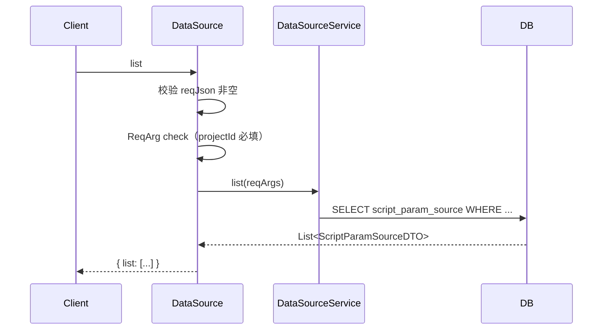
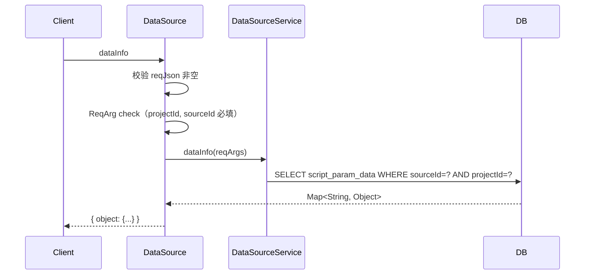

# DataSource (ApiServlet)

> 包路径：cn.testin.service.script.DataSource
> 调用方式：action=script op=DataSource.{method}

## 职责
数据源查询 API，提供数据源列表查询和数据源详情（数据信息）查询功能。

---

## 方法列表

### list
查询数据源列表，支持多维度组合筛选。

**请求参数（data字段）：**
| 参数 | 类型 | 必填 | 说明 |
|------|------|------|------|
| projectId | Integer | 是 | 项目组ID |
| sourceId | Integer | 否 | 数据源ID |
| type | Integer | 否 | 类型：1=数据源, 2=Global表, 3=普通数据表 |
| parentId | Integer | 否 | 父节点ID |
| appId | Integer | 否 | 应用ID |
| scriptId | Integer | 否 | 脚本ID |
| scriptNo | Integer | 否 | 脚本编号 |
| sourceName | String | 否 | 数据源名称 |
| scriptName | String | 否 | 脚本名称 |

**返回参数：**
| 字段 | 类型 | 说明 |
|------|------|------|
| code | Integer | 状态码，0=成功 |
| message | String | 提示信息 |
| data | Object | 返回数据 |
| data.list | JSONArray | 数据源列表，元素为 ScriptParamSourceDTO |

**实现意图：**
通过 ReqArg 机制校验参数，调用 DataSourceService.list 查询数据源。

**流程图：**

**涉及表：**
- [script_param_source](../../../数据库管理/db_file/script_param_source.md)

---

### dataInfo
查询数据源的数据详情。

**请求参数（data字段）：**
| 参数 | 类型 | 必填 | 说明 |
|------|------|------|------|
| projectId | Integer | 是 | 项目组ID |
| sourceId | Integer | 是 | 数据源ID |
| isGlobal | Integer | 否 | 是否全局参数：0=是, 1=不是 |
| format | Integer | 否 | 是否格式化：0=不格式化（默认）, 1=格式化 |

**返回参数：**
| 字段 | 类型 | 说明 |
|------|------|------|
| code | Integer | 状态码，0=成功 |
| message | String | 提示信息 |
| data | Object | 返回数据 |
| data.object | Object | 数据源数据详情（Map，键为参数名，值为参数数据） |

**实现意图：**
通过 ReqArg 校验参数，调用 DataSourceService.dataInfo 返回数据源内的参数数据。

**流程图：**

**涉及表：**
- [script_param_source](../../../数据库管理/db_file/script_param_source.md)
- [script_param_data](../../../数据库管理/db_file/script_param_data.md)
