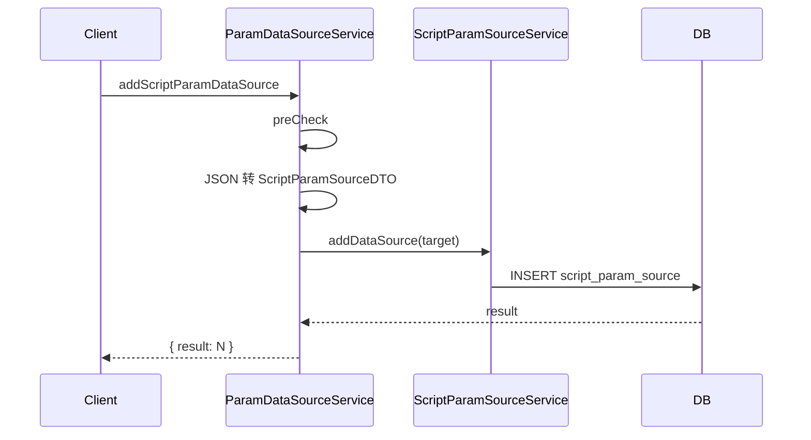
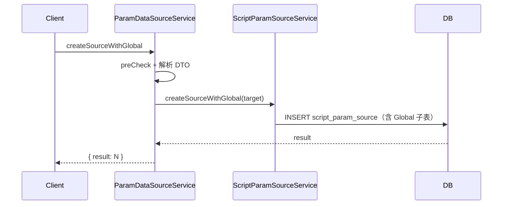
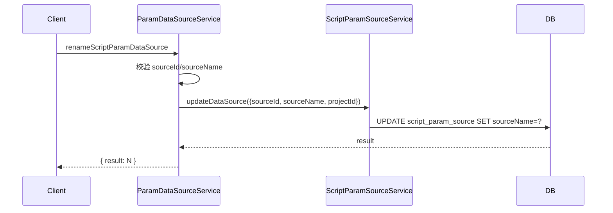
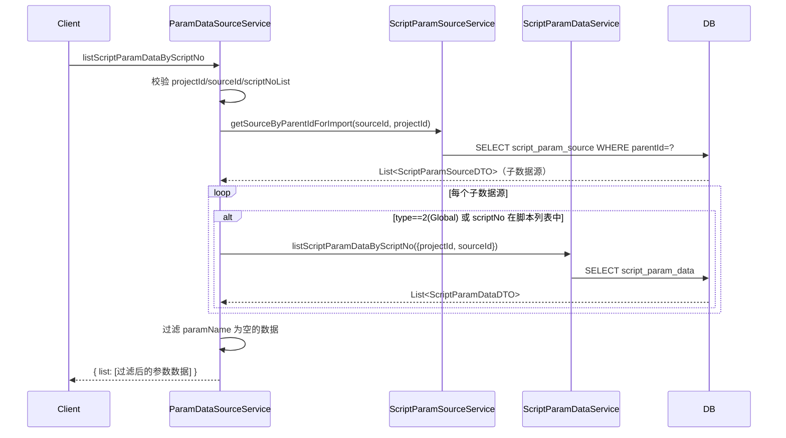

# ParamDataSourceService (ApiServlet)

> 包路径：cn.testin.service.script.ParamDataSourceService
> 调用方式：action=script op=ParamDataSourceService.{method}

## 职责
参数数据源管理 API，提供数据源（Source）和数据参数（Data）的增删改查、重命名、名称唯一性校验、脚本关联检查等功能。

---

## 方法列表

### addScriptParamDataSource
新增数据源。

**请求参数（data字段）：** ScriptParamSourceDTO 对象字段
| 参数 | 类型 | 必填 | 说明 |
|------|------|------|------|
| projectId | Integer | 是 | 项目组ID |
| sourceName | String | 是 | 数据源名称 |
| parentId | Integer | 否 | 父数据源ID |
| type | String | 否 | 类型：1=数据源, 2=Global表, 3=普通数据表 |
| scriptNo | Integer | 否 | 关联脚本编号 |
| scriptId | Integer | 否 | 关联脚本ID |
| appId | Integer | 否 | 应用ID |

**返回参数：**
| 字段 | 类型 | 说明 |
|------|------|------|
| code | Integer | 状态码，0=成功 |
| message | String | 提示信息 |
| data | Object | 返回数据 |
| data.object | Object | 返回对象 |
| data.object.result | Integer | 新增结果（inserted id） |

**流程图：**

**涉及表：**
- [script_param_source](../../../数据库管理/db_file/script_param_source.md)

---

### createSourceWithGlobal
创建数据源并同时生成 Global 表。

**请求参数（data字段）：** 同 addScriptParamDataSource

**返回参数：**
| 字段 | 类型 | 说明 |
|------|------|------|
| code | Integer | 状态码，0=成功 |
| message | String | 提示信息 |
| data | Object | 返回数据 |
| data.object | Object | 返回对象 |
| data.object.result | Integer | 新增结果（inserted id） |

**流程图：**

**涉及表：**
- [script_param_source](../../../数据库管理/db_file/script_param_source.md)

---

### getScriptParamDataSource
根据 sourceId 查询数据源详情。

**请求参数（data字段）：**
| 参数 | 类型 | 必填 | 说明 |
|------|------|------|------|
| sourceId | Integer | 是 | 数据源ID |

**返回参数：**
| 字段 | 类型 | 说明 |
|------|------|------|
| code | Integer | 状态码，0=成功 |
| message | String | 提示信息 |
| data | Object | 返回数据 |
| data.object | Object | 数据源详情（ScriptParamSourceDTO：sourceId/sourceName/type/parentId/scriptId/scriptNo/scriptName/appId/appVersion/projectId/eId/createTime/createBy/updateTime/updateBy/status/remarks） |

**涉及表：**
- [script_param_source](../../../数据库管理/db_file/script_param_source.md)

---

### getSourceByParentId
根据父节点ID和项目ID查询子数据源列表（供导入时使用）。

**请求参数（data字段）：**
| 参数 | 类型 | 必填 | 说明 |
|------|------|------|------|
| parentId | Integer | 是 | 父数据源ID |
| projectId | Integer | 是 | 项目组ID |

**返回参数：**
| 字段 | 类型 | 说明 |
|------|------|------|
| code | Integer | 状态码，0=成功 |
| message | String | 提示信息 |
| data | Object | 返回数据 |
| data.list | JSONArray | 子数据源列表，元素为 ScriptParamSourceDTO |

**涉及表：**
- [script_param_source](../../../数据库管理/db_file/script_param_source.md)

---

### checkName
检查数据源名称是否已存在（同名检测）。

**请求参数（data字段）：**
| 参数 | 类型 | 必填 | 说明 |
|------|------|------|------|
| dsName | String | 是 | 数据源名称 |
| parentId | Integer | 否 | 父数据源ID |
| projectId | Integer | 否 | 项目组ID |
| type | String | 否 | 数据源类型 |

**返回参数：**
| 字段 | 类型 | 说明 |
|------|------|------|
| code | Integer | 状态码，0=成功 |
| message | String | 提示信息 |
| data | Object | 返回数据 |
| data.object | Object | 返回对象 |
| data.object.result | Boolean | true=已存在 |

**涉及表：**
- [script_param_source](../../../数据库管理/db_file/script_param_source.md)

---

### checkScriptNo
检查脚本是否已绑定数据源（判重）。

**请求参数（data字段）：**
| 参数 | 类型 | 必填 | 说明 |
|------|------|------|------|
| sourceId | Integer | 是 | 数据源ID |
| scriptNo | Integer | 是 | 脚本编号 |
| projectId | Integer | 是 | 项目组ID |

**返回参数：**
| 字段 | 类型 | 说明 |
|------|------|------|
| code | Integer | 状态码，0=成功 |
| message | String | 提示信息 |
| data | Object | 返回数据 |
| data.object | Object | 返回对象 |
| data.object.result | Boolean | true=已绑定 | 

**涉及表：**
- [script_param_source](../../../数据库管理/db_file/script_param_source.md)

---

### deleteScriptParamDataSource
逻辑删除数据源。

**请求参数（data字段）：**
| 参数 | 类型 | 必填 | 说明 |
|------|------|------|------|
| sourceId | Integer | 否 | 数据源ID（与 sourceName+projectId 至少有一组有效） |
| projectId | Integer | 否 | 项目组ID |
| sourceName | String | 否 | 数据源名称 |

**返回参数：**
| 字段 | 类型 | 说明 |
|------|------|------|
| code | Integer | 状态码，0=成功 |
| message | String | 提示信息 |
| data | Object | 返回数据 |
| data.object | Object | 返回对象（参数无效时直接返回 data.sourceId/data.projectId/data.sourceName） |
| data.object.result | Integer | 逻辑删除条数 |

**实现意图：**
支持按 sourceId 或 (sourceName + projectId) 定位数据源进行逻辑删除。

**涉及表：**
- [script_param_source](../../../数据库管理/db_file/script_param_source.md)

---

### renameScriptParamDataSource
重命名数据源。

**请求参数（data字段）：**
| 参数 | 类型 | 必填 | 说明 |
|------|------|------|------|
| sourceId | Integer | 是 | 数据源ID |
| sourceName | String | 是 | 新的数据源名称 |
| projectId | Integer | 否 | 项目组ID |

**返回参数：**
| 字段 | 类型 | 说明 |
|------|------|------|
| code | Integer | 状态码，0=成功 |
| message | String | 提示信息 |
| data | Object | 返回数据 |
| data.object | Object | 返回对象 |
| data.object.result | Integer | 更新条数 |

**流程图：**

**涉及表：**
- [script_param_source](../../../数据库管理/db_file/script_param_source.md)

---

### listScriptParamDataSource
查询数据源列表。

**请求参数（data字段）：**
| 参数 | 类型 | 必填 | 说明 |
|------|------|------|------|
| projectId | Integer | 是 | 项目组ID |
| eId | Integer | 否 | 企业ID |
| type | String | 否 | 数据源类型（1=数据源, 2=Global, 3=数据表） |
| parentId | Integer | 否 | 父节点ID |

**返回参数：**
| 字段 | 类型 | 说明 |
|------|------|------|
| code | Integer | 状态码，0=成功 |
| message | String | 提示信息 |
| data | Object | 返回数据 |
| data.list | JSONArray | 数据源列表，元素为 ScriptParamSourceDTO |

**涉及表：**
- [script_param_source](../../../数据库管理/db_file/script_param_source.md)

---

### listScriptParamData
查询数据参数列表。

**请求参数（data字段）：**
| 参数 | 类型 | 必填 | 说明 |
|------|------|------|------|
| projectId | Integer | 是 | 项目组ID |
| paramName | String | 否 | 参数名称 |
| sourceId | Integer | 否 | 数据源ID |
| appId | Integer | 否 | 应用ID |

**返回参数：**
| 字段 | 类型 | 说明 |
|------|------|------|
| code | Integer | 状态码，0=成功 |
| message | String | 提示信息 |
| data | Object | 返回数据 |
| data.list | JSONArray | 数据参数列表，元素为 ScriptParamDataDTO |

**涉及表：**
- [script_param_data](../../../数据库管理/db_file/script_param_data.md)

---

### listScriptParamDataByScriptNo
根据数据源和脚本编号列表筛选数据参数（供提测使用）。

**请求参数（data字段）：**
| 参数 | 类型 | 必填 | 说明 |
|------|------|------|------|
| projectId | Integer | 是 | 项目组ID |
| sourceId | Integer | 是 | 数据源ID |
| scriptNoList | JSONArray | 是 | 脚本编号列表 |

**返回参数：**
| 字段 | 类型 | 说明 |
|------|------|------|
| code | Integer | 状态码，0=成功 |
| message | String | 提示信息 |
| data | Object | 返回数据 |
| data.list | JSONArray | 数据参数列表，元素为 ScriptParamDataDTO（已过滤 paramName 为空项） |

**实现意图：**
先查询 sourceId 下的所有子数据源，再筛选出类型为 Global(2) 或 scriptNo 在脚本列表中的子数据源，聚合其下的数据参数，过滤空名称后返回。

**流程图：**

**涉及表：**
- [script_param_source](../../../数据库管理/db_file/script_param_source.md)
- [script_param_data](../../../数据库管理/db_file/script_param_data.md)

---

### addScriptParamData
新增数据参数。

**请求参数（data字段）：** ScriptParamDataDTO 对象字段
| 参数 | 类型 | 必填 | 说明 |
|------|------|------|------|
| paramName | String | 是 | 参数名称 |
| projectId | Integer | 是 | 项目组ID |
| sourceId | Integer | 否 | 数据源ID |
| ... | ... | 否 | 其他 ScriptParamDataDTO 字段 |

**返回参数：**
| 字段 | 类型 | 说明 |
|------|------|------|
| code | Integer | 状态码，0=成功 |
| message | String | 提示信息 |
| data | Object | 返回数据 |
| data.object | Object | 返回对象 |
| data.object.result | Integer | 新增条数 |

**涉及表：**
- [script_param_data](../../../数据库管理/db_file/script_param_data.md)

---

### batchAddScriptParamData
批量新增数据参数。

**请求参数（data字段）：**
| 参数 | 类型 | 必填 | 说明 |
|------|------|------|------|
| arrData | String | 是 | JSON数组字符串，元素为 ScriptParamDataDTO |

**返回参数：**
| 字段 | 类型 | 说明 |
|------|------|------|
| code | Integer | 状态码，0=成功 |
| message | String | 提示信息 |
| data | Object | 返回数据 |
| data.object | Object | 返回对象 |
| data.object.result | Integer | 批量插入行数 |

**涉及表：**
- [script_param_data](../../../数据库管理/db_file/script_param_data.md)

---

### checkParamName
检查参数名称是否已存在。

**请求参数（data字段）：**
| 参数 | 类型 | 必填 | 说明 |
|------|------|------|------|
| paramName | String | 是 | 参数名称 |

**返回参数：**
| 字段 | 类型 | 说明 |
|------|------|------|
| code | Integer | 状态码，0=成功 |
| message | String | 提示信息 |
| data | Object | 返回数据 |
| data.object | Object | 返回对象 |
| data.object.result | Boolean | true=已存在 |

**涉及表：**
- [script_param_data](../../../数据库管理/db_file/script_param_data.md)

---

### listScriptNoByCondition
根据数据源查询有数据的脚本编号列表。

**请求参数（data字段）：**
| 参数 | 类型 | 必填 | 说明 |
|------|------|------|------|
| projectId | Integer | 是 | 项目组ID |
| sourceId | Integer | 是 | 数据源ID |

**返回参数：**
| 字段 | 类型 | 说明 |
|------|------|------|
| code | Integer | 状态码，0=成功 |
| message | String | 提示信息 |
| data | Object | 返回数据 |
| data.list | JSONArray | 脚本编号列表，元素为 Integer scriptNo |

**涉及表：**
- [script_param_data](../../../数据库管理/db_file/script_param_data.md)
