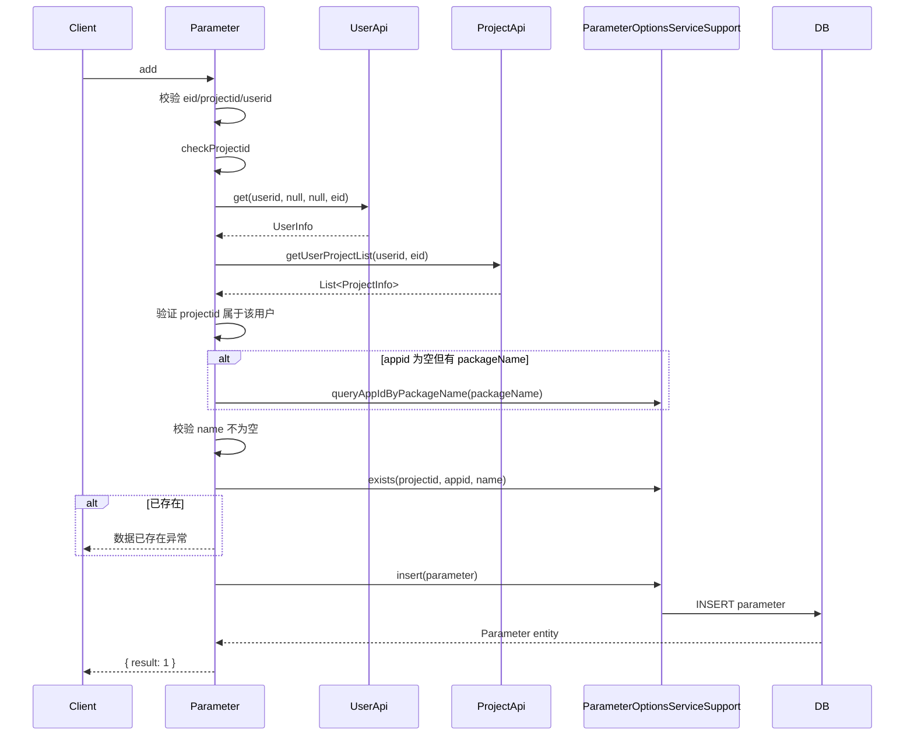
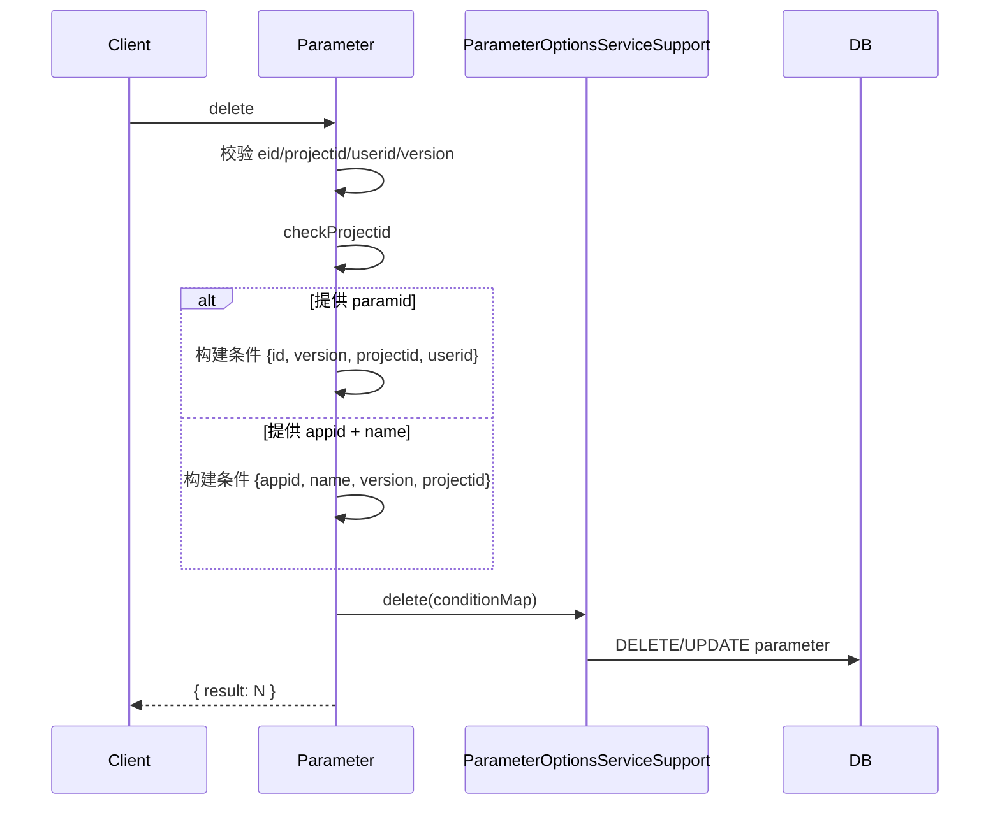
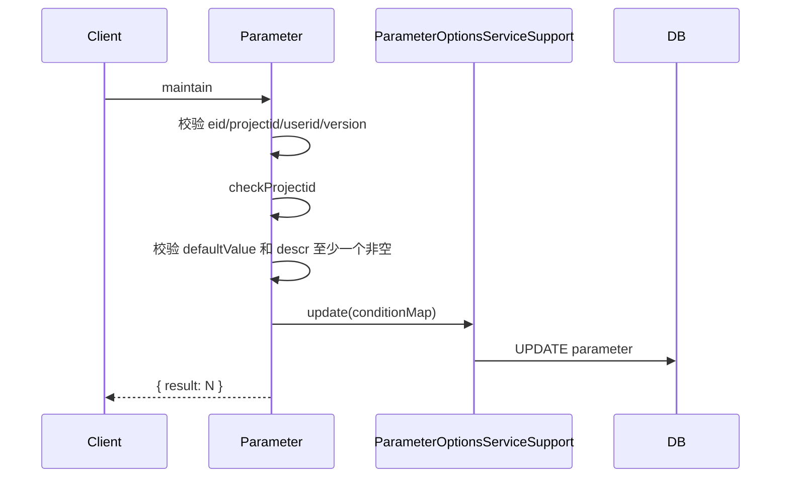
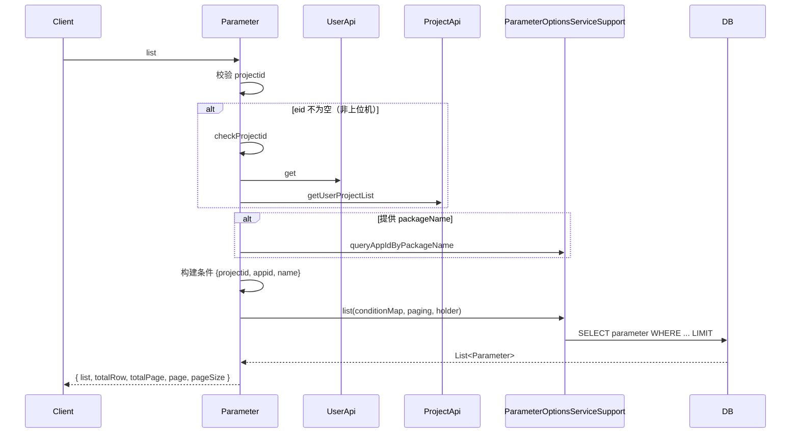

# Parameter (ApiServlet)

> 包路径：cn.testin.service.script.Parameter
> 调用方式：action=script op=Parameter.{method}

## 职责
参数管理 API，提供脚本公共参数的增删改查功能，支持按应用/包名维度隔离。

---

## 方法列表

### add
新增参数信息。

**请求参数（data字段）：**
| 参数 | 类型 | 必填 | 说明 |
|------|------|------|------|
| eid | Integer | 是 | 企业ID |
| projectid | Integer | 是 | 项目组ID |
| userid | Integer | 是 | 用户ID |
| appid/packageName | Integer/String | 是 | 应用ID 或 包名（二选一） |
| name | String | 是 | 参数名称 |
| defaultValue | String | 否 | 默认值 |
| descr | String | 否 | 描述说明 |

**返回参数：**
| 字段 | 类型 | 说明 |
|------|------|------|
| code | Integer | 状态码，0=成功 |
| message | String | 提示信息 |
| data | Object | 返回数据 |
| data.result | Integer | 1=成功，0=失败 |

**实现意图：**
先校验用户-企业-项目合法性（checkProjectid），再检查 appid（可通过 packageName 反查），同名去重检查后入库。

**流程图：**

**涉及表：**
- [parameter](SQL/db_file/parameter.md)

**跨服务调用：**
- [UserApi](../../../平台基础功能服务/00-首页.md)
- [ProjectApi](../../../平台基础功能服务/00-首页.md)

---

### delete
删除参数信息（逻辑删除）。

**请求参数（data字段）：**
| 参数 | 类型 | 必填 | 说明 |
|------|------|------|------|
| eid | Integer | 是 | 企业ID |
| projectid | Integer | 是 | 项目组ID |
| userid | Integer | 是 | 用户ID |
| version | Integer | 是 | 版本号 |
| paramid | Integer | 否 | 参数ID（与 appid+name 二选一） |
| appid | Integer | 否 | 应用ID |
| name | String | 否 | 参数名称 |

**返回参数：**
| 字段 | 类型 | 说明 |
|------|------|------|
| code | Integer | 状态码，0=成功 |
| message | String | 提示信息 |
| data | Object | 返回数据 |
| data.result | Integer | 删除条数 |

**实现意图：**
支持按 paramid 精确删除或按 appid+name 组合删除，必须提供 version 做乐观锁。

**流程图：**

**涉及表：**
- [parameter](SQL/db_file/parameter.md)

**跨服务调用：**
- [UserApi](../../../平台基础功能服务/00-首页.md)
- [ProjectApi](../../../平台基础功能服务/00-首页.md)

---

### maintain
更新参数信息。

**请求参数（data字段）：**
| 参数 | 类型 | 必填 | 说明 |
|------|------|------|------|
| eid | Integer | 是 | 企业ID |
| projectid | Integer | 是 | 项目组ID |
| userid | Integer | 是 | 用户ID |
| version | Integer | 是 | 版本号 |
| paramid | Integer | 否 | 参数ID（优先使用） |
| appid | Integer | 否 | 应用ID |
| name | String | 否 | 参数名称 |
| defaultValue | String | 否 | 默认值 |
| descr | String | 否 | 描述（defaultValue 和 descr 至少传一个） |

**返回参数：**
| 字段 | 类型 | 说明 |
|------|------|------|
| code | Integer | 状态码，0=成功 |
| message | String | 提示信息 |
| data | Object | 返回数据 |
| data.result | Integer | 更新条数 |

**实现意图：**
支持按 paramid 或 appid+name 定位参数，必须传 defaultValue 或 descr 至少一项。使用 version 做乐观锁。

**流程图：**

**涉及表：**
- [parameter](SQL/db_file/parameter.md)

**跨服务调用：**
- [UserApi](../../../平台基础功能服务/00-首页.md)
- [ProjectApi](../../../平台基础功能服务/00-首页.md)

---

### list
分页查询参数列表。

**请求参数（data字段）：**
| 参数 | 类型 | 必填 | 说明 |
|------|------|------|------|
| projectid | Integer | 是 | 项目组ID |
| eid | Integer | 否 | 企业ID（非上位机场景必填） |
| userid | Integer | 否 | 用户ID（非上位机场景必填） |
| appid/packageName | Integer/String | 否 | 应用ID 或 包名 |
| name | String | 否 | 参数名称（精确匹配） |
| page | Integer | 否 | 页码，默认1 |
| pageSize | Integer | 否 | 每页条数，默认20 |

**返回参数：**
| 字段 | 类型 | 说明 |
|------|------|------|
| code | Integer | 状态码，0=成功 |
| message | String | 提示信息 |
| data | Object | 返回数据 |
| data.list | JSONArray | 参数列表，元素为 Parameter 实体（含 id/projectid/appid/userid/name/defaultValue/descr/version/status/createtime/updatetime） |
| data.totalRow | Integer | 总行数 |
| data.totalPage | Integer | 总页数 |
| data.page | Integer | 当前页码 |
| data.pageSize | Integer | 每页条数 |

**流程图：**

**涉及表：**
- [parameter](SQL/db_file/parameter.md)

**跨服务调用：**
- [UserApi](../../../平台基础功能服务/00-首页.md)
- [ProjectApi](../../../平台基础功能服务/00-首页.md)
