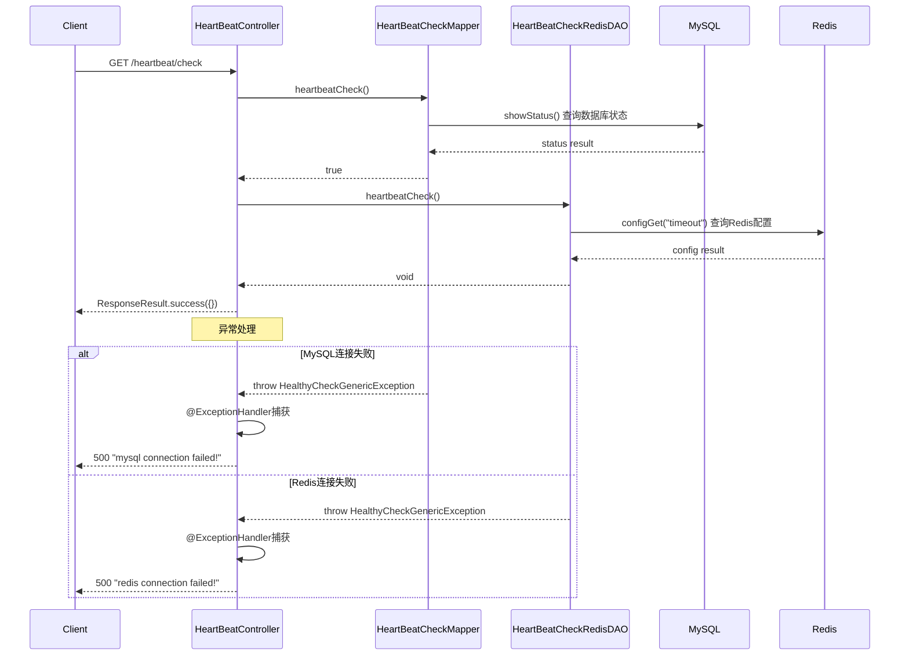

# HeartBeatController

> 包路径：cn.testin.mvc.controller.HeartBeatController
> 基础路径：/v3/script

## 接口列表

### GET /v3/script/heartbeat/check
健康检查接口。检查服务是否正常运行，包括MySQL数据库连接和Redis连接状态。

**请求参数：**
无

**响应结构：**
```json
{
  "code": 200,
  "data": {}
}
```

失败时返回HTTP 500：
```json
{
  "code": 500,
  "message": "mysql connection failed!"
}
```
或
```json
{
  "code": 500,
  "message": "redis connection failed!"
}
```

**实现意图：**
依次执行两项检查：
1. HeartBeatCheckMapper.heartbeatCheck()：调用MySQL的showStatus()查询，验证数据库连接是否正常。
2. HeartBeatCheckRedisDAOImpl.heartbeatCheck()：通过Jedis客户端执行configGet("timeout")命令，验证Redis连接是否正常。

任何一项检查失败都会抛出HealthyCheckGenericException，由@ExceptionHandler统一捕获后返回HTTP 500响应。

**流程图：**


**涉及表：**
- 无（使用MySQL showStatus查询状态）

**跨服务调用：**
- HeartBeatCheckMapper (MySQL连接检查)
- HeartBeatCheckRedisDAOImpl (Redis连接检查，通过Jedis)
