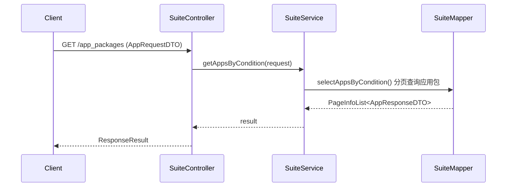
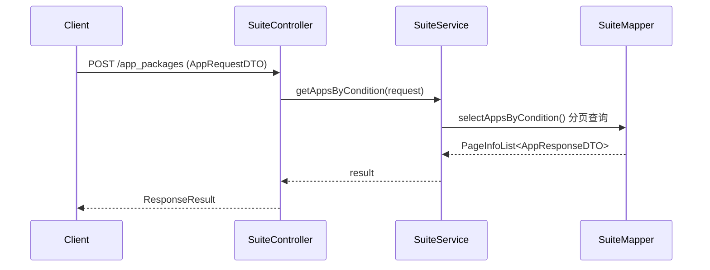
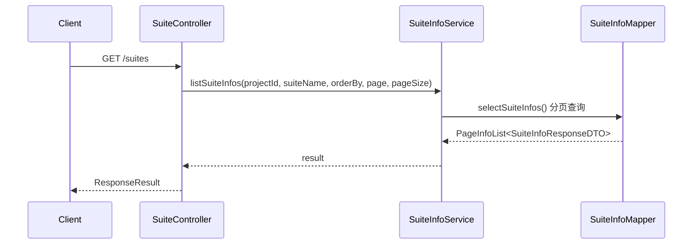
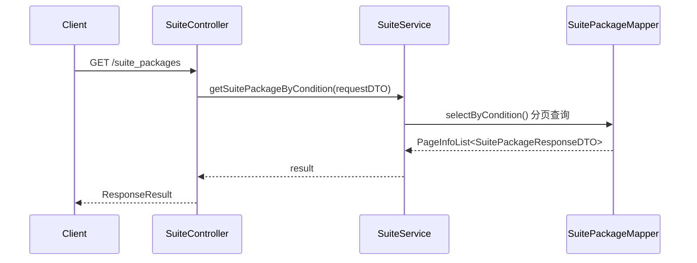
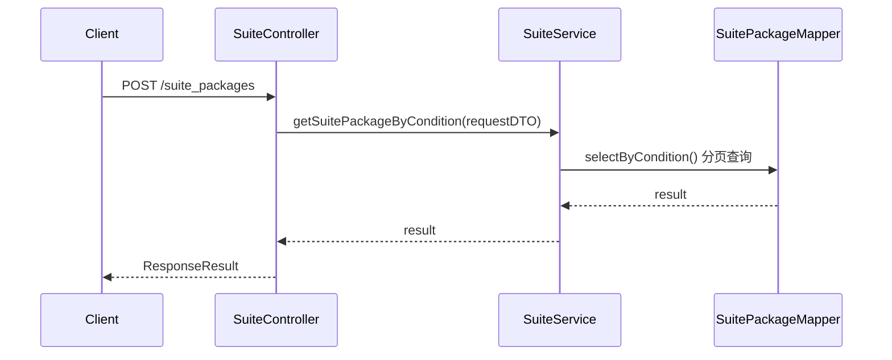

# SuiteController

> 包路径：cn.testin.mvc.controller.SuiteController
> 基础路径：/v3/suite

## 接口列表

### GET /v3/suite/app_packages
获取App包分页列表(GET方式)。按条件查询应用包信息，返回分页列表。

**请求参数：** AppRequestDTO 实体字段
| 参数 | 类型 | 必填 | 说明 |
|------|------|------|------|
| suiteId | Integer | 是 | 应用ID（@NotNull，suite_id不能为空） |
| projectId | Integer | 是 | 项目ID（继承 BaseQueryRequestDTO，@NotNull） |
| userId | Integer | 是 | 用户ID（继承 BaseQueryRequestDTO，@NotNull） |
| eid | Integer | 否 | 企业ID |
| userName | String | 否 | 用户名称 |
| appName | String | 否 | 应用名称过滤 |
| osType | Integer | 否 | 系统类型 |
| osTypes | String | 否 | 系统类型列表（逗号分隔） |
| osTypeList | List\<Integer\> | 否 | 系统类型列表（POST 用） |
| versionName | String | 否 | 版本名称 |
| packageName | String | 否 | 包名 |
| appId | Integer | 否 | App ID |
| uploadName | String | 否 | 上传者名称 |
| channelId | String | 否 | 渠道ID |
| latestPackage | Integer | 否 | 是否使用最新包（1=是） |
| page | Integer | 否 | 页码，默认1 |
| pageSize | Integer | 否 | 每页大小，默认20 |

**响应结构：** data 为 PageInfoList\<AppResponseDTO\>
```json
{
  "code": 200,
  "data": {
    "page": 1,
    "pageSize": 20,
    "totalRow": 50,
    "totalPage": 3,
    "list": [
      {
        "suiteId": 100,
        "appId": 200,
        "packageId": 300,
        "appName": "示例APP",
        "versionName": "1.0.0",
        "packageName": "com.example.app",
        "versionRemark": "版本备注",
        "channelId": "official",
        "iconPackageUrl": "https://...",
        "uploadUserName": "张三",
        "uploadTime": 1690800000000,
        "uploadUserId": 10,
        "packageDownloadUrl": "https://...",
        "versionCode": "100",
        "osType": 1,
        "projectId": 1000
      }
    ]
  }
}
```

**实现意图：**
设置默认分页参数 → 调用SuiteService.getAppsByCondition()查询app包信息 → 返回分页结果。

**流程图：**


**涉及表：**
- suite_info
- suite_script

---

### POST /v3/suite/app_packages
获取App包分页列表(POST方式)。功能与GET方式相同，使用POST请求体传参。

**请求参数：** 同 GET /v3/suite/app_packages（@RequestBody @Valid AppRequestDTO）

**响应结构：**
同 GET /v3/suite/app_packages

**实现意图：**
与GET方式完全相同，调用同一个SuiteService.getAppsByCondition()方法。

**流程图：**


**涉及表：**
- suite_info
- suite_script

---

### GET /v3/suite/suites
查询套件分页列表。根据项目ID和套件名称查询suite_info列表。

**请求参数：**
| 参数 | 类型 | 必填 | 说明 |
|------|------|------|------|
| project_id | Integer | 是 | 项目ID |
| suite_name | String | 否 | 套件名称（模糊匹配） |
| order_by_clause | String | 是 | 排序子句 |
| page | Integer | 是 | 页码 |
| page_size | Integer | 是 | 每页大小 |

**响应结构：** data 为 PageInfoList\<SuiteInfoResponseDTO\>
```json
{
  "code": 200,
  "data": {
    "page": 1,
    "pageSize": 20,
    "totalRow": 10,
    "totalPage": 1,
    "list": [
      {
        "id": 100,
        "suiteName": "Web测试套件",
        "suiteDescription": "描述",
        "iconUrl": "https://...",
        "status": 1,
        "createTime": 1690800000000,
        "updateTime": 1690800000000,
        "eid": 1,
        "projectId": 1000,
        "userId": 10,
        "userName": "张三"
      }
    ]
  }
}
```

**实现意图：**
校验分页参数 → 调用SuiteInfoService.listSuiteInfos()分页查询suite_info表 → 返回套件列表。

**流程图：**


**涉及表：**
- suite_info

---

### GET /v3/suite/suite_packages
查询应用包信息(GET方式)。分页查询suite_package信息。

**请求参数：** SuitePackageRequestDTO 实体字段
| 参数 | 类型 | 必填 | 说明 |
|------|------|------|------|
| pkgId | Integer | 否 | 包ID |
| pkgIds | List\<Integer\> | 否 | 包ID列表 |
| page | Integer | 否 | 页码，默认1 |
| pageSize | Integer | 否 | 每页大小，默认20 |

**响应结构：** data 为 PageInfoList\<SuitePackageResponseDTO\>
```json
{
  "code": 200,
  "data": {
    "page": 1,
    "pageSize": 20,
    "totalRow": 30,
    "totalPage": 2,
    "list": [
      {
        "suiteId": 100,
        "suiteName": "Web测试套件",
        "appName": "示例APP",
        "pkgId": 1,
        "packageName": "com.example.app",
        "versionName": "1.0.0",
        "versionRemark": "备注",
        "iconFileUrl": "https://...",
        "build": 100,
        "systemPlatformId": 1
      }
    ]
  }
}
```

**实现意图：**
设置默认分页 → 调用SuiteService.getSuitePackageByCondition()查询suite_package表 → 返回分页结果。

**流程图：**


**涉及表：**
- suite_package

---

### POST /v3/suite/suite_packages
查询应用包信息(POST方式)。功能与GET方式相同。

**请求参数：**
同 GET /v3/suite/suite_packages

**响应结构：**
同 GET /v3/suite/suite_packages

**实现意图：**
与GET方式完全相同，调用同一个SuiteService.getSuitePackageByCondition()方法。

**流程图：**


**涉及表：**
- suite_package
