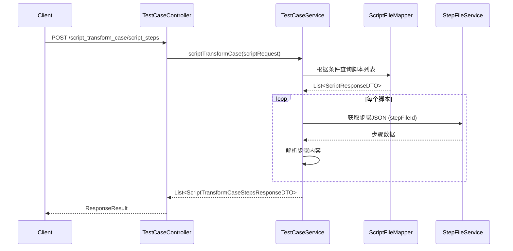
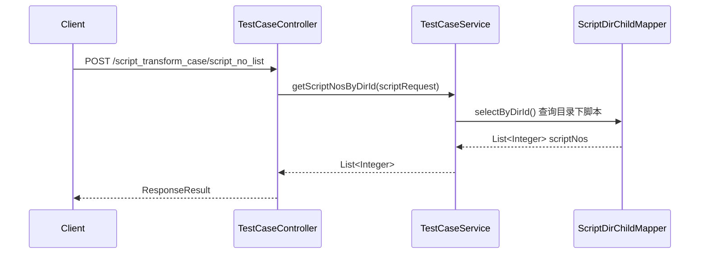
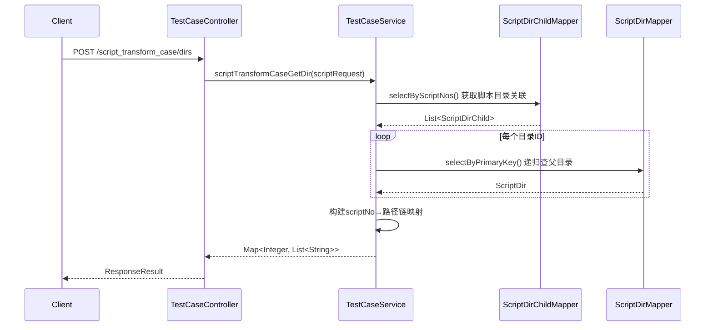

# TestCaseController

> 包路径：cn.testin.mvc.controller.TestCaseController
> 基础路径：/v3/script/test_case

本Controller提供脚本转换为用例时的数据查询功能，供用例平台调用。

## 接口列表

### POST /v3/script/test_case/script_transform_case/script_steps
脚本转换用例获取步骤。根据请求条件查询脚本的步骤信息，用于将脚本转换为用例时展示步骤内容。

**请求参数：** ScriptTransformCaseRequestDTO 实体字段
| 参数 | 类型 | 必填 | 说明 |
|------|------|------|------|
| scriptNoList | List\<Integer\> | 否 | 脚本编号列表（为空返回空列表） |
| projectId | Integer | 否 | 项目ID（查询条件） |
| eid | Integer | 否 | 企业ID（查询条件） |
| scriptDirId | Integer | 否 | 目录ID（本接口未使用） |
| scriptType | Integer | 否 | 脚本类型（本接口未使用） |

**响应结构：** data 为 List\<ScriptTransformCaseStepsResponseDTO\>
```json
{
  "code": 200,
  "data": [
    {
      "scriptId": 1001,
      "scriptNo": 2001,
      "scriptName": "登录测试",
      "scriptType": 1,
      "scriptStatus": 1,
      "scriptCreateUserId": 10,
      "scriptUpdateUserId": 11,
      "scriptCreateTime": 1690800000000,
      "scriptUpdateTime": 1690800000000,
      "order": 1,
      "errorMsg": null,
      "childScriptList": [
        {
          "scriptId": 2002,
          "scriptNo": 2002,
          "scriptName": "子脚本",
          "scriptType": 1,
          "scriptStatus": 1,
          "order": 1,
          "errorMsg": null,
          "childScriptList": []
        }
      ]
    }
  ]
}
```

**实现意图：**
调用TestCaseService.scriptTransformCase() → 根据条件查询script_file表获取脚本列表 → 通过stepFileId获取步骤JSON数据 → 解析步骤信息 → 返回脚本步骤详情列表。

**流程图：**


**涉及表：**
- script_file

---

### POST /v3/script/test_case/script_transform_case/script_no_list
脚本转换用例获取脚本编号列表。根据目录ID查询目录下所有有效的脚本编号，用于脚本转用例时筛选脚本。

**请求参数：** ScriptTransformCaseRequestDTO 实体字段
| 参数 | 类型 | 必填 | 说明 |
|------|------|------|------|
| scriptDirId | Integer | 否 | 目录ID（查询其下所有子目录脚本） |
| projectId | Integer | 否 | 项目ID（查询条件） |
| scriptType | Integer | 否 | 脚本类型 |
| scriptNoList | List\<Integer\> | 否 | 脚本编号列表（本接口未使用） |
| eid | Integer | 否 | 企业ID（本接口未使用） |

**响应结构：** data 为 List\<Integer\>（scriptNo 列表）
```json
{
  "code": 200,
  "data": [1001, 1002, 1003, 1004]
}
```

**实现意图：**
调用TestCaseService.getScriptNosByDirId() → 查询script_dir_child表获取目录下所有脚本编号 → 返回scriptNo列表。

**流程图：**


**涉及表：**
- script_dir_child

---

### POST /v3/script/test_case/script_transform_case/dirs
脚本转换用例获取目录信息。根据脚本编号查询每个脚本所在的完整目录路径。

**请求参数：** ScriptTransformCaseRequestDTO 实体字段
| 参数 | 类型 | 必填 | 说明 |
|------|------|------|------|
| scriptNoList | List\<Integer\> | 否 | 脚本编号列表（为空返回空Map） |
| projectId | Integer | 否 | 项目ID（本接口未使用） |
| eid | Integer | 否 | 企业ID（本接口未使用） |
| scriptDirId | Integer | 否 | 目录ID（本接口未使用） |
| scriptType | Integer | 否 | 脚本类型（本接口未使用） |

**响应结构：** data 为 Map\<Integer, List\<String\>\>（scriptNo → 目录路径链）
```json
{
  "code": 200,
  "data": {
    "1001": ["根目录", "功能测试", "登录模块"],
    "1002": ["根目录", "接口测试"]
  }
}
```

**实现意图：**
调用TestCaseService.scriptTransformCaseGetDir() → 通过scriptNos查询script_dir_child表获取每个脚本的目录ID → 递归查询script_dir表获取每个目录ID的完整路径名（从根到叶子） → 构建Map<Integer, List<String>>返回。

**流程图：**


**涉及表：**
- script_dir_child
- script_dir
