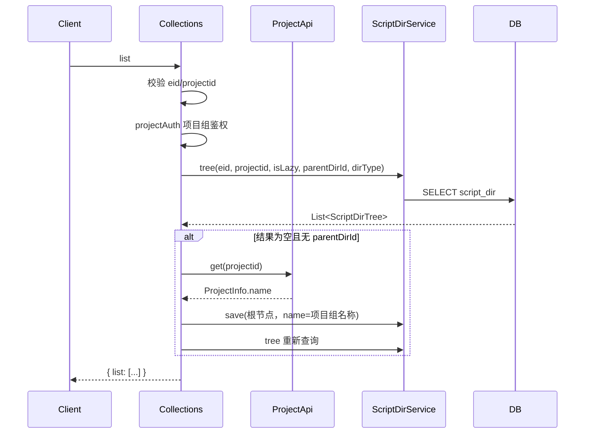
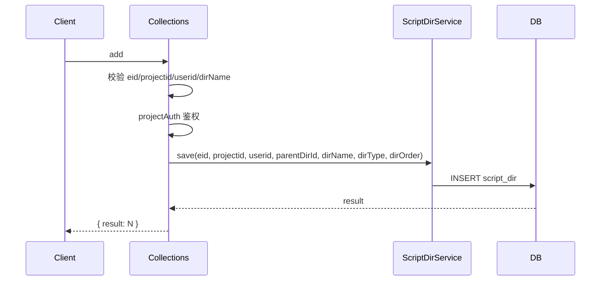
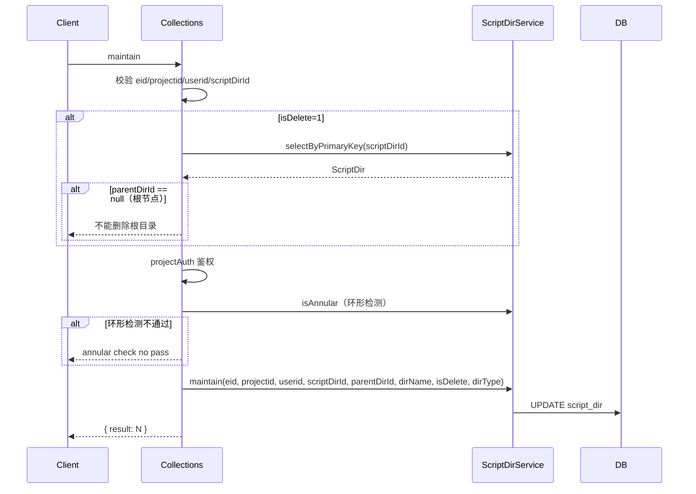
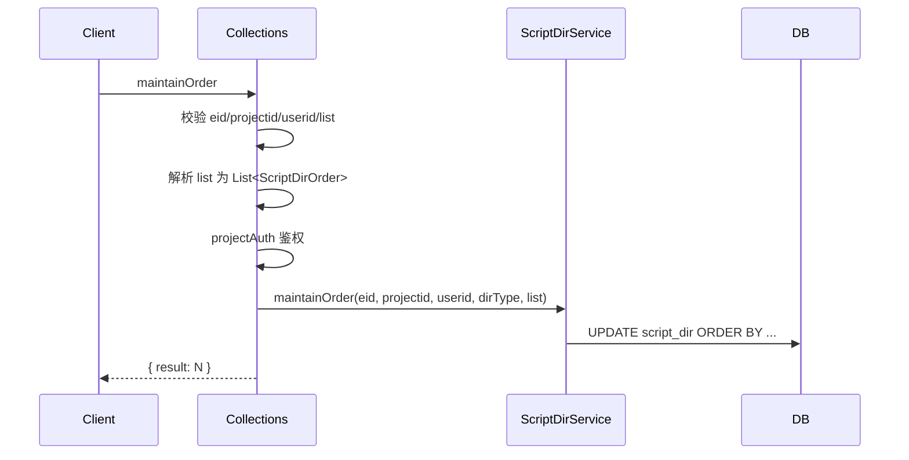
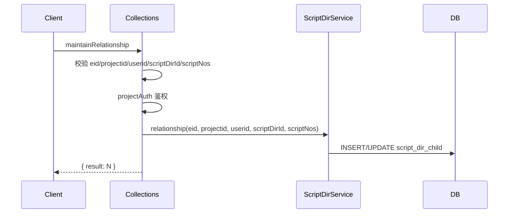
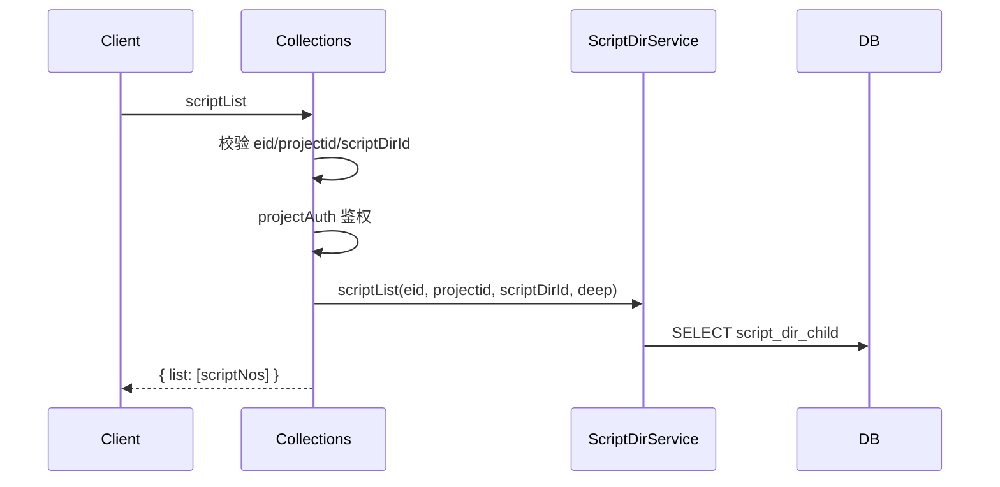
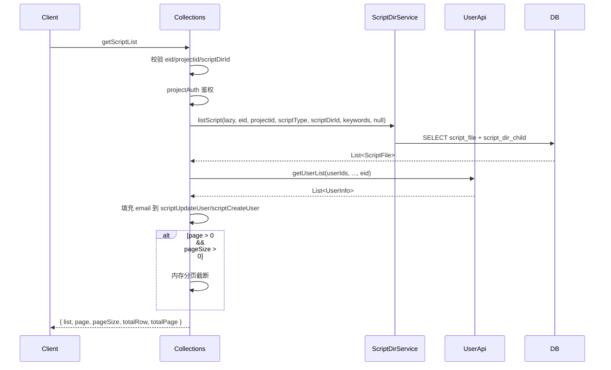

# Collections (ApiServlet)

> 包路径：cn.testin.service.script.Collections
> 调用方式：action=script op=Collections.{method}

## 职责
脚本目录管理 API，提供目录树的增删改查、排序、目录与脚本的关系维护、查看目录下脚本列表等功能。

---

## 方法列表

### list
获取脚本目录树（支持 Lazy 懒加载和全量模式）。

**请求参数（data字段）：**
| 参数 | 类型 | 必填 | 说明 |
|------|------|------|------|
| eid | Integer | 是 | 企业ID |
| projectid | Integer | 是 | 项目组ID |
| userid | Integer | 否 | 用户ID，默认1 |
| lazyTree | Integer | 否 | 1=Lazy懒加载, 0=全量，默认1 |
| parentDirId | Integer | 否 | 父目录节点ID |
| dirType | Integer | 否 | 目录类型 |

**返回参数：**
| 字段 | 类型 | 说明 |
|------|------|------|
| code | Integer | 状态码，0=成功 |
| message | String | 提示信息 |
| data | Object | 返回数据 |
| data.list | JSONArray | 目录树列表（ScriptDirTree） |

**实现意图：**
先校验项目权限（projectAuth），调用 scriptDirService.tree 获取目录树。若项目组无根节点则自动创建根节点（目录名为项目组名称）。

**流程图：**

**涉及表：**
- [script_dir](../../../数据库管理/db_file/script_dir.md)

**跨服务调用：**
- [ProjectApi](../../../平台基础功能服务/00-首页.md)

---

### add
新增目录节点。

**请求参数（data字段）：**
| 参数 | 类型 | 必填 | 说明 |
|------|------|------|------|
| eid | Integer | 是 | 企业ID |
| projectid | Integer | 是 | 项目组ID |
| userid | Integer | 是 | 用户ID |
| dirName | String | 是 | 目录名称 |
| parentDirId | Integer | 否 | 父目录节点ID |
| dirType | Integer | 否 | 目录类型 |
| dirOrder | Integer | 否 | 目录排序位置 |

**返回参数：**
| 字段 | 类型 | 说明 |
|------|------|------|
| code | Integer | 状态码，0=成功 |
| message | String | 提示信息 |
| data | Object | 返回数据 |
| data.result | Integer | 保存结果 |

**流程图：**

**涉及表：**
- [script_dir](../../../数据库管理/db_file/script_dir.md)

---

### maintain
目录节点维护（支持重命名、移动、删除/还原）。

**请求参数（data字段）：**
| 参数 | 类型 | 必填 | 说明 |
|------|------|------|------|
| eid | Integer | 是 | 企业ID |
| projectid | Integer | 是 | 项目组ID |
| userid | Integer | 是 | 用户ID |
| scriptDirId | Integer | 是 | 目录节点ID |
| parentDirId | Integer | 否 | 新的父目录节点ID |
| dirName | String | 否 | 目录名称 |
| isDelete | Integer | 否 | 1=删除, 0=还原 |
| dirType | Integer | 否 | 目录类型 |

**返回参数：**
| 字段 | 类型 | 说明 |
|------|------|------|
| code | Integer | 状态码，0=成功 |
| message | String | 提示信息 |
| data | Object | 返回数据 |
| data.result | Integer | 保存结果 |

**实现意图：**
更新前先做环形检测（防止目录指向自身或子节点），如果是删除操作且为根节点则拒绝。

**流程图：**

**涉及表：**
- [script_dir](../../../数据库管理/db_file/script_dir.md)

---

### maintainOrder
维护目录排序。

**请求参数（data字段）：**
| 参数 | 类型 | 必填 | 说明 |
|------|------|------|------|
| eid | Integer | 是 | 企业ID |
| projectid | Integer | 是 | 项目组ID |
| userid | Integer | 是 | 用户ID |
| dirType | Integer | 否 | 目录类型 |
| list | JSONArray | 是 | 排序后的目录顺序列表（ScriptDirOrder） |

**返回参数：**
| 字段 | 类型 | 说明 |
|------|------|------|
| code | Integer | 状态码，0=成功 |
| message | String | 提示信息 |
| data | Object | 返回数据 |
| data.result | Integer | 排序结果 |

**流程图：**

**涉及表：**
- [script_dir](../../../数据库管理/db_file/script_dir.md)

---

### maintainRelationship
维护目录与脚本的关联关系（设置某个目录下包含哪些脚本）。

**请求参数（data字段）：**
| 参数 | 类型 | 必填 | 说明 |
|------|------|------|------|
| eid | Integer | 是 | 企业ID |
| projectid | Integer | 是 | 项目组ID |
| userid | Integer | 是 | 用户ID |
| scriptDirId | Integer | 是 | 目录节点ID |
| scriptNos | JSONArray | 是 | 脚本编号列表 |

**返回参数：**
| 字段 | 类型 | 说明 |
|------|------|------|
| code | Integer | 状态码，0=成功 |
| message | String | 提示信息 |
| data | Object | 返回数据 |
| data.result | Integer | 维护结果 |

**流程图：**

**涉及表：**
- [script_dir_child](../../../数据库管理/db_file/script_dir_child.md)

---

### scriptList
获取目录下的脚本编号列表。

**请求参数（data字段）：**
| 参数 | 类型 | 必填 | 说明 |
|------|------|------|------|
| eid | Integer | 是 | 企业ID |
| projectid | Integer | 是 | 项目组ID |
| scriptDirId | Integer | 是 | 目录节点ID |
| deep | Integer | 否 | 是否深度查询子目录，默认0 |

**返回参数：**
| 字段 | 类型 | 说明 |
|------|------|------|
| code | Integer | 状态码，0=成功 |
| message | String | 提示信息 |
| data | Object | 返回数据 |
| data.list | JSONArray | 目录下脚本编号列表（Integer） |

**流程图：**

**涉及表：**
- [script_dir_child](../../../数据库管理/db_file/script_dir_child.md)

---

### getScriptList
获取目录下脚本列表（含分页，含更新人/创建人名称）。

**请求参数（data字段）：**
| 参数 | 类型 | 必填 | 说明 |
|------|------|------|------|
| eid | Integer | 是 | 企业ID |
| projectid | Integer | 是 | 项目组ID |
| scriptDirId | Integer | 是 | 目录节点ID |
| scriptType | Integer | 否 | 脚本类型，默认1 |
| page | Integer | 否 | 页码（>0时启用分页） |
| pageSize | Integer | 否 | 每页条数 |

**返回参数：**
| 字段 | 类型 | 说明 |
|------|------|------|
| code | Integer | 状态码，0=成功 |
| message | String | 提示信息 |
| data | Object | 返回数据 |
| data.list | JSONArray | 脚本基础信息列表，元素含 scriptno、scriptDesc、scriptUpdateUser、scriptUpdateTime、scriptCreateUser、scriptCreateTime |
| data.page / pageSize | Integer | 当前页 / 每页条数（仅 page>0 且 pageSize>0 时返回） |
| data.totalRow / totalPage | Integer | 总行数 / 总页数（仅分页时返回） |

**流程图：**

**涉及表：**
- [script_file](../../../数据库管理/db_file/script_file.md)
- [script_dir_child](../../../数据库管理/db_file/script_dir_child.md)

**跨服务调用：**
- [UserApi](../../../平台基础功能服务/00-首页.md)

---

### unstorage
查询目录下所有未被储存（分配）的脚本编号。

**请求参数（data字段）：**
| 参数 | 类型 | 必填 | 说明 |
|------|------|------|------|
| eid | Integer | 是 | 企业ID |
| projectid | Integer | 是 | 项目组ID |
| scriptDirIds | JSONArray | 是 | 目录ID列表 |

**返回参数：**
| 字段 | 类型 | 说明 |
|------|------|------|
| code | Integer | 状态码，0=成功 |
| message | String | 提示信息 |
| data | Object | 返回数据 |
| data.list | JSONArray | 未存储脚本编号列表（Integer） |

**涉及表：**
- [script_dir_child](../../../数据库管理/db_file/script_dir_child.md)
- [script_file](../../../数据库管理/db_file/script_file.md)

---

### listScript
获取目录下脚本文件列表（支持 Lazy 懒加载和 scriptTypes 多类型筛选）。

**请求参数（data字段）：**
| 参数 | 类型 | 必填 | 说明 |
|------|------|------|------|
| lazy | Integer | 否 | 是否仅查直属脚本 |
| eid | Integer | 是 | 企业ID |
| projectid | Integer | 是 | 项目组ID |
| scriptType | Integer | 否 | 脚本类型，默认1 |
| scriptTypes | JSONArray | 否 | 多脚本类型 |
| dirId | Integer | 是 | 目录ID |
| keyword | JSONArray | 否 | 关键字列表（指定返回字段） |

**返回参数：**
| 字段 | 类型 | 说明 |
|------|------|------|
| code | Integer | 状态码，0=成功 |
| message | String | 提示信息 |
| data | Object | 返回数据 |
| data.list | JSONArray | 目录下脚本文件列表（ScriptFile） |

**涉及表：**
- [script_file](../../../数据库管理/db_file/script_file.md)
- [script_dir_child](../../../数据库管理/db_file/script_dir_child.md)
