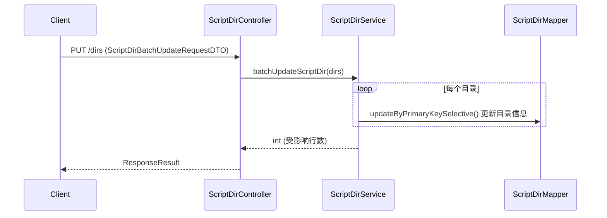
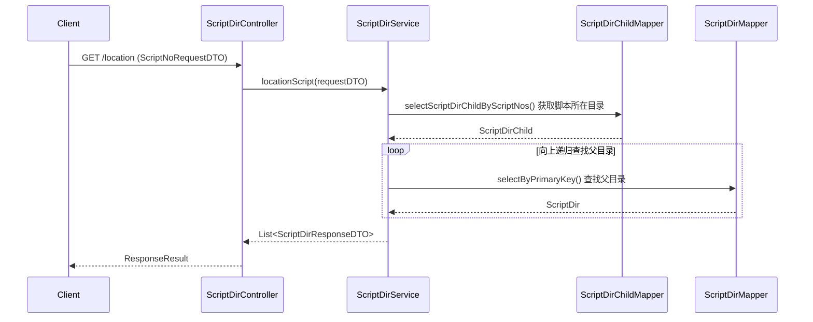
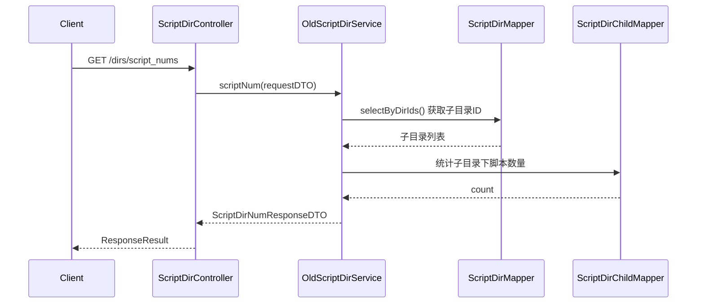

# ScriptDirController

> 包路径：cn.testin.mvc.controller.ScriptDirController
> 基础路径：/v3/script

## 接口列表

### PUT /v3/script/dirs
批量更新目录信息。支持一次更新多个目录的名称或描述。

**请求参数：** ScriptDirBatchUpdateRequestDTO 实体字段
| 参数 | 类型 | 必填 | 说明 |
|------|------|------|------|
| dirs | List\<ScriptDirRequestDTO\> | 是 | 待更新的目录信息列表（@NotEmpty） |

ScriptDirRequestDTO:
| 参数 | 类型 | 必填 | 说明 |
|------|------|------|------|
| dirId | Integer | 是 | 目录ID（更新主键） |
| parentDirId | Integer | 否 | 父目录ID（移动目录用） |
| dirOrder | Integer | 否 | 目录在父目录下的顺序 |
| scriptDirName | String | 否 | 目录名称 |
| projectId | Integer | 否 | 项目ID（继承 BaseRequestDTO，@NotNull，但本接口更新未使用） |
| userId | Integer | 否 | 用户ID（继承 BaseRequestDTO，@NotNull，但本接口更新未使用） |
| eid | Integer | 否 | 企业ID |
| userName | String | 否 | 用户名称 |

**响应结构：** data 为 BaseResponseDTO（result 为受影响行数）
```json
{
  "code": 200,
  "data": {
    "result": 3
  }
}
```

**实现意图：**
接收目录更新列表，调用ScriptDirService.batchUpdateScriptDir()批量执行更新操作。更新script_dir表中的script_dir_name字段。

**流程图：**


**涉及表：**
- script_dir

---

### GET /v3/script/location
脚本快速定位。根据脚本编号查询其在目录树中的完整路径，返回从根目录到该脚本所在目录的路径链。

**请求参数：** ScriptNoRequestDTO 实体字段
| 参数 | 类型 | 必填 | 说明 |
|------|------|------|------|
| scriptNo | Integer | 是 | 脚本编号（@NotNull） |
| projectId | Integer | 是 | 项目ID（继承 BaseRequestDTO，@NotNull） |
| userId | Integer | 是 | 用户ID（继承 BaseRequestDTO，@NotNull） |
| eid | Integer | 否 | 企业ID |
| userName | String | 否 | 用户名称 |

**响应结构：** data 为 BaseListResponseDTO\<ScriptDirResponseDTO\>（list 元素仅含 dirId，子目录在前、父目录在后）
```json
{
  "code": 200,
  "data": {
    "list": [
      {
        "dirId": 5
      },
      {
        "dirId": 1
      }
    ]
  }
}
```

**实现意图：**
通过scriptNo查找script_dir_child表中该脚本所在目录 → 向上递归查找父目录直到根节点 → 返回从根到该目录的完整路径链。

**流程图：**


**涉及表：**
- script_dir_child
- script_dir

---

### GET /v3/script/dirs/script_nums
目录下脚本数量统计。统计指定目录及其子目录下的脚本总数。

**请求参数：** ScriptDirNumRequestDTO 实体字段
| 参数 | 类型 | 必填 | 说明 |
|------|------|------|------|
| eid | Integer | 是 | 企业ID（查询条件） |
| projectId | Integer | 是 | 项目组ID（查询条件） |
| userId | Integer | 否 | 用户ID（新建根目录时使用） |
| scriptType | Integer | 是 | 脚本类型（代码直接使用，null 会抛 NPE） |
| checkStatus | Integer | 否 | 是否检查脚本状态 |
| unStorage | Integer | 否 | 是否查询未分配目录脚本数 |
| recycleBin | Integer | 否 | 是否查询回收站脚本数 |

**响应结构：** data 为 ScriptDirNumResponseDTO
```json
{
  "code": 200,
  "data": {
    "dirIdWithCount": {
      "1": 10,
      "2": 20,
      "3": 8,
      "5": 7
    },
    "unStorageCount": 3,
    "deletedScriptCount": 2
  }
}
```

**实现意图：**
调用oldScriptDirService.scriptNum()（旧版服务），统计指定目录及其所有子目录下的脚本数量。返回脚本总数和包含的目录ID列表。

**流程图：**


**涉及表：**
- script_dir
- script_dir_child

**跨服务调用：**
- OldScriptDirService (cn.testin.file.service.ScriptDirService)
